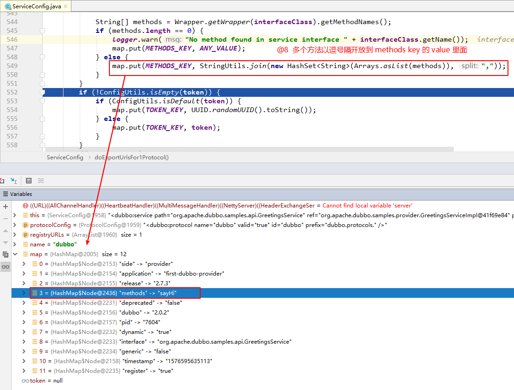
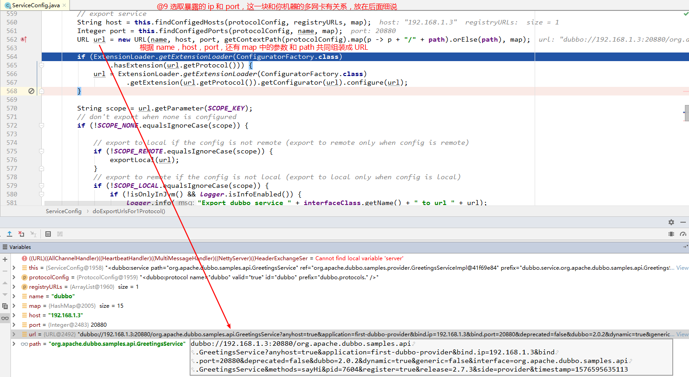

## 引言

研究源码是一个充满疑惑并且非常枯燥的过程，因为在研究的过程中可能很多你都看不懂，所以我们最好先带着问题去看源码，这样即使研究完后还是存在很多疑问，但是我们至少抓住了重点。

## 带着这些问题

1. 延时暴露和立即暴露。

2. 什么时候建立与注册中心的连接。

3. 服务提供者什么时候向注册中心注册服务。

4. 服务提供者与注册中心的心跳机制。

## 暴露总体过程

在详细研究服务暴露细节之前，我们先看一下整体 RPC 的暴露原理，如图 5-4。

从整体上看，Dubbo 框架做服务暴露分为两大部分，第一步将持有的服务实例通过代理转换成 Invoker，第二步把 Invoker 通过具体的协议（比如 Dubbo） 转换成 Exporter，框架做了这层抽象大大方便了功能扩展。这里的 Invoker 可以简单的理解成一个真实的服务对象实例，是 Dubbo 框架实体域，所有模型都会向它靠拢，可向他发起 invoke 调用。它可能是一个本地实现，也可能是一个远程实现，还可能是一个集群实现。


在正式研究源码之前有必要先说一下，笔者研究的源码基于 <code><font color="#f52814">2.7.3</font></code> 版本的 <code><font color="#f52814">dubbo-samples-api</font></code> 工程，不想自己搭 Demo 的朋友可以去 Dubbo 官网或者笔者的 [github](https://github.com/tiankaizhi/dubboSourceCodeAnalysis) 仓库去下载。

## 暴露细节

1、 创建 ServiceConfig 对象用来承载配置信息

2、 暴露服务入口 <code><font color="#f52814">service.export()</font></code>


2.1

代码 ① 处判断是否暴露服务，根据<code><font color="#f52814"><dubbo:service export="true|false"></font></code> 设置

代码 ② 处如果 <code><font color="#f52814">delay</font></code> 大于 0，表示延迟多少毫秒后暴露服务


延迟暴露采用的是 JDK 的 <code><font color="#f52814">ScheduledExecutorService</font></code> 进行调度的。


延时调度机制触发时机是当 Spring 容器实例化 bean 完成，走到最后一步发布 <code><font color="#f52814">ContextRefreshEvent</font></code> 事件的时候，<code><font color="#f52814">ServiceBean </font></code> 会执行 <code><font color="#f52814">onApplicationEvent</font></code> 方法，该方法调用 <code><font color="#f52814">ServiceConfig</font></code> 的 <code><font color="#f52814">export</font></code> 方法。


第 412 行判断 <code><font color="#f52814">path</font></code> 为空后，将 <code><font color="#f52814">interfaceName</font></code> 赋给 <code><font color="#f52814">path</font></code>


<code><font color="#f52814">doExportUrls</font></code>  正式开始暴露服务

```java
    private void doExportUrls() {

        // 获取当前服务对应的注册中心实例
        List<URL> registryURLs = loadRegistries(true);   // @1 获取当前服务所有的注册中心地址

        for (ProtocolConfig protocolConfig : protocols) { // @2 如果服务指暴露多个协议，则依次暴露

            String pathKey = URL.buildKey(getContextPath(protocolConfig).map(p -> p + "/" + path).orElse(path), group, version);
            ProviderModel providerModel = new ProviderModel(pathKey, ref, interfaceClass);
            ApplicationModel.initProviderModel(pathKey, providerModel);

            doExportUrlsFor1Protocol(protocolConfig, registryURLs); // @3
        }
    }
```

代码 @1：首先遍历 <code><font color="#f52814">ServiceBean</font></code> 的 <code><font color="#f52814">List< RegistryConfig> registries</font></code>（所有注册中心的配置信息），然后将地址封装成 <code><font color="#f52814">URL 对象</font></code> ，关于注册中心的所有配置属性，最终转换成 <code><font color="#f52814">url</font></code> 的属性(?属性名=属性值)。<code><font color="#f52814">loadRegistries(true)</font></code>，参数 true 代表服务提供者，false 代表服务消费者，如果是服务提供者，则检测注册中心的配置，如果配置了 <code><font color="#f52814">register="false"</font></code>，则忽略该地址，如果是服务消费者，并配置了 <code><font color="#f52814">subscribe="false"</font></code> 则表示不从该注册中心订阅服务，故也不返回。如果没有显示指定的服务注册中心，则默认会使用全局配置的注册中心。

```java
    /**
     * 加载注册表并将其转换为{@link URL}，优先级顺序为：系统属性> dubbo注册表配置
     * Load the registry and conversion it to {@link URL}, the priority order is: system property > dubbo registry config
     *
     * 是否是提供方
     * @param provider whether it is the provider side
     * @return
     */
    protected List<URL> loadRegistries(boolean provider) {
        //必要时检查&&覆盖
        // check && override if necessary
        List<URL> registryList = new ArrayList<URL>();
        if (CollectionUtils.isNotEmpty(registries)) {
            for (RegistryConfig config : registries) {
                String address = config.getAddress();
                if (StringUtils.isEmpty(address)) {
                    address = ANYHOST_VALUE;
                }
                if (!RegistryConfig.NO_AVAILABLE.equalsIgnoreCase(address)) {
                    Map<String, String> map = new HashMap<String, String>();
                    appendParameters(map, application);
                    appendParameters(map, config);
                    map.put(PATH_KEY, RegistryService.class.getName());
                    appendRuntimeParameters(map);
                    if (!map.containsKey(PROTOCOL_KEY)) {
                        map.put(PROTOCOL_KEY, DUBBO_PROTOCOL);
                    }
                    List<URL> urls = UrlUtils.parseURLs(address, map);

                    for (URL url : urls) {
                        url = URLBuilder.from(url)
                                .addParameter(REGISTRY_KEY, url.getProtocol())
                                .setProtocol(REGISTRY_PROTOCOL)
                                .build();
                        if ((provider && url.getParameter(REGISTER_KEY, true))
                                || (!provider && url.getParameter(SUBSCRIBE_KEY, true))) {
                            registryList.add(url);
                        }
                    }
                }
            }
        }
        return registryList;
    }
```

我们看一下加载完的 <code><font color="#f52814">registryList</font></code> 值：


代码 @2，加载完所有配置的注册中心 URL 之后，开始按照协议进行暴露。Dubbo 支持相同服务暴露多个协议。


我们看一下 <code><font color="#f52814">doExportUrlsFor1Protocol</font></code> 方法具体暴露逻辑

```java
private void doExportUrlsFor1Protocol(ProtocolConfig protocolConfig, List<URL> registryURLs) {
        String name = protocolConfig.getName();
        if (StringUtils.isEmpty(name)) {
            name = DUBBO;
        }

        Map<String, String> map = new HashMap<String, String>();
        map.put(SIDE_KEY, PROVIDER_SIDE);

        // @4
        // 读取其他配置信息到 map，用于后续构造 URL
        appendRuntimeParameters(map);
        appendParameters(map, metrics);
        appendParameters(map, application);
        appendParameters(map, module);

        // 这部分是删除了 2.6.x 版本的 default
        // remove 'default.' prefix for configs from ProviderConfig
        // appendParameters(map, provider, Constants.DEFAULT_KEY);
        appendParameters(map, provider);
        appendParameters(map, protocolConfig);
        appendParameters(map, this);

        if (CollectionUtils.isNotEmpty(methods)) {  //@5
            for (MethodConfig method : methods) {
                appendParameters(map, method, method.getName());
                String retryKey = method.getName() + ".retry";
                if (map.containsKey(retryKey)) {
                    String retryValue = map.remove(retryKey);
                    if ("false".equals(retryValue)) {
                        map.put(method.getName() + ".retries", "0");
                    }
                }
                List<ArgumentConfig> arguments = method.getArguments();
                if (CollectionUtils.isNotEmpty(arguments)) {
                    for (ArgumentConfig argument : arguments) {
                        // convert argument type
                        if (argument.getType() != null && argument.getType().length() > 0) {
                            Method[] methods = interfaceClass.getMethods();
                            // visit all methods
                            if (methods != null && methods.length > 0) {
                                for (int i = 0; i < methods.length; i++) {
                                    String methodName = methods[i].getName();
                                    // target the method, and get its signature
                                    if (methodName.equals(method.getName())) {
                                        Class<?>[] argtypes = methods[i].getParameterTypes();
                                        // one callback in the method
                                        if (argument.getIndex() != -1) {
                                            if (argtypes[argument.getIndex()].getName().equals(argument.getType())) {
                                                appendParameters(map, argument, method.getName() + "." + argument.getIndex());
                                            } else {
                                                throw new IllegalArgumentException("Argument config error : the index attribute and type attribute not match :index :" + argument.getIndex() + ", type:" + argument.getType());
                                            }
                                        } else {
                                            // multiple callbacks in the method
                                            for (int j = 0; j < argtypes.length; j++) {
                                                Class<?> argclazz = argtypes[j];
                                                if (argclazz.getName().equals(argument.getType())) {
                                                    appendParameters(map, argument, method.getName() + "." + j);
                                                    if (argument.getIndex() != -1 && argument.getIndex() != j) {
                                                        throw new IllegalArgumentException("Argument config error : the index attribute and type attribute not match :index :" + argument.getIndex() + ", type:" + argument.getType());
                                                    }
                                                }
                                            }
                                        }
                                    }
                                }
                            }
                        } else if (argument.getIndex() != -1) {
                            appendParameters(map, argument, method.getName() + "." + argument.getIndex());
                        } else {
                            throw new IllegalArgumentException("Argument config must set index or type attribute.eg: <dubbo:argument index='0' .../> or <dubbo:argument type=xxx .../>");
                        }

                    }
                }
            } // end of methods for
        }

        if (ProtocolUtils.isGeneric(generic)) {  //@6
            map.put(GENERIC_KEY, generic);
            map.put(METHODS_KEY, ANY_VALUE);
        } else {
            String revision = Version.getVersion(interfaceClass, version);
            if (revision != null && revision.length() > 0) {
                map.put(REVISION_KEY, revision);
            }

            // 获取接口中的方法数组
            String[] methods = Wrapper.getWrapper(interfaceClass).getMethodNames();  //@7
            if (methods.length == 0) {
                logger.warn("No method found in service interface " + interfaceClass.getName());
                map.put(METHODS_KEY, ANY_VALUE);
            } else {
                map.put(METHODS_KEY, StringUtils.join(new HashSet<String>(Arrays.asList(methods)), ","));
            }
        }
        if (!ConfigUtils.isEmpty(token)) {
            if (ConfigUtils.isDefault(token)) {
                map.put(TOKEN_KEY, UUID.randomUUID().toString());
            } else {
                map.put(TOKEN_KEY, token);
            }
        }
        // export service
        String host = this.findConfigedHosts(protocolConfig, registryURLs, map);
        Integer port = this.findConfigedPorts(protocolConfig, name, map);
        URL url = new URL(name, host, port, getContextPath(protocolConfig).map(p -> p + "/" + path).orElse(path), map);

        if (ExtensionLoader.getExtensionLoader(ConfiguratorFactory.class)
                .hasExtension(url.getProtocol())) {
            url = ExtensionLoader.getExtensionLoader(ConfiguratorFactory.class)
                    .getExtension(url.getProtocol()).getConfigurator(url).configure(url);
        }

        String scope = url.getParameter(SCOPE_KEY);
        // don't export when none is configured
        if (!SCOPE_NONE.equalsIgnoreCase(scope)) {

            // export to local if the config is not remote (export to remote only when config is remote)
            if (!SCOPE_REMOTE.equalsIgnoreCase(scope)) {
                exportLocal(url);
            }
            // export to remote if the config is not local (export to local only when config is local)
            if (!SCOPE_LOCAL.equalsIgnoreCase(scope)) {
                if (!isOnlyInJvm() && logger.isInfoEnabled()) {
                    logger.info("Export dubbo service " + interfaceClass.getName() + " to url " + url);
                }
                if (CollectionUtils.isNotEmpty(registryURLs)) {
                    for (URL registryURL : registryURLs) {
                        //if protocol is only injvm ,not register
                        if (LOCAL_PROTOCOL.equalsIgnoreCase(url.getProtocol())) {
                            continue;
                        }
                        url = url.addParameterIfAbsent(DYNAMIC_KEY, registryURL.getParameter(DYNAMIC_KEY));
                        URL monitorUrl = loadMonitor(registryURL);
                        if (monitorUrl != null) {
                            url = url.addParameterAndEncoded(MONITOR_KEY, monitorUrl.toFullString());
                        }
                        if (logger.isInfoEnabled()) {
                            logger.info("Register dubbo service " + interfaceClass.getName() + " url " + url + " to registry " + registryURL);
                        }

                        // For providers, this is used to enable custom proxy to generate invoker
                        String proxy = url.getParameter(PROXY_KEY);
                        if (StringUtils.isNotEmpty(proxy)) {
                            registryURL = registryURL.addParameter(PROXY_KEY, proxy);
                        }

                        Invoker<?> invoker = PROXY_FACTORY.getInvoker(ref, (Class) interfaceClass, registryURL.addParameterAndEncoded(EXPORT_KEY, url.toFullString()));
                        DelegateProviderMetaDataInvoker wrapperInvoker = new DelegateProviderMetaDataInvoker(invoker, this);

                        Exporter<?> exporter = protocol.export(wrapperInvoker);
                        exporters.add(exporter);
                    }
                } else {
                    Invoker<?> invoker = PROXY_FACTORY.getInvoker(ref, (Class) interfaceClass, url);
                    DelegateProviderMetaDataInvoker wrapperInvoker = new DelegateProviderMetaDataInvoker(invoker, this);

                    Exporter<?> exporter = protocol.export(wrapperInvoker);
                    exporters.add(exporter);
                }
                /**
                 * @since 2.7.0
                 * ServiceData Store
                 */
                MetadataReportService metadataReportService = null;
                if ((metadataReportService = getMetadataReportService()) != null) {
                    metadataReportService.publishProvider(url);
                }
            }
        }
        this.urls.add(url);
    }
```

代码 @4 参数拼装后的结果


代码 @5 处判断 methods 为 null，直接跳到代码 @6 处






到这里本篇文章的第一个重点到了本地暴露

为什么会有本地暴露和远程暴露呢？

不从场景考虑讨论技术是没有意义的，在 dubbo 服务中我们一个服务可能既是 Provider，又是 Consumer，因此就存在他自己调用自己服务的情况，如果再通过网络去访问，那自然是舍近求远，因此他是有本地暴露服务的这个设计。从这里我们就知道这个两者的区别：

1. 本地暴露是暴露在 JVM 中，不需要网络通信。
2. 远程暴露是将 ip，端口等信息暴露给远程客户端，调用时需要网络通信。


本地暴露细节


SPI 机制生成 protocol，SPI 机制会单独写一篇文章来解释

```java
/**
  * 具有自适应功能的 {@link协议} 实现在不同情况下会有所不同。
  * 具体的{@link协议}实现由{@link URL}中的协议属性确定。
  * 例如：
  * <li> 当 URL 为 Registry：//224.5.6.7：1234/org.apache.dubbo.registry.RegistryService？application = dubbo- sample 时，协议为 <b> RegistryProtocol </b> </li>
  * <li> 如果网址为dubbo：//224.5.6.7：1234/org.apache.dubbo.config.api.DemoService？application = dubbo- sample，则协议为 <b> DubboProtocol </b> </li>
  * <p>
  * 实际上，当 {@link ExtensionLoader} 初始化 {@link Protocol} 瞬间时，它将自动包装两层，并最终获得 <b> ProtocolFilterWrapper </b> 或 <b> ProtocolListenerWrapper </b>
  *
  * The {@link Protocol} implementation with adaptive functionality,it will be different in different scenarios.
  * A particular {@link Protocol} implementation is determined by the protocol attribute in the {@link URL}.
  * For example:
  *
  * <li>when the url is registry://224.5.6.7:1234/org.apache.dubbo.registry.RegistryService?application=dubbo-sample,
  * then the protocol is <b>RegistryProtocol</b></li>
  *
  * <li>when the url is dubbo://224.5.6.7:1234/org.apache.dubbo.config.api.DemoService?application=dubbo-sample, then
  * the protocol is <b>DubboProtocol</b></li>
  * <p>
  * Actually，when the {@link ExtensionLoader} init the {@link Protocol} instants,it will automatically wraps two
  * layers, and eventually will get a <b>ProtocolFilterWrapper</b> or <b>ProtocolListenerWrapper</b>
  */
  private static final Protocol protocol = ExtensionLoader.getExtensionLoader(Protocol.class).getAdaptiveExtension();
```
SPI 机制生成 PROXY_FACTORY

```java
/**
  *{@link ProxyFactory} 实现将生成导出的服务代理，JavassistProxyFactor是其实现
  *
  * A {@link ProxyFactory} implementation that will generate a exported service proxy,the JavassistProxyFactor is its
  * default implementation
  */
  private static final ProxyFactory PROXY_FACTORY = ExtensionLoader.getExtensionLoader(ProxyFactory.class).getAdaptiveExtension();
```


<code><font color="#f52814">ProtocolFilterWrapper</font></code> 是在生成 Invoker 的过滤器链

到这里有一个问题请大家思考一下：

即将要暴露的 <code><font color="#f52814"> Invoker </font></code> 是 injvm 协议的，而 protocol 也是 jvm 协议，这是怎么做到的。


RPC 协议


<code><font color="#d80532">buildInvokerChain</font></code> 之后，形成了一个过滤器链，从中可以看出 dubbo 默认的过滤器是 8 个。


到达 <code><font color="#d80532">InjvmProtocol</font></code>


```java
@Override
    public <T> Exporter<T> export(Invoker<T> invoker) throws RpcException {
        // Registry类型的 Invoker
        if (REGISTRY_PROTOCOL.equals(invoker.getUrl().getProtocol())) {
            return protocol.export(invoker);
        }

        //其他具体协议类型的 Invoker
        //先进行导出 protocol.export(invoker)
        //然后获取自适应的监听器
        //最后返回的是包装了监听器的 Exporter
        //这里监听器的获取是 getActivateExtension，如果指定了 listener 就加载实现，没有指定就不加载
        return new ListenerExporterWrapper<T>(protocol.export(invoker),  // @11
                Collections.unmodifiableList(ExtensionLoader.getExtensionLoader(ExporterListener.class)
                        .getActivateExtension(invoker.getUrl(), EXPORTER_LISTENER_KEY)));
    }
```


将 exporter 保存到 exporters 中


这条日志是很重要的


本地暴露到这里就结束了


按照协议 URL 一次暴露


```java
  if (CollectionUtils.isNotEmpty(registryURLs)) {  // @1
      for (URL registryURL : registryURLs) {
          //if protocol is only injvm ,not register
          if (LOCAL_PROTOCOL.equalsIgnoreCase(url.getProtocol())) {  // @2
              continue;
          }
          url = url.addParameterIfAbsent(DYNAMIC_KEY, registryURL.getParameter(DYNAMIC_KEY)); // @3
          URL monitorUrl = loadMonitor(registryURL); //@4
          if (monitorUrl != null) {
              url = url.addParameterAndEncoded(MONITOR_KEY, monitorUrl.toFullString());
          }
          if (logger.isInfoEnabled()) {
              logger.info("Register dubbo service " + interfaceClass.getName() + " url " + url + " to registry " + registryURL);
          }

          // For providers, this is used to enable custom proxy to generate invoker
          String proxy = url.getParameter(PROXY_KEY);
          if (StringUtils.isNotEmpty(proxy)) {
              registryURL = registryURL.addParameter(PROXY_KEY, proxy);
          }

          Invoker<?> invoker = PROXY_FACTORY.getInvoker(ref, (Class) interfaceClass, registryURL.addParameterAndEncoded(EXPORT_KEY, url.toFullString()));
          DelegateProviderMetaDataInvoker wrapperInvoker = new DelegateProviderMetaDataInvoker(invoker, this);

          Exporter<?> exporter = protocol.export(wrapperInvoker);
          exporters.add(exporter);
      }
  } else {
      Invoker<?> invoker = PROXY_FACTORY.getInvoker(ref, (Class) interfaceClass, url);
      DelegateProviderMetaDataInvoker wrapperInvoker = new DelegateProviderMetaDataInvoker(invoker, this);

      Exporter<?> exporter = protocol.export(wrapperInvoker);
      exporters.add(exporter);
  }
```

代码 @1：如果 scope 不为 remote，则先在本地暴露(injvm)，具体暴露服务的具体实现，将在 remote 模式中详细分析。

代码 @2：如果 scope 不为 local，则将服务暴露在远程。

代码 @3：remote 方式，检测当前配置的所有注册中心，如果注册中心不为空，则遍历注册中心，将服务依次在不同的注册中心进行注册。

代码 @4：如果 dubbo:service 的 dynamic 属性未配置， 尝试取 dubbo:registry 的 dynamic 属性，该属性的作用是否启用动态注册，如果设置为 false，服务注册后，其状态显示为 disable，需要人工启用，当服务不可用时，也不会自动移除，同样需要人工处理，此属性不要在生产环境上配置。

代码 @5：根据注册中心 url （注册中心 url），构建监控中心的 URL，如果监控中心 URL 不为空，则在服务提供者 URL 上追加 monitor，其值为监控中心 url (已编码)。


```java
/*
 * Licensed to the Apache Software Foundation (ASF) under one or more
 * contributor license agreements.  See the NOTICE file distributed with
 * this work for additional information regarding copyright ownership.
 * The ASF licenses this file to You under the Apache License, Version 2.0
 * (the "License"); you may not use this file except in compliance with
 * the License.  You may obtain a copy of the License at
 *
 *     http://www.apache.org/licenses/LICENSE-2.0
 *
 * Unless required by applicable law or agreed to in writing, software
 * distributed under the License is distributed on an "AS IS" BASIS,
 * WITHOUT WARRANTIES OR CONDITIONS OF ANY KIND, either express or implied.
 * See the License for the specific language governing permissions and
 * limitations under the License.
 */
package org.apache.dubbo.rpc;

import org.apache.dubbo.common.URL;
import org.apache.dubbo.common.extension.Adaptive;
import org.apache.dubbo.common.extension.SPI;

import static org.apache.dubbo.rpc.Constants.PROXY_KEY;

/**
 * ProxyFactory. (API/SPI, Singleton, ThreadSafe)
 */
@SPI("javassist")
public interface ProxyFactory {

    /**
     * create proxy.
     *
     * @param invoker
     * @return proxy
     */
    @Adaptive({PROXY_KEY})
    <T> T getProxy(Invoker<T> invoker) throws RpcException;

    /**
     * create proxy.
     *
     * @param invoker
     * @return proxy
     */
    @Adaptive({PROXY_KEY})
    <T> T getProxy(Invoker<T> invoker, boolean generic) throws RpcException;

    /**
     * create invoker.
     *
     * @param <T>
     * @param proxy
     * @param type
     * @param url
     * @return invoker
     */
    @Adaptive({PROXY_KEY})
    <T> Invoker<T> getInvoker(T proxy, Class<T> type, URL url) throws RpcException;

}
```


1
