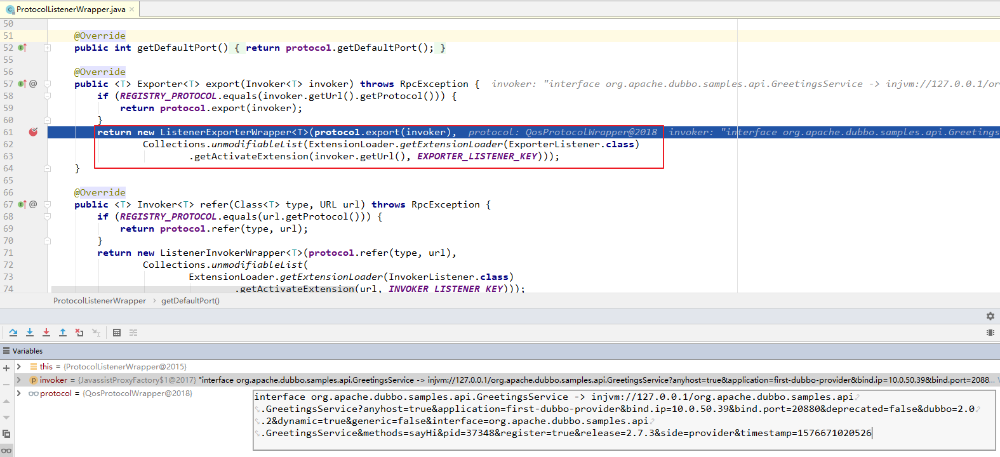

## 引言

研究源码是一个充满疑惑并且非常枯燥的过程，因为在研究的过程中可能很多你都看不懂，所以我们最好先带着问题去看源码，这样即使研究完后还是存在很多疑问，但是我们至少抓住了重点。

## 带着这些问题

1. 延时暴露和立即暴露。

2. 什么时候建立与注册中心的连接。

3. 服务提供者什么时候向注册中心注册服务。

4. 服务提供者与注册中心的心跳机制。

## 暴露总体过程

在详细研究服务暴露细节之前，我们先看一下整体 RPC 的暴露原理，如图 5-4。

从整体上看，Dubbo 框架做服务暴露分为两大部分，第一步将持有的服务实例通过代理转换成 Invoker，第二步把 Invoker 通过具体的协议（比如 Dubbo） 转换成 Exporter，框架做了这层抽象大大方便了功能扩展。这里的 Invoker 可以简单的理解成一个真实的服务对象实例，是 Dubbo 框架实体域，所有模型都会向它靠拢，可向他发起 invoke 调用。它可能是一个本地实现，也可能是一个远程实现，还可能是一个集群实现。


在正式研究源码之前有必要先说一下，笔者研究的源码基于 <code><font color="#de2c58">2.7.3</font></code> 版本的 <code><font color="#de2c58">dubbo-samples-api</font></code> 工程，不想自己搭 Demo 的朋友可以去 Dubbo 官网或者笔者的 [github](https://github.com/tiankaizhi/dubboSourceCodeAnalysis) 仓库去下载。

## 暴露入口

### ServiceConfig#export()

```java
public synchronized void export() {
    if (provider != null) {
        if (export == null) {
            export = provider.getExport();
        }
        if (delay == null) {
            delay = provider.getDelay();
        }
    }
    if (export != null && !export) {  // @1
        return;
    }

    if (delay != null && delay > 0) {  // @2
        delayExportExecutor.schedule(new Runnable() {
            @Override
            public void run() {
                doExport();
            }
        }, delay, TimeUnit.MILLISECONDS);
    } else {
        doExport();
    }
}
```

代码 @1 处判断是否暴露服务，根据 <code><font color="#de2c58"><dubbo:service export="true|false"></font></code> 设置

代码 ② 处如果 <code><font color="#de2c58">delay</font></code> 大于 0，表示延迟多少毫秒后暴露服务

延迟暴露采用的是 JDK 的 <code><font color="#de2c58">ScheduledExecutorService</font></code> 进行调度的。


延时调度机制触发时机是当 Spring 容器实例化 bean 完成，走到最后一步发布 <code><font color="#de2c58">ContextRefreshEvent</font></code> 事件的时候，<code><font color="#de2c58">ServiceBean </font></code> 会执行 <code><font color="#de2c58">onApplicationEvent</font></code> 方法，该方法调用 <code><font color="#f52814">ServiceConfig</font></code> 的 <code><font color="#de2c58">export</font></code> 方法。


### ServiceConfig#doExportUrls()

<code><font color="#de2c58">ServiceConfig</font></code> 的 <code><font color="#de2c58">export</font></code> 方法会调用 <code><font color="#de2c58">ServiceConfig</font></code> 的 <code><font color="#de2c58">doExport</font></code> 方法，到 319 行处。接下来调用 <code><font color="#de2c58">ServiceConfig</font></code> 的 <code><font color="#de2c58">doExportUrls</font></code> 正式开始暴露服务。


```java
@SuppressWarnings({"unchecked", "rawtypes"})
    private void doExportUrls() {

      // @1 加载所有的注册中心 URL 地址
      List<URL> registryURLs = loadRegistries(true);

      // @2 遍历所有协议, 按照协议依次向每个注册中心暴露服务
      for (ProtocolConfig protocolConfig : protocols) {
          doExportUrlsFor1Protocol(protocolConfig, registryURLs);
      }
  }
```

#### AbstractInterfaceConfig#loadRegistries(true)

调用父类的 loadRegistries(true) 方法

<code><font color="#de2c58">loadRegistries(true)</font></code>，参数 true 代表服务提供者，false 代表服务消费者，如果是服务提供者，则检测注册中心的配置，如果配置了 <code><font color="#de2c58">register="false"</font></code>，则忽略该地址，如果是服务消费者，并配置了 <code><font color="#de2c58">subscribe="false"</font></code> 则表示不从该注册中心订阅服务，故也不返回。如果没有显示指定的服务注册中心，则默认会使用全局配置的注册中心。

```java
    /**
     * 加载注册表并将其转换为{@link URL}，优先级顺序为：系统属性> dubbo注册表配置
     * Load the registry and conversion it to {@link URL}, the priority order is: system property > dubbo registry config
     *
     * 是否是提供方
     * @param provider whether it is the provider side
     * @return
     */
    protected List<URL> loadRegistries(boolean provider) {
        // 校验 RegistryConfig 配置数组。
        checkRegistry();
        List<URL> registryList = new ArrayList<URL>();
        if (registries != null && !registries.isEmpty()) {
            for (RegistryConfig config : registries) {
                // 获得注册中心的地址
                String address = config.getAddress();
                if (address == null || address.length() == 0) {
                    address = Constants.ANYHOST_VALUE;
                }
                String sysaddress = System.getProperty("dubbo.registry.address");  // 系统属性，优先级最高，可以覆盖
                if (sysaddress != null && sysaddress.length() > 0) {
                    address = sysaddress;
                }
                // 地址 address 是有效地址，包括 address != N/A ("N/A" 代表不配置注册中心)
                if (address.length() > 0 && !RegistryConfig.NO_AVAILABLE.equalsIgnoreCase(address)) {
                    Map<String, String> map = new HashMap<String, String>();
                    // 将各种配置对象，添加到 `map` 集合中。
                    appendParameters(map, application);
                    appendParameters(map, config);
                    // 添加 `path` `dubbo` `timestamp` `pid` 到 `map` 集合中。
                    map.put("path", RegistryService.class.getName());
                    map.put("dubbo", Version.getProtocolVersion());
                    map.put(Constants.TIMESTAMP_KEY, String.valueOf(System.currentTimeMillis()));
                    if (ConfigUtils.getPid() > 0) {
                        map.put(Constants.PID_KEY, String.valueOf(ConfigUtils.getPid()));
                    }
                    // 若不存在 `protocol` 参数，默认 "dubbo" 添加到 `map` 集合中。
                    if (!map.containsKey("protocol")) {
                        if (ExtensionLoader.getExtensionLoader(RegistryFactory.class).hasExtension("remote")) { // "remote" 可以忽略。因为，remote 这个拓展实现已经不存在。
                            map.put("protocol", "remote");
                        } else {
                            map.put("protocol", "dubbo");
                        }
                    }
                    // 解析地址，创建 Dubbo URL 数组。（数组大小可以为一）
                    List<URL> urls = UrlUtils.parseURLs(address, map);  // @1
                    // 循环 `url` ，设置 "registry" 和 "protocol" 属性。
                    for (URL url : urls) {
                        // 设置 `registry=${protocol}` 和 `protocol=registry` 到 URL
                        url = url.addParameter(Constants.REGISTRY_KEY, url.getProtocol());
                        // 添加到结果
                        url = url.setProtocol(Constants.REGISTRY_PROTOCOL);
                        if ((provider && url.getParameter(Constants.REGISTER_KEY, true)) // @2 服务提供者 && 注册
                                || (!provider && url.getParameter(Constants.SUBSCRIBE_KEY, true))) { // @3 服务消费者 && 订阅
                            registryList.add(url);
                        }
                    }
                }
            }
        }
        return registryList;
    }
```

代码 @1：<code><font color="#de2c58">address(true)</font></code> 可以使用 "|" 或者 ";" 作为分隔符，设置多个注册中心分组。注意，一个注册中心集群是一个分组，而不是多个。

这个方法从名字上很难看出具体的含义，看下图的注释，相信胖友能理解


代码 @2 ：若是服务提供者，判断是否只订阅不注册。如果是，不添加结果到 registryList 中。对应 [《Dubbo 用户指南 —— 只订阅》](http://dubbo.apache.org/zh-cn/docs/user/demos/subscribe-only.html) 文档。
第 54 行：若是服务消费者，判断是否只注册不订阅。如果是，不添加到结果 registryList 。对应 [《Dubbo 用户指南 —— 只注册》](http://dubbo.apache.org/zh-cn/docs/user/demos/registry-only.html) 文档。


我们看一下加载完的 <code><font color="#f52814">registryList</font></code> 值：


#### ServiceConfig#doExportUrlsFor1Protocol(protocolConfig, registryURLs)

加载完所有配置的注册中心 URL 之后，开始按照协议进行暴露。Dubbo 支持相同服务暴露多个协议。

我们看一下 <code><font color="#f52814">doExportUrlsFor1Protocol</font></code> 方法具体暴露逻辑，我们先看一下入参吧，分别是暴露协议和注册中心 URL


```java
private void doExportUrlsFor1Protocol(ProtocolConfig protocolConfig, List<URL> registryURLs) {
    String scope = url.getParameter(Constants.SCOPE_KEY);
    // don't export when none is configured
    if (!Constants.SCOPE_NONE.toString().equalsIgnoreCase(scope)) {

        // 本地暴露 (这里后面分析)
        // export to local if the config is not remote (export to remote only when config is remote)
        if (!Constants.SCOPE_REMOTE.toString().equalsIgnoreCase(scope)) {
            exportLocal(url);
        }
        // export to remote if the config is not local (export to local only when config is local)
        if (!Constants.SCOPE_LOCAL.toString().equalsIgnoreCase(scope)) {
            if (logger.isInfoEnabled()) {
                logger.info("Export dubbo service " + interfaceClass.getName() + " to url " + url);
            }
            if (registryURLs != null && !registryURLs.isEmpty()) {
                for (URL registryURL : registryURLs) {
                    // @1
                    url = url.addParameterIfAbsent(Constants.DYNAMIC_KEY, registryURL.getParameter(Constants.DYNAMIC_KEY));
                    // 获得监控中心 URL
                    URL monitorUrl = loadMonitor(registryURL);
                    if (monitorUrl != null) {
                        url = url.addParameterAndEncoded(Constants.MONITOR_KEY, monitorUrl.toFullString()); // @2
                    }
                    if (logger.isInfoEnabled()) {
                        logger.info("Register dubbo service " + interfaceClass.getName() + " url " + url + " to registry " + registryURL);
                    }

                    // For providers, this is used to enable custom proxy to generate invoker
                    String proxy = url.getParameter(Constants.PROXY_KEY);
                    if (StringUtils.isNotEmpty(proxy)) {
                        registryURL = registryURL.addParameter(Constants.PROXY_KEY, proxy);
                    }

                    // @3
                    // 根据具体实现类, 实现接口, 以及 registryUrl, 通过 ProxyFactory 将 DemoServiceImpl 封装成一个具体的本地执行的 Invoker
                    // invoker 是 DemoServiceImpl 的代理对象, 具体是怎样动态代理生成的？为什么传递的是注册中心的 URL 呢？后面会详细分析.
                    Invoker<?> invoker = proxyFactory.getInvoker(ref, (Class) interfaceClass, registryURL.addParameterAndEncoded(Constants.EXPORT_KEY, url.toFullString()));

                    // @4
                    DelegateProviderMetaDataInvoker wrapperInvoker = new DelegateProviderMetaDataInvoker(invoker, this);

                    // 核心代码 @5
                    // 使用 Protocol 将 invoker 封装成 Exporter
                    // 调用 Protocol 生成的适配类的 export 方法
                    Exporter<?> exporter = protocol.export(wrapperInvoker);
                    exporters.add(exporter);
                }
            } else {
                Invoker<?> invoker = proxyFactory.getInvoker(ref, (Class) interfaceClass, url);
                DelegateProviderMetaDataInvoker wrapperInvoker = new DelegateProviderMetaDataInvoker(invoker, this);

                Exporter<?> exporter = protocol.export(wrapperInvoker);
                exporters.add(exporter);
            }
        }
    }
}
```

代码 @1：<code><font color="#de2c58">dynamic</font></code> 配置项，服务是否动态注册。如果设为 **false** ，注册后将显示后 **disable** 状态，需人工启用，并且服务提供者停止时，也不会自动取消册，需人工禁用。

代码 @2：调用 <code><font color="#de2c58">URL#addParameterAndEncoded(key, value)</font></code> 方法，将监控中心的 URL 作为 <code><font color="#de2c58">monitor</font></code> 参数添加到服务提供者的 URL 中，并且需要编码。通过这样的方式，服务提供者的 URL 中，**包含了监控中心的配置**。

代码 @3：调用 <code><font color="#de2c58">URL#addParameterAndEncoded(key, value)</font></code> 方法，将服务体用这的 URL 作为 <code><font color="#de2c58">export</font></code> 参数添加到注册中心的 URL 中。通过这样的方式，注册中心的 URL 中，**包含了服务提供者的配置**。

代码 @3：调用 <code><font color="#de2c58">ProxyFactory#getInvoker(proxy, type, url)</font></code> 方法，创建 Invoker 对象。该 Invoker 对象，执行 #invoke(invocation) 方法时，内部会调用 Service 对象( ref )对应的调用方法。

代码 @4：创建 <code><font color="#de2c58">com.alibaba.dubbo.config.invoker.DelegateProviderMetaDataInvoker</font></code> 对象。该对象在 Invoker 对象的基础上，增加了当前服务提供者 ServiceConfig 对象

#### Protocol#export(invoker) 暴露服务

此处 Dubbo SPI 自适应的特性的好处就出来了，可以自动根据 URL 参数，获得对应的拓展实现。例如，invoker 传入后，根据 invoker.url 自动获得对应 Protocol 拓展实现为 DubboProtocol 。

实际上，Protocol 有两个 Wrapper 拓展实现类： ProtocolFilterWrapper、ProtocolListenerWrapper 。所以，#export(...) 方法的调用顺序是：

```java
Protocol$Adaptive => ProtocolFilterWrapper => ProtocolListenerWrapper => RegistryProtocol
=>
Protocol$Adaptive => ProtocolFilterWrapper => ProtocolListenerWrapper => DubboProtocol
```

也就是说，**这一条大的调用链，包含两条小的调用链**。原因是：

首先，传入的是注册中心的 URL ，通过 ```Protocol$Adaptive``` 获取到的是 RegistryProtocol 对象。
其次，RegistryProtocol 会在其 <code><font color="#de2c58">#export(...)</font></code> 方法中，使用服务提供者的 URL ( 即注册中心的 URL 的 <code><font color="#de2c58">export</font></code> 参数值)，再次调用 Protocol$Adaptive 获取到的是 DubboProtocol 对象，进行服务暴露。

为什么是这样的顺序？通过这样的顺序，可以实现类似 AOP 的效果，在本地服务器启动完成后，再向注册中心注册。伪代码如下：

```java
RegistryProtocol#export(...) {

    // 1. 启动本地服务器
    DubboProtocol#export(...);

    // 2. 向注册中心注册。
}
```

这也是为什么上文提到的 “为什么传递的是注册中心的 URL 呢？” 的原因。

## RegistryProtocol

**com.alibaba.dubbo.registry.integration.RegistryProtocol** ，实现 **Protocol** 接口，注册中心协议实现类。

看一下本文涉及到的 **Protocol**


> **友情提示，仅包含本文涉及的属性。**

```java
// ... 省略部分和本文无关的属性。

/**
 * 单例。在 Dubbo SPI 中，被初始化，有且仅有一次。
 */
private static RegistryProtocol INSTANCE;

/**
 * 绑定关系集合。
 *
 * key：服务 Dubbo URL
 */
// To solve the problem of RMI repeated exposure port conflicts, the services that have been exposed are no longer exposed.
// 用于解决 rmi 重复暴露端口冲突的问题，已经暴露过的服务不再重新暴露
// providerurl <--> exporter
private final Map<String, ExporterChangeableWrapper<?>> bounds = new ConcurrentHashMap<String, ExporterChangeableWrapper<?>>();

/**
 * Protocol 自适应拓展实现类，通过 Dubbo SPI 自动注入。
 */
private Protocol protocol;

/**
 * RegistryFactory 自适应拓展实现类，通过 Dubbo SPI 自动注入。
 */
private RegistryFactory registryFactory;

public RegistryProtocol() {
    INSTANCE = this;
}

public static RegistryProtocol getRegistryProtocol() {
    if (INSTANCE == null) {
        ExtensionLoader.getExtensionLoader(Protocol.class).getExtension(Constants.REGISTRY_PROTOCOL); // load
    }
    return INSTANCE;
}
```

+ <code><font color="#de2c58">INSTANCE</font></code> 静态属性，单例。通过 Dubbo SPI 加载创建，有且仅有一次。
  + <code><font color="#de2c58">#getRegistryProtocol()</font></code> 静态方法，获得单例。
+ <code><font color="#de2c58">bounds</font></code> 属性，绑定关系集合。其中，Key 为服务提供者 URL 。
+ <code><font color="#de2c58">protocol</font></code> 属性，Protocol 自适应拓展实现类，通过 Dubbo SPI 自动注入。
+ <code><font color="#de2c58">registryFactory</font></code> 属性，自适应拓展实现类，通过 Dubbo SPI 自动注入。
  + 用于创建注册中心 Registry 对象。

#export(invoker)


1

SPI 机制生成 protocol，SPI 机制会单独写一篇文章来解释

```java
/**
  * 具有自适应功能的 {@link协议} 实现在不同情况下会有所不同。
  * 具体的{@link协议}实现由{@link URL}中的协议属性确定。
  * 例如：
  * <li> 当 URL 为 Registry：//224.5.6.7：1234/org.apache.dubbo.registry.RegistryService？application = dubbo- sample 时，协议为 <b> RegistryProtocol </b> </li>
  * <li> 如果网址为dubbo：//224.5.6.7：1234/org.apache.dubbo.config.api.DemoService？application = dubbo- sample，则协议为 <b> DubboProtocol </b> </li>
  * <p>
  * 实际上，当 {@link ExtensionLoader} 初始化 {@link Protocol} 瞬间时，它将自动包装两层，并最终获得 <b> ProtocolFilterWrapper </b> 或 <b> ProtocolListenerWrapper </b>
  *
  * The {@link Protocol} implementation with adaptive functionality,it will be different in different scenarios.
  * A particular {@link Protocol} implementation is determined by the protocol attribute in the {@link URL}.
  * For example:
  *
  * <li>when the url is registry://224.5.6.7:1234/org.apache.dubbo.registry.RegistryService?application=dubbo-sample,
  * then the protocol is <b>RegistryProtocol</b></li>
  *
  * <li>when the url is dubbo://224.5.6.7:1234/org.apache.dubbo.config.api.DemoService?application=dubbo-sample, then
  * the protocol is <b>DubboProtocol</b></li>
  * <p>
  * Actually，when the {@link ExtensionLoader} init the {@link Protocol} instants,it will automatically wraps two
  * layers, and eventually will get a <b>ProtocolFilterWrapper</b> or <b>ProtocolListenerWrapper</b>
  */
  private static final Protocol protocol = ExtensionLoader.getExtensionLoader(Protocol.class).getAdaptiveExtension();
```
SPI 机制生成 PROXY_FACTORY

```java
/**
  *{@link ProxyFactory} 实现将生成导出的服务代理，JavassistProxyFactor是其实现
  *
  * A {@link ProxyFactory} implementation that will generate a exported service proxy,the JavassistProxyFactor is its
  * default implementation
  */
  private static final ProxyFactory PROXY_FACTORY = ExtensionLoader.getExtensionLoader(ProxyFactory.class).getAdaptiveExtension();
```


<code><font color="#f52814">ProtocolFilterWrapper</font></code> 是在生成 Invoker 的过滤器链

到这里有一个问题请大家思考一下：

即将要暴露的 <code><font color="#f52814"> Invoker </font></code> 是 injvm 协议的，而 protocol 也是 jvm 协议，这是怎么做到的。


RPC 协议


<code><font color="#d80532">buildInvokerChain</font></code> 之后，形成了一个过滤器链，从中可以看出 dubbo 默认的过滤器是 8 个。


到达 <code><font color="#d80532">InjvmProtocol</font></code>




```java
@Override
    public <T> Exporter<T> export(Invoker<T> invoker) throws RpcException {
        // Registry类型的 Invoker
        if (REGISTRY_PROTOCOL.equals(invoker.getUrl().getProtocol())) {
            return protocol.export(invoker);
        }

        //其他具体协议类型的 Invoker
        //先进行导出 protocol.export(invoker)
        //然后获取自适应的监听器
        //最后返回的是包装了监听器的 Exporter
        //这里监听器的获取是 getActivateExtension，如果指定了 listener 就加载实现，没有指定就不加载
        return new ListenerExporterWrapper<T>(protocol.export(invoker),  // @11
                Collections.unmodifiableList(ExtensionLoader.getExtensionLoader(ExporterListener.class)
                        .getActivateExtension(invoker.getUrl(), EXPORTER_LISTENER_KEY)));
    }
```


将 exporter 保存到 exporters 中


这条日志是很重要的


本地暴露到这里就结束了


按照协议 URL 一次暴露


```java
  if (CollectionUtils.isNotEmpty(registryURLs)) {  // @1
      for (URL registryURL : registryURLs) {
          //if protocol is only injvm ,not register
          if (LOCAL_PROTOCOL.equalsIgnoreCase(url.getProtocol())) {  // @2
              continue;
          }
          url = url.addParameterIfAbsent(DYNAMIC_KEY, registryURL.getParameter(DYNAMIC_KEY)); // @3
          URL monitorUrl = loadMonitor(registryURL); //@4
          if (monitorUrl != null) {
              url = url.addParameterAndEncoded(MONITOR_KEY, monitorUrl.toFullString());
          }
          if (logger.isInfoEnabled()) {
              logger.info("Register dubbo service " + interfaceClass.getName() + " url " + url + " to registry " + registryURL);
          }

          // For providers, this is used to enable custom proxy to generate invoker
          String proxy = url.getParameter(PROXY_KEY);
          if (StringUtils.isNotEmpty(proxy)) {
              registryURL = registryURL.addParameter(PROXY_KEY, proxy);
          }

          Invoker<?> invoker = PROXY_FACTORY.getInvoker(ref, (Class) interfaceClass, registryURL.addParameterAndEncoded(EXPORT_KEY, url.toFullString()));
          DelegateProviderMetaDataInvoker wrapperInvoker = new DelegateProviderMetaDataInvoker(invoker, this);

          Exporter<?> exporter = protocol.export(wrapperInvoker);
          exporters.add(exporter);
      }
  } else {
      Invoker<?> invoker = PROXY_FACTORY.getInvoker(ref, (Class) interfaceClass, url);
      DelegateProviderMetaDataInvoker wrapperInvoker = new DelegateProviderMetaDataInvoker(invoker, this);

      Exporter<?> exporter = protocol.export(wrapperInvoker);
      exporters.add(exporter);
  }
```

代码 @1：如果 scope 不为 remote，则先在本地暴露(injvm)，具体暴露服务的具体实现，将在 remote 模式中详细分析。

代码 @2：如果 scope 不为 local，则将服务暴露在远程。

代码 @3：remote 方式，检测当前配置的所有注册中心，如果注册中心不为空，则遍历注册中心，将服务依次在不同的注册中心进行注册。

代码 @4：如果 dubbo:service 的 dynamic 属性未配置， 尝试取 dubbo:registry 的 dynamic 属性，该属性的作用是否启用动态注册，如果设置为 false，服务注册后，其状态显示为 disable，需要人工启用，当服务不可用时，也不会自动移除，同样需要人工处理，此属性不要在生产环境上配置。

代码 @5：根据注册中心 url （注册中心 url），构建监控中心的 URL，如果监控中心 URL 不为空，则在服务提供者 URL 上追加 monitor，其值为监控中心 url (已编码)。


```java
/*
 * Licensed to the Apache Software Foundation (ASF) under one or more
 * contributor license agreements.  See the NOTICE file distributed with
 * this work for additional information regarding copyright ownership.
 * The ASF licenses this file to You under the Apache License, Version 2.0
 * (the "License"); you may not use this file except in compliance with
 * the License.  You may obtain a copy of the License at
 *
 *     http://www.apache.org/licenses/LICENSE-2.0
 *
 * Unless required by applicable law or agreed to in writing, software
 * distributed under the License is distributed on an "AS IS" BASIS,
 * WITHOUT WARRANTIES OR CONDITIONS OF ANY KIND, either express or implied.
 * See the License for the specific language governing permissions and
 * limitations under the License.
 */
package org.apache.dubbo.rpc;

import org.apache.dubbo.common.URL;
import org.apache.dubbo.common.extension.Adaptive;
import org.apache.dubbo.common.extension.SPI;

import static org.apache.dubbo.rpc.Constants.PROXY_KEY;

/**
 * ProxyFactory. (API/SPI, Singleton, ThreadSafe)
 */
@SPI("javassist")
public interface ProxyFactory {

    /**
     * create proxy.
     *
     * @param invoker
     * @return proxy
     */
    @Adaptive({PROXY_KEY})
    <T> T getProxy(Invoker<T> invoker) throws RpcException;

    /**
     * create proxy.
     *
     * @param invoker
     * @return proxy
     */
    @Adaptive({PROXY_KEY})
    <T> T getProxy(Invoker<T> invoker, boolean generic) throws RpcException;

    /**
     * create invoker.
     *
     * @param <T>
     * @param proxy
     * @param type
     * @param url
     * @return invoker
     */
    @Adaptive({PROXY_KEY})
    <T> Invoker<T> getInvoker(T proxy, Class<T> type, URL url) throws RpcException;

}
```


1
