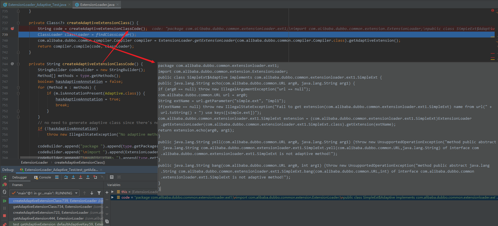

## 前言

## 扩展点自适应 @Adaptive 注解与适配器

@Adaptive 注解用来实现 Dubbo 的适配器功能，那什么是适配器呢？这里我们通过一个示例进行说明。Dubbo 中的 ExtensionFactory 接口有三个实现类，如下图所示，ExtensionFactory 接口上有 @SPI 注解，AdaptiveExtensionFactory 实现类上有 @Adaptive 注解。

@Adaptive 注解可以表示在类，接口，枚举和方法上，但是在整个Dubbo框架中，只有几个地方使用到了类级别上。其他都标注在方法上。如果标注在方法上，为方法级别注解，则可以通过参数动态获取实现类，这一点在自适应特性中已经说明。方法级别注解，在第一次getExtension时，会自动生成和编译一个动态的Adaptive类，从而达到动态实现类的效果。
例如：Protocol接口在export和refer两个接口上添加了@Adaptive注解。Dubbo在初始化扩展点时，会生成Protocol$Adaptive类，里面会实现两个方法，方法里会有一些抽象的通用逻辑，通过@Adaptive中传入的参数，找到并调用真正的实现类。和装饰器模式比较类似。

```java
@SPI("impl1")
public interface SimpleExt {
    String echo(URL url, String s);
}
```

```java
public class SimpleExtImpl1 implements SimpleExt {
    public String echo(URL url, String s) {
        return "Ext1Impl1-echo";
    }
}
```

```java
public class SimpleExtImpl2 implements SimpleExt {
    public String echo(URL url, String s) {
        return "Ext1Impl2-echo";
    }
}
```

```java
public class SimpleExtImpl3 implements SimpleExt {
    public String echo(URL url, String s) {
        return "Ext1Impl3-echo";
    }
}
```

```java
@Test
public void test_getAdaptiveExtension_defaultAdaptiveKey() throws Exception {
    {
        SimpleExt ext = ExtensionLoader.getExtensionLoader(SimpleExt.class).getAdaptiveExtension();

        Map<String, String> map = new HashMap<String, String>();
        URL url = new URL("p1", "1.2.3.4", 1010, "path1", map);

        String echo = ext.echo(url, "haha");
        System.out.println(echo);
    }
}
```

测试结果报错：

```java
java.lang.IllegalStateException: fail to create adaptive instance: java.lang.IllegalStateException: Can not create adaptive extension interface com.alibaba.dubbo.common.extensionloader.ext1.SimpleExt, cause: No adaptive method on extension com.alibaba.dubbo.common.extensionloader.ext1.SimpleExt, refuse to create the adaptive class!

	at com.alibaba.dubbo.common.extension.ExtensionLoader.getAdaptiveExtension(ExtensionLoader.java:448)
	at com.alibaba.dubbo.common.extensionloader.ExtensionLoader_Adaptive_Test.test_getAdaptiveExtension_defaultAdaptiveKey(ExtensionLoader_Adaptive_Test.java:59)
	at sun.reflect.NativeMethodAccessorImpl.invoke0(Native Method)
	at sun.reflect.NativeMethodAccessorImpl.invoke(NativeMethodAccessorImpl.java:62)
	at sun.reflect.DelegatingMethodAccessorImpl.invoke(DelegatingMethodAccessorImpl.java:43)
	at java.lang.reflect.Method.invoke(Method.java:498)
	at org.junit.runners.model.FrameworkMethod$1.runReflectiveCall(FrameworkMethod.java:50)
	at org.junit.internal.runners.model.ReflectiveCallable.run(ReflectiveCallable.java:12)
	at org.junit.runners.model.FrameworkMethod.invokeExplosively(FrameworkMethod.java:47)
	at org.junit.internal.runners.statements.InvokeMethod.evaluate(InvokeMethod.java:17)
	at org.junit.runners.ParentRunner.runLeaf(ParentRunner.java:325)
	at org.junit.runners.BlockJUnit4ClassRunner.runChild(BlockJUnit4ClassRunner.java:78)
	at org.junit.runners.BlockJUnit4ClassRunner.runChild(BlockJUnit4ClassRunner.java:57)
	at org.junit.runners.ParentRunner$3.run(ParentRunner.java:290)
	at org.junit.runners.ParentRunner$1.schedule(ParentRunner.java:71)
	at org.junit.runners.ParentRunner.runChildren(ParentRunner.java:288)
	at org.junit.runners.ParentRunner.access$000(ParentRunner.java:58)
	at org.junit.runners.ParentRunner$2.evaluate(ParentRunner.java:268)
	at org.junit.runners.ParentRunner.run(ParentRunner.java:363)
	at org.junit.runner.JUnitCore.run(JUnitCore.java:137)
	at com.intellij.junit4.JUnit4IdeaTestRunner.startRunnerWithArgs(JUnit4IdeaTestRunner.java:68)
	at com.intellij.rt.junit.IdeaTestRunner$Repeater.startRunnerWithArgs(IdeaTestRunner.java:33)
	at com.intellij.rt.junit.JUnitStarter.prepareStreamsAndStart(JUnitStarter.java:230)
	at com.intellij.rt.junit.JUnitStarter.main(JUnitStarter.java:58)
Caused by: java.lang.IllegalStateException: Can not create adaptive extension interface com.alibaba.dubbo.common.extensionloader.ext1.SimpleExt, cause: No adaptive method on extension com.alibaba.dubbo.common.extensionloader.ext1.SimpleExt, refuse to create the adaptive class!
	at com.alibaba.dubbo.common.extension.ExtensionLoader.createAdaptiveExtension(ExtensionLoader.java:725)
	at com.alibaba.dubbo.common.extension.ExtensionLoader.getAdaptiveExtension(ExtensionLoader.java:444)
	... 23 more
Caused by: java.lang.IllegalStateException: No adaptive method on extension com.alibaba.dubbo.common.extensionloader.ext1.SimpleExt, refuse to create the adaptive class!
	at com.alibaba.dubbo.common.extension.ExtensionLoader.createAdaptiveExtensionClassCode(ExtensionLoader.java:756)
	at com.alibaba.dubbo.common.extension.ExtensionLoader.createAdaptiveExtensionClass(ExtensionLoader.java:738)
	at com.alibaba.dubbo.common.extension.ExtensionLoader.getAdaptiveExtensionClass(ExtensionLoader.java:734)
	at com.alibaba.dubbo.common.extension.ExtensionLoader.createAdaptiveExtension(ExtensionLoader.java:723)
	... 24 more
```

getAdaptiveExtension() 作为入口 --> createAdaptiveExtension() --> getAdaptiveExtensionClass() -- > createAdaptiveExtensionClassCode()

```java
private Class<?> createAdaptiveExtensionClass() {
    String code = createAdaptiveExtensionClassCode();
    ClassLoader classLoader = findClassLoader();
    com.alibaba.dubbo.common.compiler.Compiler compiler = ExtensionLoader.getExtensionLoader(com.alibaba.dubbo.common.compiler.Compiler.class).getAdaptiveExtension();
    return compiler.compile(code, classLoader);
}
```

```java
private String createAdaptiveExtensionClassCode() {
        StringBuilder codeBuilder = new StringBuilder();
        Method[] methods = type.getMethods();
        boolean hasAdaptiveAnnotation = false;
        for (Method m : methods) {
            if (m.isAnnotationPresent(Adaptive.class)) {
                hasAdaptiveAnnotation = true;
                break;
            }
        }
        // no need to generate adaptive class since there's no adaptive method found.
        if (!hasAdaptiveAnnotation)
            throw new IllegalStateException("No adaptive method on extension " + type.getName() + ", refuse to create the adaptive class!");

        codeBuilder.append("package ").append(type.getPackage().getName()).append(";");
        codeBuilder.append("\nimport ").append(ExtensionLoader.class.getName()).append(";");
        codeBuilder.append("\npublic class ").append(type.getSimpleName()).append("$Adaptive").append(" implements ").append(type.getCanonicalName()).append(" {");

        for (Method method : methods) {
            Class<?> rt = method.getReturnType();
            Class<?>[] pts = method.getParameterTypes();
            Class<?>[] ets = method.getExceptionTypes();

            Adaptive adaptiveAnnotation = method.getAnnotation(Adaptive.class);
            StringBuilder code = new StringBuilder(512);
            if (adaptiveAnnotation == null) {
                code.append("throw new UnsupportedOperationException(\"method ")
                        .append(method.toString()).append(" of interface ")
                        .append(type.getName()).append(" is not adaptive method!\");");
            } else {
                int urlTypeIndex = -1;
                for (int i = 0; i < pts.length; ++i) {
                    if (pts[i].equals(URL.class)) {
                        urlTypeIndex = i;
                        break;
                    }
                }
                // found parameter in URL type
                if (urlTypeIndex != -1) {
                    // Null Point check
                    String s = String.format("\nif (arg%d == null) throw new IllegalArgumentException(\"url == null\");",
                            urlTypeIndex);
                    code.append(s);

                    s = String.format("\n%s url = arg%d;", URL.class.getName(), urlTypeIndex);
                    code.append(s);
                }
                // did not find parameter in URL type
                else {
                    String attribMethod = null;

                    // find URL getter method
                    LBL_PTS:
                    for (int i = 0; i < pts.length; ++i) {
                        Method[] ms = pts[i].getMethods();
                        for (Method m : ms) {
                            String name = m.getName();
                            if ((name.startsWith("get") || name.length() > 3)
                                    && Modifier.isPublic(m.getModifiers())
                                    && !Modifier.isStatic(m.getModifiers())
                                    && m.getParameterTypes().length == 0
                                    && m.getReturnType() == URL.class) {
                                urlTypeIndex = i;
                                attribMethod = name;
                                break LBL_PTS;
                            }
                        }
                    }
                    if (attribMethod == null) {
                        throw new IllegalStateException("fail to create adaptive class for interface " + type.getName()
                                + ": not found url parameter or url attribute in parameters of method " + method.getName());
                    }

                    // Null point check
                    String s = String.format("\nif (arg%d == null) throw new IllegalArgumentException(\"%s argument == null\");",
                            urlTypeIndex, pts[urlTypeIndex].getName());
                    code.append(s);
                    s = String.format("\nif (arg%d.%s() == null) throw new IllegalArgumentException(\"%s argument %s() == null\");",
                            urlTypeIndex, attribMethod, pts[urlTypeIndex].getName(), attribMethod);
                    code.append(s);

                    s = String.format("%s url = arg%d.%s();", URL.class.getName(), urlTypeIndex, attribMethod);
                    code.append(s);
                }

                String[] value = adaptiveAnnotation.value();
                // value is not set, use the value generated from class name as the key
                if (value.length == 0) {
                    char[] charArray = type.getSimpleName().toCharArray();
                    StringBuilder sb = new StringBuilder(128);
                    for (int i = 0; i < charArray.length; i++) {
                        if (Character.isUpperCase(charArray[i])) {
                            if (i != 0) {
                                sb.append(".");
                            }
                            sb.append(Character.toLowerCase(charArray[i]));
                        } else {
                            sb.append(charArray[i]);
                        }
                    }
                    value = new String[]{sb.toString()};
                }

                boolean hasInvocation = false;
                for (int i = 0; i < pts.length; ++i) {
                    if (pts[i].getName().equals("com.alibaba.dubbo.rpc.Invocation")) {
                        // Null Point check
                        String s = String.format("\nif (arg%d == null) throw new IllegalArgumentException(\"invocation == null\");", i);
                        code.append(s);
                        s = String.format("\nString methodName = arg%d.getMethodName();", i);
                        code.append(s);
                        hasInvocation = true;
                        break;
                    }
                }

                String defaultExtName = cachedDefaultName;
                String getNameCode = null;
                for (int i = value.length - 1; i >= 0; --i) {
                    if (i == value.length - 1) {
                        if (null != defaultExtName) {
                            if (!"protocol".equals(value[i]))
                                if (hasInvocation)
                                    getNameCode = String.format("url.getMethodParameter(methodName, \"%s\", \"%s\")", value[i], defaultExtName);
                                else
                                    getNameCode = String.format("url.getParameter(\"%s\", \"%s\")", value[i], defaultExtName);
                            else
                                getNameCode = String.format("( url.getProtocol() == null ? \"%s\" : url.getProtocol() )", defaultExtName);
                        } else {
                            if (!"protocol".equals(value[i]))
                                if (hasInvocation)
                                    getNameCode = String.format("url.getMethodParameter(methodName, \"%s\", \"%s\")", value[i], defaultExtName);
                                else
                                    getNameCode = String.format("url.getParameter(\"%s\")", value[i]);
                            else
                                getNameCode = "url.getProtocol()";
                        }
                    } else {
                        if (!"protocol".equals(value[i]))
                            if (hasInvocation)
                                getNameCode = String.format("url.getMethodParameter(methodName, \"%s\", \"%s\")", value[i], defaultExtName);
                            else
                                getNameCode = String.format("url.getParameter(\"%s\", %s)", value[i], getNameCode);
                        else
                            getNameCode = String.format("url.getProtocol() == null ? (%s) : url.getProtocol()", getNameCode);
                    }
                }
                code.append("\nString extName = ").append(getNameCode).append(";");
                // check extName == null?
                String s = String.format("\nif(extName == null) " +
                                "throw new IllegalStateException(\"Fail to get extension(%s) name from url(\" + url.toString() + \") use keys(%s)\");",
                        type.getName(), Arrays.toString(value));
                code.append(s);

                s = String.format("\n%s extension = (%<s)%s.getExtensionLoader(%s.class).getExtension(extName);",
                        type.getName(), ExtensionLoader.class.getSimpleName(), type.getName());
                code.append(s);

                // return statement
                if (!rt.equals(void.class)) {
                    code.append("\nreturn ");
                }

                s = String.format("extension.%s(", method.getName());
                code.append(s);
                for (int i = 0; i < pts.length; i++) {
                    if (i != 0)
                        code.append(", ");
                    code.append("arg").append(i);
                }
                code.append(");");
            }

            codeBuilder.append("\npublic ").append(rt.getCanonicalName()).append(" ").append(method.getName()).append("(");
            for (int i = 0; i < pts.length; i++) {
                if (i > 0) {
                    codeBuilder.append(", ");
                }
                codeBuilder.append(pts[i].getCanonicalName());
                codeBuilder.append(" ");
                codeBuilder.append("arg").append(i);
            }
            codeBuilder.append(")");
            if (ets.length > 0) {
                codeBuilder.append(" throws ");
                for (int i = 0; i < ets.length; i++) {
                    if (i > 0) {
                        codeBuilder.append(", ");
                    }
                    codeBuilder.append(ets[i].getCanonicalName());
                }
            }
            codeBuilder.append(" {");
            codeBuilder.append(code.toString());
            codeBuilder.append("\n}");
        }
        codeBuilder.append("\n}");
        if (logger.isDebugEnabled()) {
            logger.debug(codeBuilder.toString());
        }
        return codeBuilder.toString();
    }
```


在 SimpleExt 接口的 echo 方法上加上 @Adaptive 注解再执行一次测试用例得到如下结果：

```java
Ext1Impl1-echo
```

```java
public class SimpleExt$Adaptive implements com.alibaba.dubbo.common.extensionloader.ext1.SimpleExt {
    public java.lang.String bang(com.alibaba.dubbo.common.URL arg0, int arg1) {
        throw new UnsupportedOperationException("method public abstract java.lang.String com.alibaba.dubbo.common.extensionloader.ext1.SimpleExt.bang(com.alibaba.dubbo.common.URL,int) of interface com.alibaba.dubbo.common.extensionloader.ext1.SimpleExt is not adaptive method!");
    }
    public java.lang.String yell(com.alibaba.dubbo.common.URL arg0, java.lang.String arg1) {throw new UnsupportedOperationException("method public abstract java.lang.String com.alibaba.dubbo.common.extensionloader.ext1.SimpleExt.yell(com.alibaba.dubbo.common.URL,java.lang.String) of interface com.alibaba.dubbo.common.extensionloader.ext1.SimpleExt is not adaptive method!");
    }
    public java.lang.String echo(com.alibaba.dubbo.common.URL arg0, java.lang.String arg1) {
        if (arg0 == null) throw new IllegalArgumentException("url == null");
        com.alibaba.dubbo.common.URL url = arg0;
        String extName = url.getParameter("simple.ext", "impl1");
        if(extName == null) throw new IllegalStateException("Fail to get extension(com.alibaba.dubbo.common.extensionloader.ext1.SimpleExt) name from url(" + url.toString() + ") use keys([simple.ext])");
        com.alibaba.dubbo.common.extensionloader.ext1.SimpleExt extension = (com.alibaba.dubbo.common.extensionloader.ext1.SimpleExt)ExtensionLoader.getExtensionLoader(com.alibaba.dubbo.common.extensionloader.ext1.SimpleExt.class).getExtension(extName);
        return extension.echo(arg0, arg1);
    }
}
```


