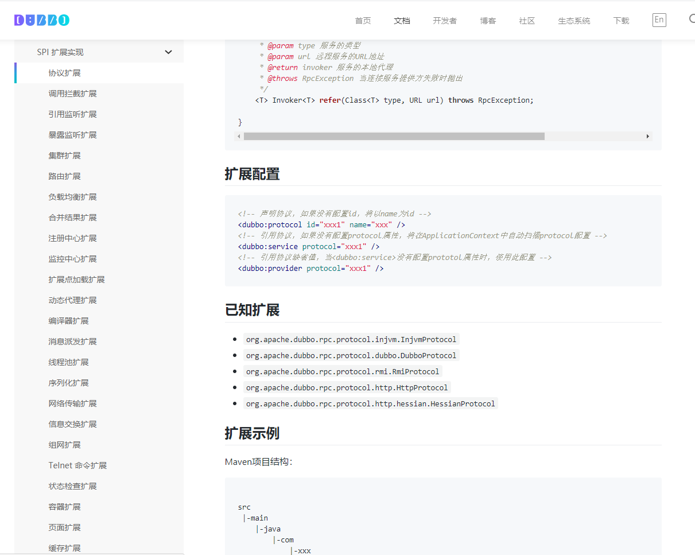
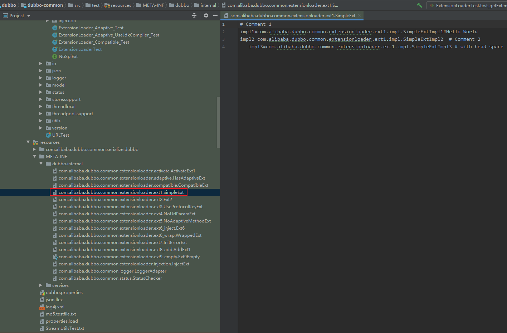

## 前言

在聊 Dubbo 的 SPI 之前，对 SPI 机制还不是很了解的小伙伴可以先简单了解一下 JDK 的 SPI 机制。

在 Dubbo 中，SPI 是一个非常重要的模块，贯穿整个 Dubbo 框架，以下模块的扩展都是基于 SPI 机制实现的。其实 SPI 用一句话概括就是在程序运行时，动态为接口根据条件生成对应的实现类。




Dubbo 并未使用 Java SPI，而是重新实现了一套功能更强的 SPI 机制。Dubbo SPI 的相关逻辑被封装在了 ExtensionLoader 类中，通过 ExtensionLoader，我们可以加载指定的实现类。Dubbo SPI 所需的配置文件需放置在 META-INF/dubbo 路径下，配置内容如下。

## Dubbo SPI 示例




接口
```Java
@SPI
public interface SimpleExt {
    // @Adaptive example, do not specify a explicit key.

    String echo(URL url, String s);


    String yell(URL url, String s);

    // no @Adaptive
    String bang(URL url, int i);
}
```

实现类一
```Java
public class SimpleExtImpl1 implements SimpleExt {
    public String echo(URL url, String s) {
        return "Ext1Impl1-echo";
    }

    public String yell(URL url, String s) {
        return "Ext1Impl1-yell";
    }

    public String bang(URL url, int i) {
        return "bang1";
    }
}
```

实现类二
```Java
public class SimpleExtImpl2 implements SimpleExt {
    public String echo(URL url, String s) {
        return "Ext1Impl2-echo";
    }

    public String yell(URL url, String s) {
        return "Ext1Impl2-yell";
    }

    public String bang(URL url, int i) {
        return "bang2";
    }

}
```

实现类三
```Java
public class SimpleExtImpl3 implements SimpleExt {
    public String echo(URL url, String s) {
        return "Ext1Impl3-echo";
    }

    public String yell(URL url, String s) {
        return "Ext1Impl3-yell";
    }

    public String bang(URL url, int i) {
        return "bang3";
    }

}
```

测试用例：
```Java
@Test
public void test_getExtension() throws Exception {
    System.out.println(ExtensionLoader.getExtensionLoader(SimpleExt.class).getExtension("impl1").echo(new URL("","",9001),""));
    System.out.println(ExtensionLoader.getExtensionLoader(SimpleExt.class).getExtension("impl2").echo(new URL("","",9001),""));
}
```

测试结果：
```
Ext1Impl1-echo
Ext1Impl2-echo
```

接下来对 Dubbo SPI 机制进行源码分析，在源码分析的过程中会对提到 Dubbo 相对于 JDK SPI 方式的优点的地方，希望能加深两种 SPI 方式的理解

```Java
public T getExtension(String name) {
    if (name == null || name.length() == 0)
        throw new IllegalArgumentException("Extension name == null");
    if ("true".equals(name)) {
        // 获取默认的拓展实现类
        return getDefaultExtension();
    }
    // Holder，顾名思义，用于持有目标对象
    Holder<Object> holder = cachedInstances.get(name);
    if (holder == null) {
        cachedInstances.putIfAbsent(name, new Holder<Object>());
        holder = cachedInstances.get(name);
    }
    Object instance = holder.get();
    if (instance == null) {
        synchronized (holder) {
            instance = holder.get();
            if (instance == null) {
                // 创建拓展实例
                instance = createExtension(name);
                // 设置实例到 holder 中
                holder.set(instance);
            }
        }
    }
    return (T) instance;
}
```

```Java
private T createExtension(String name) {
    // 从配置文件中加载所有的拓展类，可得到“配置项名称”到“配置类”的映射关系表
    Class<?> clazz = getExtensionClasses().get(name); // @1
    if (clazz == null) {
        throw findException(name);
    }
    try {
        T instance = (T) EXTENSION_INSTANCES.get(clazz);
        if (instance == null) {
            // 通过反射创建实例
            EXTENSION_INSTANCES.putIfAbsent(clazz, clazz.newInstance());  //@2
            instance = (T) EXTENSION_INSTANCES.get(clazz);
        }
        // 向实例中注入依赖
        injectExtension(instance); // @3
        Set<Class<?>> wrapperClasses = cachedWrapperClasses;
        if (wrapperClasses != null && !wrapperClasses.isEmpty()) {
            // 循环创建 Wrapper 实例
            for (Class<?> wrapperClass : wrapperClasses) {
                // 将当前 instance 作为参数传给 Wrapper 的构造方法，并通过反射创建 Wrapper 实例。
                // 然后向 Wrapper 实例中注入依赖，最后将 Wrapper 实例再次赋值给 instance 变量
                instance = injectExtension(
                    (T) wrapperClass.getConstructor(type).newInstance(instance));
            }
        }
        return instance;
    } catch (Throwable t) {
        throw new IllegalStateException("...");
    }
}
```

createExtension() 方法的逻辑稍复杂一下，包含了如下的步骤：

1. 通过 getExtensionClasses() 获取所有的拓展类
2. 通过反射创建拓展对象
3. 向拓展对象中注入依赖
4. 将拓展对象包裹在相应的 Wrapper 对象中

以上步骤中，第一个步骤是加载拓展类的关键，第三和第四个步骤是 Dubbo IOC 与 AOP 的具体实现。在接下来的章节中，将会重点分析 getExtensionClasses() 方法的逻辑，以及简单介绍 Dubbo IOC 的具体实现。

## 获取所有的拓展类

我们在通过名称获取拓展类之前，首先需要根据配置文件解析出拓展项名称到拓展类的映射关系表（Map<名称, 拓展类>），之后再根据拓展项名称从映射关系表中取出相应的拓展类即可。相关过程的代码分析如下：

```Java
private Map<String, Class<?>> getExtensionClasses() {
    // 从缓存中获取已加载的拓展类
    Map<String, Class<?>> classes = cachedClasses.get();
    // 双重检查
    if (classes == null) {
        synchronized (cachedClasses) {
            classes = cachedClasses.get();
            if (classes == null) {
                // 加载拓展类
                classes = loadExtensionClasses();
                cachedClasses.set(classes);
            }
        }
    }
    return classes;
}
```

这里也是先检查缓存，若缓存未命中，则通过 loadExtensionClasses 加载拓展类。下面分析 loadExtensionClasses 方法的逻辑。

```Java
private Map<String, Class<?>> loadExtensionClasses() {
    // 获取 SPI 注解，这里的 type 变量是在调用 getExtensionLoader 方法时传入的
    final SPI defaultAnnotation = type.getAnnotation(SPI.class);
    if (defaultAnnotation != null) {
        String value = defaultAnnotation.value();
        if ((value = value.trim()).length() > 0) {
            // 对 SPI 注解内容进行切分
            String[] names = NAME_SEPARATOR.split(value);
            // 检测 SPI 注解内容是否合法，不合法则抛出异常
            if (names.length > 1) {
                throw new IllegalStateException("more than 1 default extension name on extension...");
            }

            // 设置默认名称，参考 getDefaultExtension 方法
            if (names.length == 1) {
                cachedDefaultName = names[0];
            }
        }
    }

    Map<String, Class<?>> extensionClasses = new HashMap<String, Class<?>>();
    // 加载指定文件夹下的配置文件
    loadDirectory(extensionClasses, DUBBO_INTERNAL_DIRECTORY);
    loadDirectory(extensionClasses, DUBBO_DIRECTORY);
    loadDirectory(extensionClasses, SERVICES_DIRECTORY);
    return extensionClasses;
}
```

loadExtensionClasses 方法总共做了两件事情，一是对 SPI 注解进行解析，二是调用 loadDirectory 方法加载 **指定文件夹** 配置文件。SPI 注解解析过程比较简单，无需多说。loadDirectory 也不再赘述。

到这里 interface 所有的扩展类 class 都生成完毕，并且以 Map 的形式都缓存到
```Java
private final Holder<Map<String, Class<?>>> cachedClasses = new Holder<Map<String, Class<?>>>();
```
中，其中 Map 的 key 是 配置文件中 key 部分，value 部分则是具体实现类的 Class 对象。

@2 步根据 Class 对象创建了一个对象，并将其缓存到
```Java
private static final ConcurrentMap<Class<?>, Object> EXTENSION_INSTANCES = new ConcurrentHashMap<Class<?>, Object>();
```
里面。

@3 步就是 Dubbo 的自动注入部分，也就是 Dubbo 的 IOC 容器部分，将上一步生成的 instance 实例所需的属性注入进去

Dubbo IOC 是通过 setter 方法注入依赖。Dubbo 首先会通过反射获取到实例的所有方法，然后再遍历方法列表，检测方法名是否具有 setter 方法特征。若有，则通过 ObjectFactory 获取依赖对象，最后通过反射调用 setter 方法将依赖设置到目标对象中。整个过程对应的代码如下：

```Java
private T injectExtension(T instance) {
    try {
        if (objectFactory != null) {
            // 遍历目标类的所有方法
            for (Method method : instance.getClass().getMethods()) {
                // 检测方法是否以 set 开头，且方法仅有一个参数，且方法访问级别为 public
                if (method.getName().startsWith("set")
                    && method.getParameterTypes().length == 1
                    && Modifier.isPublic(method.getModifiers())) {
                    // 获取 setter 方法参数类型
                    Class<?> pt = method.getParameterTypes()[0];
                    try {
                        // 获取属性名，比如 setName 方法对应属性名 name
                        String property = method.getName().length() > 3 ?
                            method.getName().substring(3, 4).toLowerCase() +
                            	method.getName().substring(4) : "";
                        // 从 ObjectFactory 中获取依赖对象
                        Object object = objectFactory.getExtension(pt, property);
                        if (object != null) {
                            // 通过反射调用 setter 方法设置依赖
                            method.invoke(instance, object);
                        }
                    } catch (Exception e) {
                        logger.error("fail to inject via method...");
                    }
                }
            }
        }
    } catch (Exception e) {
        logger.error(e.getMessage(), e);
    }
    return instance;
}
```

在上面代码中，objectFactory 变量的类型为 AdaptiveExtensionFactory，AdaptiveExtensionFactory 内部维护了一个 ExtensionFactory 列表，用于存储其他类型的 ExtensionFactory。Dubbo 目前提供了两种 ExtensionFactory，分别是 SpiExtensionFactory 和 SpringExtensionFactory。前者用于创建自适应的拓展，后者是用于从 Spring 的 IOC 容器中获取所需的拓展。这两个类的类的代码不是很复杂，这里就不一一分析了。

Dubbo IOC 目前仅支持 setter 方式注入，总的来说，逻辑比较简单易懂。

## 总结

本篇文章简单分别介绍了 Java SPI 与 Dubbo SPI 用法，并对 Dubbo SPI 的加载拓展类的过程进行了分析。另外，在 Dubbo SPI 中还有一块重要的逻辑这里没有进行分析，即 Dubbo SPI 的扩展点自适应机制。该机制的逻辑较为复杂，我们将会在下一篇文章中进行详细的分析。

好了，本篇文章就先到这里了。如果文章中有错误不妥之处，欢迎大家提 issue 进行反馈，或者提 pull request 进行修正。让我们携手共建 Dubbo 社区。
