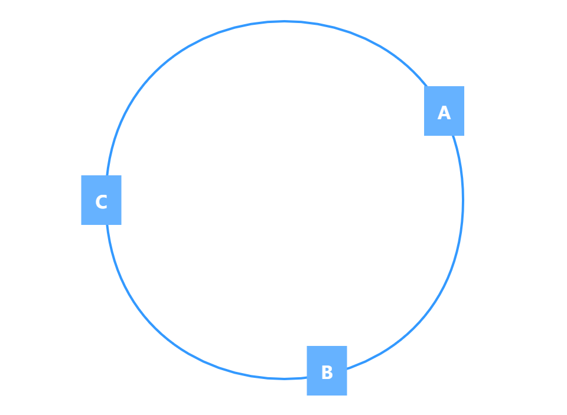
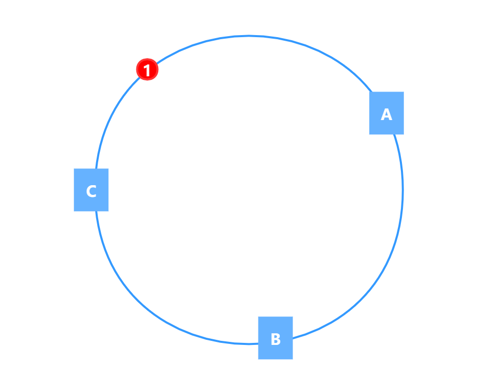
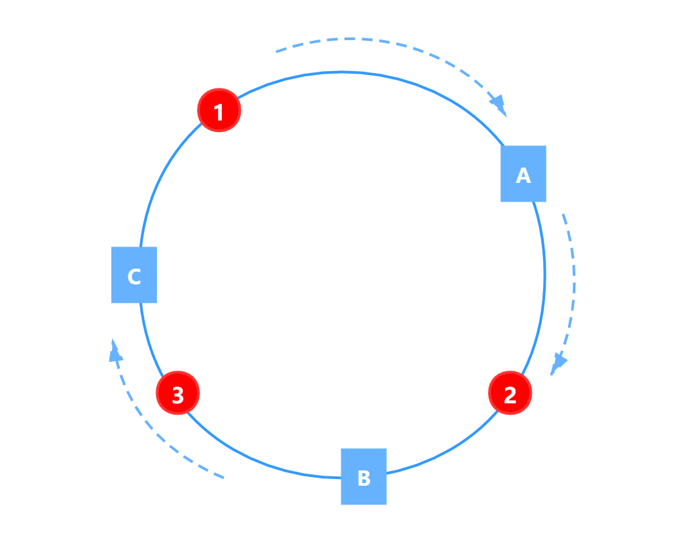
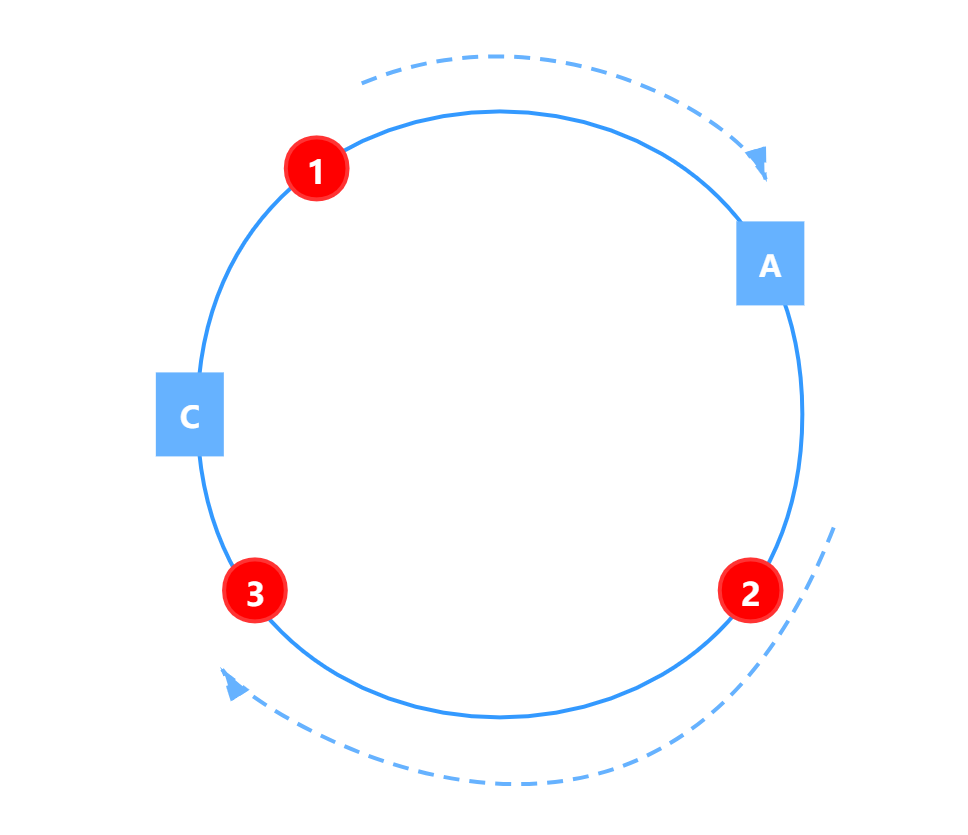
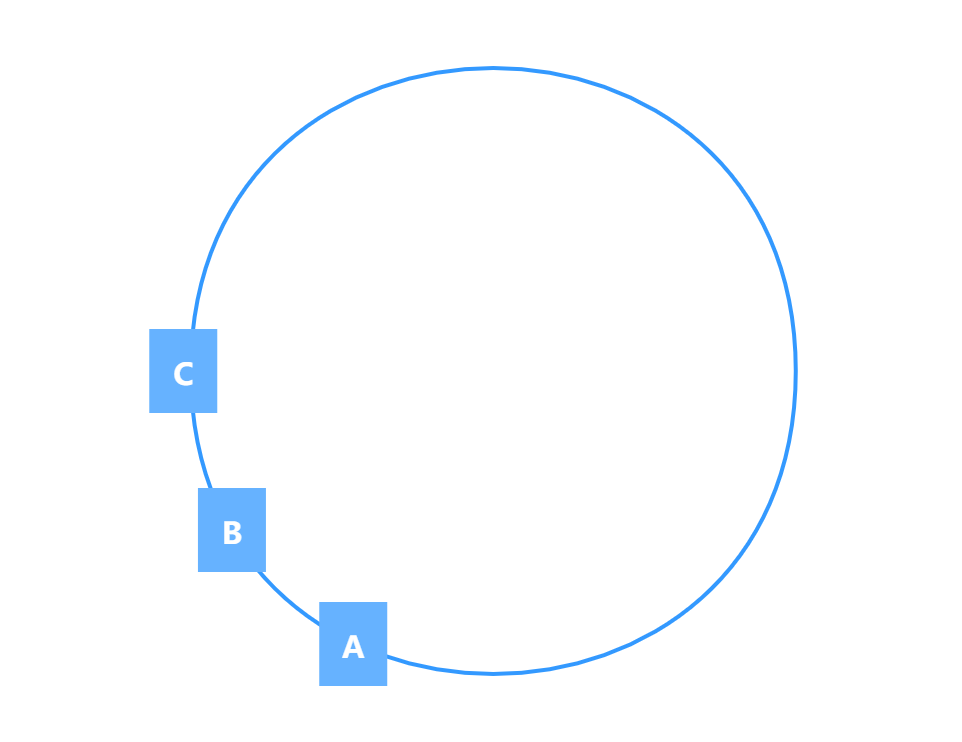
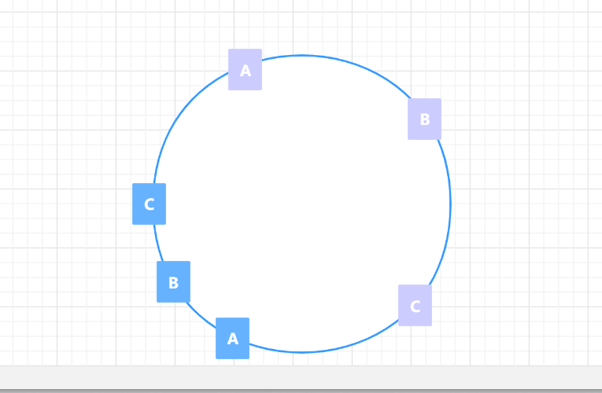

## 应用场景

一致性哈希算法主要应用于 **缓存系统的负载均衡** 和 **各类 RPC 框架的请求的负载均衡**。

对于一个缓存集群而言，假设集群有 N 个节点，如何将大量需要缓存数据均匀的缓存到 N 个节点上。

传统的哈希方式直接使用哈希算法，然后对集群节点数量取模，类似于如下公式：

```java
index = hash(key) % N
```

采用传统哈希方式有一个缺点：当集群节点数量发生变化的时候，即集群扩容或者缩容会导致大量缓存失效。

比如，刚开始集群有 3 个节点，因为数据量越来越多，增加了 1 个节点，那么集群节点的数量由 3 变成了 4，此时，如果有一个查询请求，根据原有资源的 key 进行 hash 后对 4 进行取模得到的节点位置已经发生了变化，无法获取原来节点的缓存数据，从而导致大量缓存失效的问题。

类似的，对于 RPC 框架处理请求的负载均衡策略也是类似，目的是保证相同的请求尽可能落到同一个服务器上，同时提供服务的集群节点数量变化的时候也要尽量保证大部分请求的服务器不发生改变。

## 一致性哈希算法

实际上，一致性哈希算法也是采用取模的方式，但是和普通哈希不同的地方在于一致性哈希算法是对 2^32 取模。算法模型是将 2^32 个点组成的一个圆称作哈希环。以缓存集群为例，假设我们有 3 台缓存服务器，节点 A、节点 B、节点 C，我们取各自的 IP 地址进行哈希计算得出的结果对 2^32 取模，类似于如下公式：

```java
hash(ip(A)) %  2^32
```

得到的结果是介于 0 到 2^32-1 之间的一个数，这个数就代表节点 A 在哈希环上的位置，B 和 C 同理，如图：


然后，根据相同的工时，将需要缓存的数据映射到哈希环上。

```java
hash(k) %  2^32
```

得到在哈希环上的一个位置，如图所示：



下面就是一致性哈希算法采用的存储方式了，从 1 位置开始，沿顺时针方向的第一个节点 A 就是存放 1 的节点。

假设有 1，2，3 共三个数据，如图所示：



数据 1 落到节点 A 上，数据 2 落到节点 B 上，数据 3 落到节点 C 上。

那么，到这里一致性哈希的方式和传统的哈希并无太大区别，只不过是 N 的数量更大而已，那么一致性哈希采取这种模拟一个圆环的方式的目的在哪儿呢？

## 一致性 Hash 算法如何解决集群节点扩容和缩容带来的问题

假设，节点 B 宕机了，如图：



B 宕机后，数据 2 会被缓存到节点 C 中，缓存位置发生了改变。

但是，数据 1 和 3 仍然会被缓存到节点 C 中，位置保持不变，这就是一致性哈希算法的优点。

## 哈希环的偏斜

上文中，我们假设的是 3 个节点均匀的分布到了哈希环上，但是实际情况可能是这样：



如果集群节点分布如上图所示，那么大部分缓存数据可能都集中在 A 节点上，如果 A 宕机，极端情况下，可能导致缓存雪崩。上面节点分配不均匀的情况称之为哈希环的偏斜。

### 如何解决哈希环倾斜？

哈希倾斜的问题是由于节点分布不均匀导致的，那么要解决这个问题首先想到的就是让集群节点分布均匀，一致性哈希算法中使用引入 “虚拟节点” 解决了这个问题。

假设现在 A 节点的 IP 地址是：```192.168.1.3```，那么 A 在哈希环上的位置是 ```hash("192.168.1.3") %  2^32```，虚拟节点的位置是：

```java
hash("192.168.1.3#Copy1") % 2^32
hash("192.168.1.3#Copy2") % 2^32
hash("192.168.1.3#Copy3") % 2^32
......
```

这些由实际节点虚拟复制而来的节点被称为 "虚拟节点"，即对每一个服务节点计算多个哈希，每个计算结果位置都放置一个此服务节点，称为虚拟节点。具体做法可以在服务器IP或主机名的后面增加编号来实现。

如上图所示，假如 服务器1 的 IP 是 192.168.32.132，那么原 服务器1 节点在环形空间的位置就是hash("192.168.32.132") % 2^32。

我们基于 服务器1 构建两个虚拟节点，Server1-A 和 Server1-B，虚拟节点在环形空间的位置可以利用（IP+后缀）计算，例如：


解决hash环偏斜的方法其实就是最好能让这 3 台服务器尽量多的、均匀的出现在 hash 环上，但是，真实的服务器资源只有 3 台，我们怎样凭空的让它们多起来呢，没错，就是凭空的让服务器节点多起来，既然没有多余的真正的物理服务器节点，我们就只能将现有的物理节点通过虚拟的方法复制出来，这些由实际节点虚拟复制而来的节点被称为"虚拟节点"。加入虚拟节点以后的hash环如下。



"虚拟节点"是"实际节点"（实际的物理服务器）在hash环上的复制品,一个实际节点可以对应多个虚拟节点。

从上图可以看出，A、B、C三台服务器分别虚拟出了一个虚拟节点，当然，如果你需要，也可以虚拟出更多的虚拟节点。引入虚拟节点的概念后，缓存的分布就均衡多了，上图中，1号、3号图片被缓存在服务器A中，5号、4号图片被缓存在服务器B中，6号、2号图片被缓存在服务器C中，如果你还不放心，可以虚拟出更多的虚拟节点，以便减小hash环偏斜所带来的影响，虚拟节点越多，hash环上的节点就越多，缓存被均匀分布的概率就越大。

到这里，一致性哈希算法的原理基本就说完了。


1
