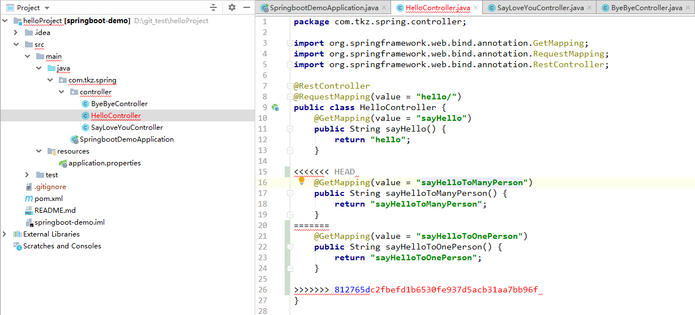

## 前言

原本 Git 的使用是不需要专门写一篇文章来记录的，但是最近在使用的时候频频出错，究其根本是因为对 Git 的很多 **<font color="#e50e0e">概念理解的不够清楚</font>** ，考虑再三还是以博客的形式记录下来方便自己查看，也可供大家参考。

## Git 工作流程


从图中可以看到 Git 整个工作流程基本涉及到 **Workspace（工作区）、Index / Stage（暂存区）、Repository（本地仓库）、Remote（远程仓库）** 四个组成部分，下面的有关 Git 的所有介绍都是基于这四个部分。

### 克隆项目到本地仓库

#### git clone

```bash
git clone git@github.com:tiankaizhi/helloProject.git
```


这个 **.git** 目录，就是你的 **本地仓库（Local Repository）**，所有版本信息都会存在这里。而 **.git** 所在的这个根目录，称为 Git 的 **工作目录（Working Directory）**，它保存了你当前从仓库中 <code><font color="#f52814">checkout</font></code> 的内容。

> **<font color="#e50e0e">小贴士：</font>**
><code><font color="#f52814">git clone</font></code> 命令默认克隆所有分支，如果要克隆指定分支，使用 <code><font color="#f52814">git clone -b branchName ssh/http</font></code>。

#### git log（仓库提交历史）

现在你在项目的目录下输入：

```bash
git log
```


在这里你只能看到一个提交，这个提交是 GitHub 帮你做的，它的内容是创建初始 README.md 文件。图中第一行中的 <code><font color="#f52814">commit</font></code> 右边的那一大串字符 ```e6f0f87a123bba989821b460b62dbc775f2859d0```，是这个 <code><font color="#f52814">commit</font></code> 的 SHA-1 校验和（如果不知道什么是 SHA-1，你可以暂时把它简单理解为这个 <code><font color="#f52814">commit</font></code> 的 ID）；后面括号里的内容 <code><font color="#f52814">HEAD -> master</font></code>, <code><font color="#f52814">origin/master</font></code>, <code><font color="#f52814">origin/HEAD</font></code> 稍后再讲；第二行，第三行和第四行，依次是这个 <code><font color="#f52814">commit</font></code> 的作者、提交日期和提交信息，其中提交信息记录了这个提交做了什么，是提交者填写的（当然，```Initial commit``` 这条提交信息是 GitHub 帮你写的）。

### 新建一个项目项目并提交代码

新建一个 SpringBoot 项目将其代码复制到 helloProject 目录下。


#### git status

<code><font color="#f52814">git status</font></code> 命令用于显示 ```工作空间``` 和 ```暂存区``` 的状态。使用此命令能看到那些修改被暂存到了, 哪些没有, 哪些文件没有被 Git ```tracked``` 到。

>注意：<code><font color="#f52814">git status</font></code> 不显示已经 <code><font color="#f52814">commit</font></code> 到 ```本地从仓库``` 文件信息。


这段文字表述了很多项信息：

1. ```on branch master``` 表示：当前你处在 <code><font color="#f52814">master</font></code> 分支
2. ```Your branch is up to date with 'origin/master'.``` 表示：当前分支（也就是 <code><font color="#f52814">master</font></code> 分支） 没有落后于 <code><font color="#f52814">origin/master</font></code>。
3. ```untracked files``` 表示：文件名分别是 .gitignore，pom.xml，src/ 这 3 个文件并未被 Git 管理。
4. 你可以使用 <code><font color="#f52814">git add</font></code> 来开始追踪文件。

> **<font color="#e50e0e">小贴士：</font>**
><code><font color="#f52814">origin/master</font></code> 的中的 <code><font color="#f52814">origin</font></code> 是远程仓库的名称，是你在用 <code><font color="#f52814">git clone</font></code> 指令初始化本地仓库时 Git 自动帮你起的默认名称；<code><font color="#f52814">master</font></code> 是 <code><font color="#f52814">origin</font></code> 上的分支名称。

从上面的信息可以看出，.gitignore，pom.xml，src/ 这 3 个文件目前属于 ```untracked``` 状态，它的意思是 Git 仓库对它没有进行任何记录，你在提交的时候不会把它提交上去，查看提交历史也不会看到它。总之，对于 Git 仓库来说，它是不存在的。

而你现在想提交这个文件，所以首先，你需要用 <code><font color="#f52814">git add</font></code> 指令来让 Git 开始跟踪它。

#### git add

先添加一个 pom.xml 文件，然后运行 <code><font color="#f52814">git status</font></code> 看一下加入暂存区的和未加入暂存区的有什么区别。

```bash
git add pom.xml
```


可以看到，pom.xml 的文字变成了绿色，它的前面多了 ```「new file:」``` 的标记，而它的描述也从 ```Untracked files``` 变成了 ```Changes to be commited```。这些都说明一点：pom.xml 这个文件的状态从 ```untracked（未跟踪）``` 变成了 ```staged（已暂存）```，意思是这个文件中被改动的部分（也就是这整个文件啦）被记录进了 ```staging area（暂存区）```。

这里我们应该能看出来已经放入暂存区的文件和未被 tracked 文件的区别了。接下来，我们把 ```src/``` 文件也放入暂存区。


#### git commit

将暂存区中的文件提交到本地仓库。

```bash
git commit -m"springboot 框架搭建完毕，首次 commit"
```


从图中 ```Your branch is ahead of 'origin/master' by 1 commit.``` 可以得知，当前本地仓库的分支已经领先于 <code><font color="#f52814">origin/master</font></code> 1 个 <code><font color="#f52814">commit</font></code> 了，并且现在可以 <code><font color="#f52814">push</font></code> 到远程仓库了。

再来看一下提交历史
```bash
git log
```


#### git push

<code><font color="#f52814">git push</font></code> 命令用于将本地仓库的 <code><font color="#f52814">commit</font></code> 推送到远程仓库。

```bash
git push <远程仓库名> <本地仓库分支名>:<远程仓库分支名>
```

如果省略远程仓库分支名名，则表示将本地分支推送与之存在 "追踪关系" 的远程分支（通常两者同名），如果该远程分支不存在，则会被新建。

```bash
git push origin master
```

该命令表示，将本地的 <code><font color="#f52814">master</font></code> 分支推送到 <code><font color="#f52814">origin</font></code> 仓库的 <code><font color="#f52814">master</font></code> 分支。如果后者不存在，则会被新建。


看一下 <code><font color="#f52814">origin</font></code> 仓库的 <code><font color="#f52814">master</font></code> 分支


如果省略本地分支名，则表示删除指定的远程分支，因为这等同于推送一个空的本地分支到远程分支。

该命令表示删除 <code><font color="#f52814">origin</font></code> 仓库的 <code><font color="#f52814">master</font></code> 分支，在这里我就不演示了。
```bash
git push origin :master
```
等同于
```bash
git push origin --delete master
```

如果本地仓库的当前分支与远程分支之间存在 “追踪关系”，则本地分支和远程分支都可以省略。

```bash
git push origin
```
该命令表示，将本地仓库的当前分支推送到 <code><font color="#f52814">origin</font></code> 仓库的对应分支。

基于 <code><font color="#f52814">master</font></code> 分支创建一个 <code><font color="#f52814">dev</font></code> 分支。

```bash
git checkout - b dev
```


如图，我开发了一个 sayHello 功能。


将新开发的功能 <code><font color="#f52814">add</font></code> 到暂存区并且 <code><font color="#f52814">commit</font></code> 到本地仓库，然后再将整个 <code><font color="#f52814">dev</font></code> 分支 <code><font color="#f52814">push</font></code> 到 <code><font color="#f52814">origin</font></code> 仓库。


看一下 <code><font color="#f52814">origin</font></code> 仓库的 <code><font color="#f52814">dev</font></code> 分支


我的同事克隆了这个项目


> **<font color="#f52814">小贴士:</font>**
>
>列出远程分支
>```bash
>git branch -r
>```
>
>列出本地分支和远程分支
>```bash
>git branch -a
>```

克隆完项目之后他在 <code><font color="#f52814">dev</font></code> 分支上开发了 sayGoodBye 功能，并且提交了。


看一下 <code><font color="#f52814">origin</font></code> 仓库


这个时候，我的 <code><font color="#f52814">dev</font></code> 分支的 <code><font color="#f52814">commit</font></code> 是要落后它的。

我又开发了一个 I love you 的接口，要 <code><font color="#f52814">push</font></code> 到远程仓库里


执行命令报错

```bash
git push origin dev
```


根据上面提示信息，我们知道对于远程仓库而言，由于我的同事开发了一个 GoodBye 功能提交了，所以我要将 <code><font color="#f52814">dev</font></code> 分支的 <code><font color="#f52814">commit</font></code> 链更新为最新的才能够 <code><font color="#f52814">push</font></code>。

#### git pull

<code><font color="#f52814">git pull</font></code> 命令的作用是，取回远程仓库某个分支的更新，再与本地仓库的指定分支合并。

```bash
git pull <远程仓库名> <远程分支名>:<本地分支名>
```

比如，取回 <code><font color="#f52814">origin</font></code> 仓库的 <code><font color="#f52814">dev</font></code> 分支的 <code><font color="#f52814">commit</font></code> 链，与本地的 <code><font color="#f52814">master</font></code> 分支合并，需要写成下面这样：

```bash
git pull origin dev:master
```

如果远程分支是与当前所在分支合并，则当前所在的本地分支可以省略。

```bash
git pull origin dev
```

上面命令表示，取回 <code><font color="#f52814">origin/dev</font></code> 分支，再与当前分支合并。实质上，这等同于先 <code><font color="#f52814">git fetch</font></code>，然后再 <code><font color="#f52814">git merge</font></code>

```bash
git fetch origin dev
git merge origin/dev -m"merge log"
```


看一下本地仓库


可以看到我同事开发的 GoodBye 功能已经被我 <code><font color="#f52814">pull</font></code> 到本地仓库了。

再执行

```bash
git pull origin dev
```


这个时候再执行 <code><font color="#f52814">git push</font></code> 命令看是否还报错

```bash
git push origin dev
```


我的同事将 <code><font color="#f52814">dev</font></code> 最新的 <code><font color="#f52814">commit</font></code> <code><font color="#f52814">pull</font></code> 下来了。

```bash
git pull origin dev
```


这个时候 PM 说需要开发两个功能，一个是向一个人说 hello，另一个是向很多人说 hello，这两个功能我和我的同事各开发一个，但是必须都要写在 HelloController 里面，因为他们都是属于说 Hello 的接口。

我的开发


开发完了，然后提交到 <code><font color="#f52814">origin</font></code> 仓库的 <code><font color="#f52814">dev</font></code> 分支。


我同事的开发


就在他开发完了之后，<code><font color="#f52814">push</font></code> 到 <code><font color="#f52814">origin</font></code> 仓库的 <code><font color="#f52814">dev</font></code> 分支的时候出错了。


根据提示我们知道 <code><font color="#f52814">origin</font></code> 仓库的 <code><font color="#f52814">dev</font></code> 分支有我同事的本地仓库的 <code><font color="#f52814">dev</font></code> 分支不存在的 <code><font color="#f52814">commit</font></code>（其实就是我们刚才 <code><font color="#f52814">push</font></code> 的 sayHelloToOnePerson 那个功能），于是执行 <code><font color="#f52814">git pull</font></code> 命令。




我们看到产生冲突了

<code><font color="#f52814"><<<<<<< HEAD</font></code> 和 ```==========``` 之间的代码指的是我同事自己的修改的内容，而 ```==========``` 和 ```>>>>>> 812765dc2fbefd1b6530fe937d5acb31aa7bb96f``` 之间的指的是我上次 <code><font color="#f52814">commit</font></code> 的内容，这一点可以使用 <code><font color="#f52814">git log</font></code> 看一下历史信息。


同事解决冲突后再进行 <code><font color="#f52814">push</font></code>


这个时候 PM 说，之前写的 Love you 接口有问题，返回值只需要 I love you 就行了，结果返回值是多了 I miss you ，要把这个 bug 修复好。这个时候我基于 <code><font color="#f52814">dev</font></code> 分支建立一个 <code><font color="#f52814">bug</font></code> 分支
```bash
git checkout -b bug
```

等同于
```bash
git branch bug
git checkout bug
```


<code><font color="#f52814">bug</font></code> 分支创建好了之后，这个时候 PM 说，先开发 Sleep 需求，这个功能客户要的比较急，等 Sleep 开发完了再修复 Love you 功能 bug。

开发 Sleep 需求


开发完了,<code><font color="#f52814">commit</font></code> 到本地仓库。


<code><font color="#f52814">push</font></code> 到远程仓库


这个时候 Sleep 功能上线了，我有时间改 bug 了，切回到 <code><font color="#f52814">bug</font></code> 分支，改 bug。


修改完之后，合并到 <code><font color="#f52814">dev</font></code> 分支，再将 <code><font color="#f52814">bug</font></code> 分支删除掉


可以看到 <code><font color="#f52814">dev</font></code> 分支的 bug 已经修复了


删除 <code><font color="#f52814">bug</font></code> 分支

```bash
git branch -d bug
```


> **<font color="#f52814">小贴士:</font>**
>
>```bash
>git branch -d <分支名>　　     #删除已经合并了的分支，未合并过的分支会失败
>
>git branch -D <分支名>         #不管分支有没有被合并，都删除
>```


``studyAll`` 功能提交


``pom.xml`` 提交（原本应该和上面的一起提交的，忘接了）


这个时候 <code><font color="#f52814">dev</font></code> 分支也开发了一个查询学生的功能了。


开发完了之后提交到本地仓库


然后将 <code><font color="#f52814">dev-1</font></code> 分支开发的学习的功能合并到 <code><font color="#f52814">dev</font></code> 分支中（这里将 <code><font color="#f52814">dev-1</font></code> 分支的 <code><font color="#f52814">commit</font></code> 合并到 <code><font color="#f52814">dev</font></code> 分支，我用的不是 <code><font color="#f52814">merge</font></code> 而是 <code><font color="#f52814">rebase</font></code> 命令，具体区别，请看 <code><font color="#f52814">merge</font></code> 和 <code><font color="#f52814">rebase</font></code> 区别这篇文章），合并完了然后删除 <code><font color="#f52814">dev-1</font></code> 分支。


pom 文件出现冲突了


解决冲突之后，使用

```bash
git add src/
```
和
```bash
git rebase --continue
```

**<font color="#f52814">注意:</font>** <code><font color="#f52814">git add</font></code> 之后不需要 <code><font color="#f52814">git commit</font></code> ，直接执行 <code><font color="#f52814">git rebase --continue</font></code> 就可以了。

再切回到 <code><font color="#f52814">dev</font></code> 分支，执行

```bash
git merge dev-1
```

将 <code><font color="#f52814">dev</font></code> 分支 <code><font color="#f52814">HEAD</font></code> 指针移到最新的 <code><font color="#f52814">commit</font></code>.


1
