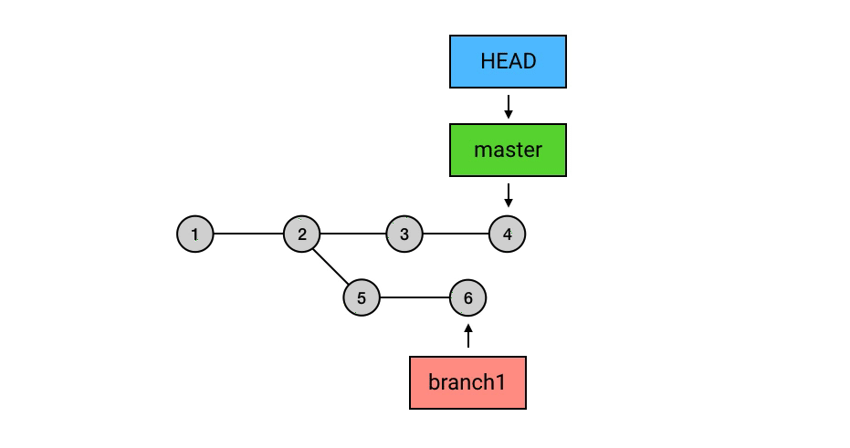
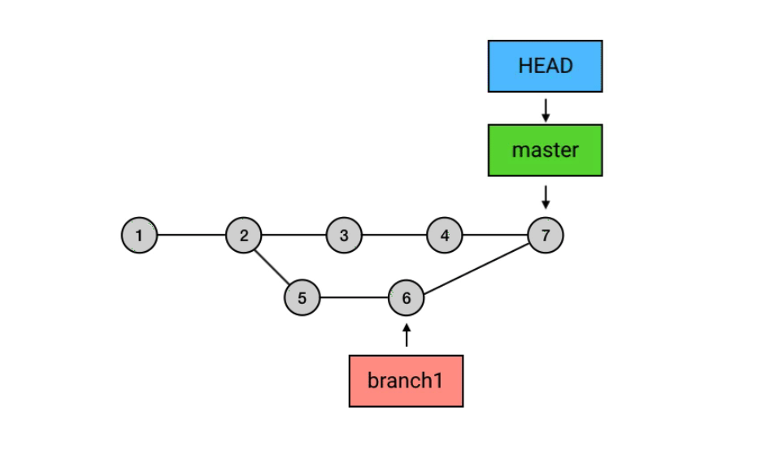
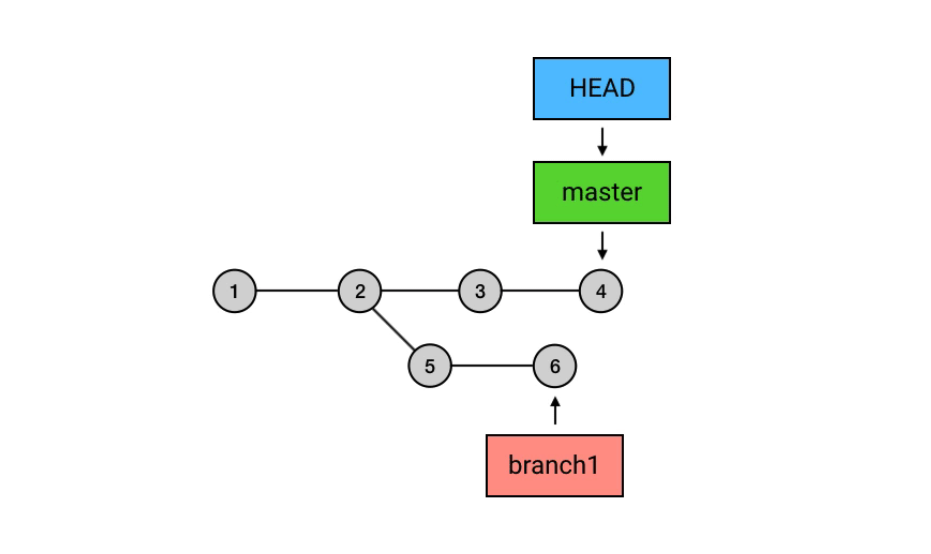
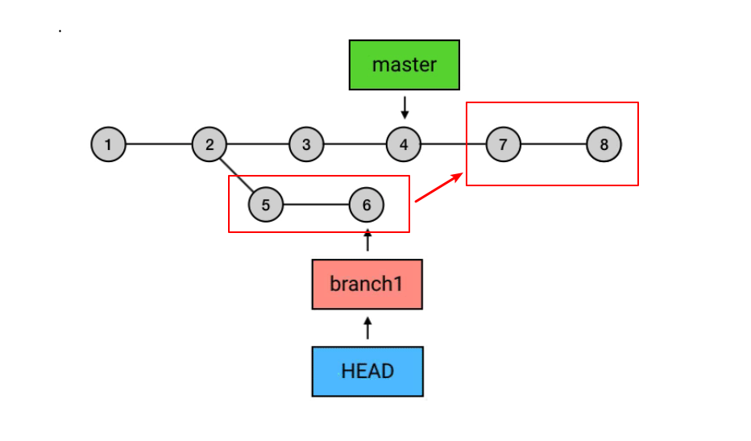
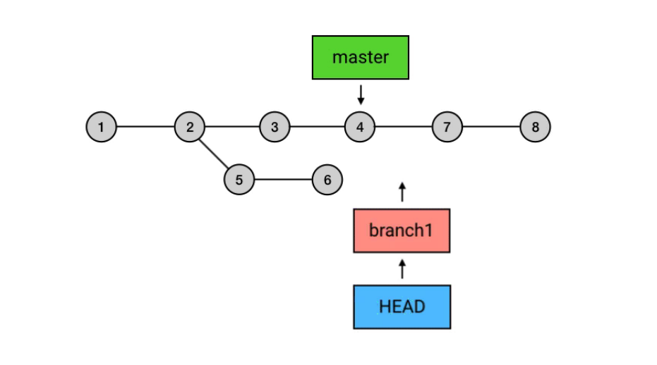
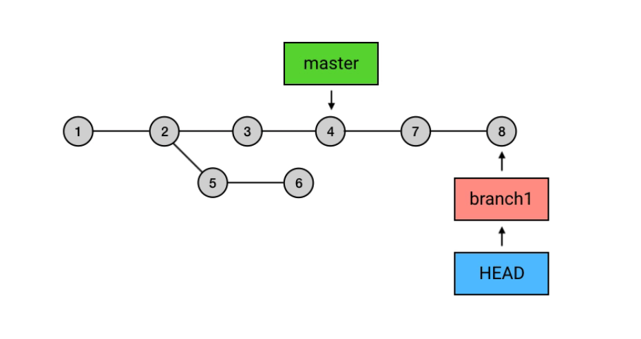
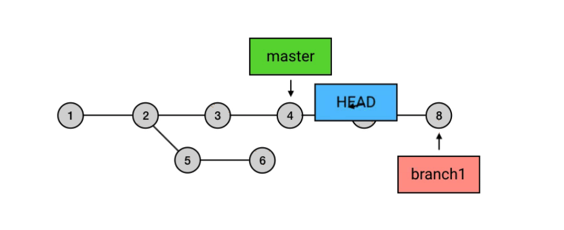
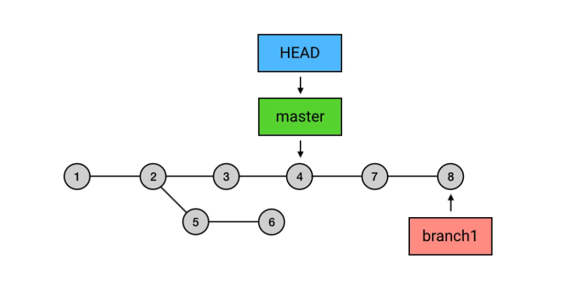
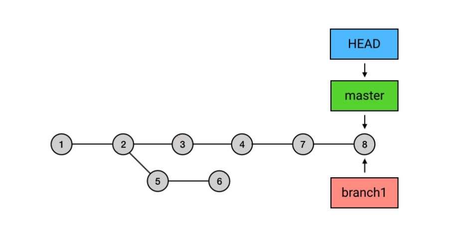

##前言

熟悉 ```git merge``` 命令都明白，当分支比较多的情况下 commit 链就会出现分叉，这种分叉再汇合的结构会让人觉得混乱而难以管理。如果你不希望 commit 历史出现分叉，可以用 <code><font color="#f52814">rebase</font></code> 来代替 <code><font color="#f52814">merge</font></code>。

##rebase——在新位置重新提交

<code><font color="#f52814">rebase</font></code> 的意思是，给你的 commit 链重新设置基础点（也就是父 commit）。展开来说就是，把你指定的 commit 以及它所在的 commit 链，以指定的目标 commit 为基础，依次重新提交一次。例如下面这个 <code><font color="#f52814">merge</font></code>：

```bash
git merge branch1
```

**<font color="#f52814">merge</font>** 之前



**<font color="#f52814">merge</font>** 之后



如果把 <code><font color="#f52814">merge</font></code> 换成 <code><font color="#f52814">rebase</font></code>，可以这样操作：

<code><font color="#f52814">rebase</font></code> 之前：



执行
```bash
git checkout branch1
git rebase master
```












