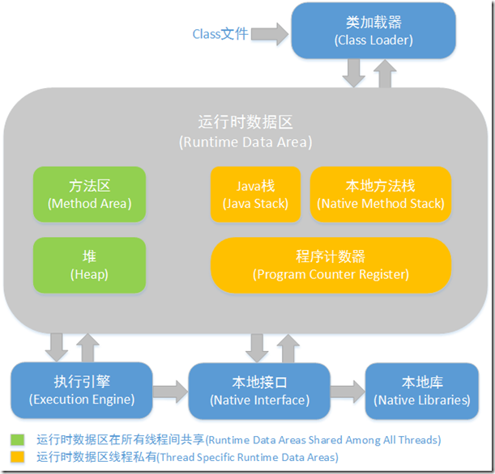

前言快速到底

　　如果有人问你 java 的内存区域分为哪些，可能很多人会说：堆、栈、方法区……。我个人理解从开发者的角度 Java 能够涉及到“内存区域”的大致有两处：第一，java 虚拟机运行时数据区；第二，java 内存模型。而这两个都不能简单的称为“java 的内存区域”。

Java 虚拟机运行时数据区
　　Java 虚拟机在执行 Java 程序的过程中会把它所管理的内存划分为若干个不同的数据区域。这是周志明老师在《深入理解 Java 虚拟机 - JVM 高级特性与最佳实践》中对于 Java 虚拟机运行时数据区的确切定义。从 http://images.blogjava.net/blogjava_net/nkjava/jvmstructure.png 贴过来一张图。

图 1-1: java 虚拟机运行时常量池

线程私有区域：
　　1、PROGRAM COUNTER REGISTER，程序计数器

　　　　  程序计数器是一块很小的区域，它存储的是当前线程正在执行的字节码的地址（在这里，其实有两个“当前”；一个是：当前正在被 CPU 执行的线程，另一个是：当前这个被执行的线程中正在被执行的方法的字节码指令）。字节码解释器工作时就是改变程序计数器的值来选取下一条需要执行的字节码。由于 Java 的多线程是通过线程轮流切换并通过分配给处理器执行时间的方式实现的，在任何一个时刻单个处理器（对于多核处理器来说是一个内核）都只会执行一条线程中所携带的指令。因此，为了线程切换后能够恢复到正确的执行的位置，每一条线程都需要拥有自己的程序计数器。如果这个线程正在执行的方法是一个 Java 方法，程序计数器记录的是当前线程正在执行的方法中的字节码地址。如果执行的是 Native 方法，则程序计数器的值为空。此区域是唯一一块在Java 虚拟机规范中没有规定任何 OutOfMemory 情况的区域。

　　2、JAVA STACK，JAVA 虚拟机栈

　　　　Java 虚拟机栈的生命周期与线程相同。虚拟机栈描述的是 Java 方法执行的内存模型。每个方法在执行的时候都会创建一个栈帧（一个方法对应一个栈帧，栈帧即栈的基本单位）用于存储局部变量表、操作数栈、动态链接、方法出口等信息。每个方法从被线程执行开始到结束，就对应着一个栈帧在虚拟机栈中出栈和入栈的过程。局部变量表中存放了编译可知的各种基本数据类型（分别是：byte,short,int,long,float,double,char,boolean）、对象引用（reference 类型，它存储的是：对象的地址或者是对象的句柄）、returnAddress 类型。Java 虚拟机规范中堆这个区域规定了两种异常状况：第一种，如果线程请求的深度大于虚拟机栈所允许的深度（这个深度理解为栈帧的个数，也就是 Java 方法的个数），将抛出 StackOverflowError 异常；第二种，虚拟机栈动态扩展（目前的虚拟机基本都支持动态扩展）过程中，如果扩展无法申请到足够的内存，就会抛出 OutOfMemoryError 异常。

　　3、NATIVE METHOD STACK，本地方法栈

　　　　本地方法栈与虚拟机栈类似。ORACLE 公司的 HotSpot 虚拟机在实现的时候把虚拟机栈和本地方法栈合二为一。与虚拟机栈一样，本地方法栈也会抛出 StackOverflowError 和 OutOfMemoryError 异常。

线程间共享的内存区域
　　1、HEAP，堆（GC 堆）

　　　　在 Java 虚拟机规范中有描述：所有的对象实例和数组都要在堆上分配，但是随着 JIT（JUST-IN-TIME）编译器的发展与逃逸分析技术的逐渐成熟，所有对象的实例都分配在堆上就不那么“绝对”了。由于现在都采用分代回收算法，所以从内存回收的角度来看，堆还可以细分为：新生代、老年代。新生代又可以分为：Eden 空间、From Survivor 空间、To Survivor 空间。如果堆中无法完成实例分配，并且堆也无法再进行扩展时，将会抛出 OutOfMemoryError 异常。

　　2、METHOD AREA，方法区

　　　　这块区域用来存储已经被虚拟机加载的类信息、常量（static final 修饰的代表常量）、静态变量、即时编译器编译后产生的代码等数据。很多开发者更愿意称方法区为“永久代”。但本质不同，由于 HotSpot 团队在方法区中沿用堆中的分代回收算法，所以按照堆中的命名方式，称方法区为“永久代”，对于 JRocket、J9 而言是不存在“永久代”的概念的。Java 虚拟机规范对方法区的限制非常松，甚至可以不实现垃圾回收，一般而言，这个区域的内存回收很不令人满意，尤其是类型的卸载，条件非常苛刻，但是由于现代框架大量的依赖于 JIT 技术，导致方法区的占用比逐渐提高，所以对于方法区的回收至关重要。根据 Java 虚拟机规范规定，当方法区无法满足内存分配需求时，将抛出 OutOfMemoryError 异常。

　　3、RUNTIME CONSTANT POOL，运行时常量池

　　　　这块区域是方法区的一部分，Class  文件中有一项信息是常量池（或者说是一张常量表，Class 文件以表存储数据）。用于存放编译时期生成的各种字面量（final int x = 1）和符号引用（final Person p = new Person()），这部分内容将在类加载（ClassLoader 加载 Class 字节码文件）后进入方法区的运行时常量池中存放。Java 虚拟机对于 Class 文件每一个部分（当然包括常量池）的格式都有严格的规定，每一个字节用于存储哪种类型的数据都必须符合规范上的要求才能够被虚拟机认可、装载和执行，但是对于运行时常量池，Java 虚拟机并没有做任何细节的要求，不同的虚拟机提供商可按照自己的需求自行实现这一块内存区域。不过，一般来说，除了保存 Class 文件中描述的符号引用外，还会把翻译出来的直接引用也存储在运行时常量池中。运行时常量池相对于 Class 文件常量池一个重要的特征就是具备动态性，Java 语言并不要求常量一定产生于编译期的 Class 文件的常量池中，也并不是只有 Class 文件常量池中的常量才能够进入运行时常量池中，在线程执行方法的过程当中可能产生新的常量存放到运行时常量池中，例如：String 类的 intern() 方法。当运行时常量池无法申请到内存的时候就会抛出 OutOfMemoryError 异常。
