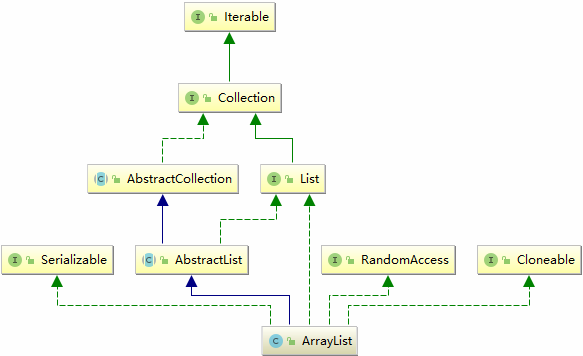

**前言**

集合的作用就是以一定的方式组织、存储数据。

分析集合，有四点要特别注意：

1. 是否线程安全

2. 是否允许存储 null

3. 是否允许存储重复数据

4. 是否有序，有序的意思是读取出来的数据的顺序和存放数据的顺序一致。

5. 扩容机制

## ArrayList 基本结构

首先我们来看一下 ArrayList 在 Collection 集合框架中的结构图，蓝线代表继承关系，绿线代表接口实现。


<center>图 1-1 : ArrayList 关系图</center>

从结构图来看，ArrayList 类继承了 AbstractList 具备了添加、删除、修改、遍历等功能；实现了 RandomAccess 接口，提供了随机访问功能，也就是通过索引快速访问数组元素；实现了 Cloneable 接口，重写 clone() 函数，可以被复制；实现了 Serializable 接口，支持序列化。

ArrayList 底层存储数据结构是通过数组实现的。接下来，我们看一下 ArrayList 里面有哪些重要的属性。

### ArrayList 属性

```Java
/**
 *  数组默认初始容量
 */
 private static final int DEFAULT_CAPACITY = 10;

/**
 *  定义一个空的数组实例以供其他需要用到空数组的地方调用
 */
 private static final Object[] EMPTY_ELEMENTDATA = {};

/**
 *  定义一个空数组，跟前面的区别就是这个空数组是用来判断 ArrayList 第一次添加数据的时候要扩容多少。默认的构造器情况下返回这个空数组
 */
 private static final Object[] DEFAULTCAPACITY_EMPTY_ELEMENTDATA = {};

/**
 *  数据存的地方，它的容量就是这个数组的长度，同时只要是使用默认构造器（DEFAULTCAPACITY_EMPTY_ELEMENTDATA ）第一次添加数据的时候容量扩容为DEFAULT_CAPACITY = 10
 */
 transient Object[] elementData; // non-private to simplify nested class access

/**
 * The size of the ArrayList (the number of elements it contains).
 */
 private int size;
```

### ArrayList 方法概要

#### 属于 Collection 接口的方法

```Java
boolean             add(E object)
boolean             addAll(Collection<? extends E> collection)
void                clear()
boolean             contains(Object object)
boolean             containsAll(Collection<?> collection)
boolean             equals(Object object)
int                 hashCode()
boolean             isEmpty()
boolean             remove(Object object)
boolean             removeAll(Collection<?> collection)
boolean             retainAll(Collection<?> collection)
int                 size()
<T> T[]             toArray(T[] array)
Object[]            toArray()
```

#### 属于 AbstractCollection 抽象类中的方法

```Java
void                add(int location, E object)
boolean             addAll(int location, Collection<? extends E> collection)
E                   get(int location)
int                 indexOf(Object object)
int                 lastIndexOf(Object object)
ListIterator<E>     listIterator(int location)
ListIterator<E>     listIterator()
E                   remove(int location)
E                   set(int location, E object)
List<E>             subList(int start, int end)
```

#### 属于 ArrayList 自己的方法

```Java
Object               clone()
void                 ensureCapacity(int minimumCapacity)
void                 trimToSize()
void                 removeRange(int fromIndex, int toIndex)
```

从上面的类的 API 来看事实上涉及到集合的本身的东西基本就在 Collection 接口中定义好了。

接下来我们就要看看源码了。

## ArrayList 源码分析

### 构造方法

```Java
   /**
     * Constructs an empty list with the specified initial capacity.
     *
     * @param  initialCapacity  the initial capacity of the list
     * @throws IllegalArgumentException if the specified initial capacity
     *         is negative
     */
    public ArrayList(int initialCapacity) {
        if (initialCapacity > 0) {
            this.elementData = new Object[initialCapacity];
        } else if (initialCapacity == 0) {
            this.elementData = EMPTY_ELEMENTDATA;
        } else {
            throw new IllegalArgumentException("Illegal Capacity: "+
                                               initialCapacity);
        }
    }

    /**
     * Constructs an empty list with an initial capacity of ten.
     */
    public ArrayList() {
        this.elementData = DEFAULTCAPACITY_EMPTY_ELEMENTDATA;
    }

    /**
     * Constructs a list containing the elements of the specified
     * collection, in the order they are returned by the collection's
     * iterator.
     *
     * @param c the collection whose elements are to be placed into this list
     * @throws NullPointerException if the specified collection is null
     */
    public ArrayList(Collection<? extends E> c) {
        elementData = c.toArray();
        if ((size = elementData.length) != 0) {
            // c.toArray might (incorrectly) not return Object[] (see 6260652)
            if (elementData.getClass() != Object[].class)
                elementData = Arrays.copyOf(elementData, size, Object[].class);
        } else {
            // replace with empty array.
            this.elementData = EMPTY_ELEMENTDATA;
        }
    }
```

### add(E e) 方法

```Java
public boolean add(E e) {
    ensureCapacityInternal(size + 1);  // Increments modCount!!
    elementData[size++] = e;
    return true;                  
}
```
```Java
private void ensureCapacityInternal(int minCapacity) {  // 最小容量 = 当前数组元素个数 + 1
    if (elementData == DEFAULTCAPACITY_EMPTY_ELEMENTDATA) {
        minCapacity = Math.max(DEFAULT_CAPACITY, minCapacity);
    }

    ensureExplicitCapacity(minCapacity);
}
```
```Java
private void ensureExplicitCapacity(int minCapacity) {
    modCount++;

    // overflow-conscious code
    if (minCapacity - elementData.length > 0)  // 如果最小容量大于当前数组长度则扩容
        grow(minCapacity);
}
```

#### add 方法执行流程

**<font color="#159957">当前数组是由默认构造方法生成的空数组或者是由自定义初始容量为 0 的构造方法创建</font>**

  第一次添加元素首先会创建一个容量为 10 的新数组，然后将原数组的引用指向新数组，最后将添加的元素放到 elementData[0] 的位置，一直到添加第 11 个元素的时候 minCapacity = size + 1 为 11，minCapacity - elementData.length > 0 成立，会进行第一次 1.5 倍扩容，根据原数组容量 10 计算得出新数组容量为 15，然后使用 elementData = Arrays.copyOf(elementData, newCapacity); 创建一个数组长度为 15 的新数组，将原数组的元素拷贝进去，然后将第 10 个元素放到 elementData[10] 的位置。当添加第 11 个元素的时候，minCapacity = 12，此时 minCapacity - elementData.length < 0，所以不会进行扩容，一直到添加第 16 个元素的时候，minCapacity 为 16，此时 minCapacity - elementData.length > 0 成立，会进行第二次扩容，将容量扩大到 22，然后创建一个容量为 22 的新数组，并将原数组的数据拷贝到新数组中。

#### 扩容机制

扩容机制主要依靠 grow() 方法，这有三点需要注意一下：

1. 扩容，是创建一个新的数组，然后将旧数组上的元素 copy 到新数组，再将旧数组的引用指向新数组。其中，当数组中元素过多的时候，拷贝的过程会很耗时，很耗性能。

2. 在 grow() 方法中新数组的容量采用了位运算，位运算的速度远远快于整除运算。

3. 相对于 JDK1.6 来说，1.8 的 ArrayList 的数组长度是有最大限制的（最大限制为 Integer.MAX_VALUE）

```Java
private static final int MAX_ARRAY_SIZE = Integer.MAX_VALUE - 8;
```

```Java
// 这个方法就是是动态扩展的精髓
private void grow(int minCapacity) {
    // overflow-conscious code
    int oldCapacity = elementData.length;
    // 将 oldCapacity 右移一位，其效果相当于 oldCapacity/2，整句的结果就是设置新数组的容量为原来数组的 1.5 倍
    int newCapacity = oldCapacity + (oldCapacity >> 1);
    // 再判断一下新数组的容量够不够，够了就直接使用这个长度创建新数组，
     // 不够就将数组长度设置为需要的长度
    if (newCapacity - minCapacity < 0)
        newCapacity = minCapacity;
    if (newCapacity - MAX_ARRAY_SIZE > 0)
        newCapacity = hugeCapacity(minCapacity);
      // 将原来数组的值 copy 新数组中去， ArrayList 的引用指向新数组
      // 这会新创建数组，如果数据量很大，重复的创建的数组，那么还是会影响效率，
      // 因此鼓励在合适的时候通过构造方法指定默认的 capaticy 大小
    // minCapacity is usually close to size, so this is a win:
    elementData = Arrays.copyOf(elementData, newCapacity);
}
```

```Java
private static int hugeCapacity(int minCapacity) {
　　if (minCapacity < 0) // overflow
　　throw new OutOfMemoryError();
　　return (minCapacity > MAX_ARRAY_SIZE) ? Integer.MAX_VALUE : MAX_ARRAY_SIZE;
}
```

JDK1.6 的动态扩容的实现原理：

```Java
public void ensureCapacity(int minCapacity) {
　　modCount++;
　　int oldCapacity = elementData.length;
　　if (minCapacity > oldCapacity) {
　　　　Object oldData[] = elementData;
　　　　int newCapacity = (oldCapacity * 3)/2 + 1;
　　　　if (newCapacity < minCapacity)
　　　　newCapacity = minCapacity;
　　　　// minCapacity is usually close to size, so this is a win:
　　　　elementData = Arrays.copyOf(elementData, newCapacity);
　　}
}
```

### add(int index, E element) 方法

```Java
public void add(int index, E element) {
    rangeCheckForAdd(index);

    ensureCapacityInternal(size + 1);  // Increments modCount!!

    // 将 index 位置后面的数组元素统一后移一位，把 index 位置空出来
    System.arraycopy(elementData, index, elementData, index + 1,size - index);
    elementData[index] = element;
    size++;
}
```

该方法有一点要注意，当 index 索引后的元素过多的时候很耗性能。

### remove(int index) 方法

根据索引删除元素的流程：

1. 取出 index 元素用于 remove 方法返回值

2. 将 index 后面的元素都逐一向前移一位（其实是复制后面一个元素并覆盖前面一个元素）

3. 将最后一个元素置位 null

```Java
public E remove(int index) {
    rangeCheck(index);

    modCount++;
    E oldValue = elementData(index);

    int numMoved = size - index - 1;  // 要删除元素的后面还有多少个元素
    if (numMoved > 0)   // 也就是说如果删除的是最后一个元素，numMoved = 0，后面没有元素了就不需要拷贝了
        System.arraycopy(elementData, index+1, elementData, index, numMoved);
    elementData[--size] = null; // clear to let GC do its work

    return oldValue;
}
```
通过删除方法，可以发现 ArrayList 中允许存储 null 值。

### remove(Object o)

删除某个元素的流程：

从索引 0 递增遍历，如果发现需要删除的元素则记录该元素索引，然后根据索引删除。

这里有一点要注意：删除元素只能删除从索引 为 0 到 size 的第一个元素，后面如果还有相同的元素是无法删除的。

```Java
public boolean remove(Object o) {
    if (o == null) {
        for (int index = 0; index < size; index++)
            if (elementData[index] == null) {
                fastRemove(index);
                return true;
            }
    } else {
        for (int index = 0; index < size; index++)
            if (o.equals(elementData[index])) {
                fastRemove(index);
                return true;
            }
    }
    return false;
}
```

```Java
private void fastRemove(int index) {
    modCount++;
    int numMoved = size - index - 1;
    if (numMoved > 0)
        System.arraycopy(elementData, index+1, elementData, index, numMoved);
    elementData[--size] = null; // clear to let GC do its work
}
```

提醒一点，添加元素时有扩容操作，但是删除元素时却没有缩容操作，那如果数组被删除了很多，那数组中大量空间将会被闲置，这时候 ArrayList 提供了 trimToSize() 方法，不过这个方法需要手动自己调用，ArrayList 中的其他方法不会调用。同时，这个方法也并不是缩容，而是创建一个新的数组，将原数组中的元素拷贝到新数组中。

```Java
public void trimToSize() {
    modCount++;
    if (size < elementData.length) {
        elementData = (size == 0) ? EMPTY_ELEMENTDATA : Arrays.copyOf(elementData, size);
    }
}
```

在这里它会取两个中最小的作为数组的长度

```Java
System.arraycopy(original, 0, copy, 0, Math.min(original.length, newLength));
```

## ArrayList 总结：

1. ArrayList 是线程非安全的，这很明显，因为 ArrayList 中所有的方法都不是同步的，在并发下一定会出现线程安全问题。

2. ArrayList 在顺序添加一个元素的时候，会将该元素放到数组的最右边，性能最好，时间复杂度为 O(1)。

3. 插入指定索引元素的时候，涉及到一次元素复制，如果要复制的元素很多，就会比较耗费性能。

4. 删除元素的时候，涉及到一次元素复制，如果被删除元素后面还有很多元素，那么这个复制的过程就会漫长，比较耗费性能。
