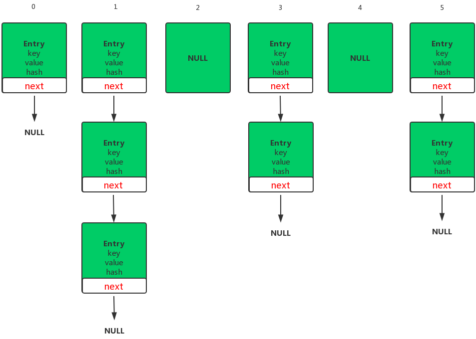
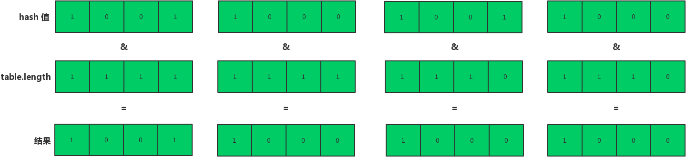

## 数据结构

HashMap 数据结构采用的是哈希表，在讨论哈希表之前，我们先大概了解下其他数据结构在新增，查找等基础操作执行性能。

###数组

数组采用一段连续的存储单元来存储数据。对于指定下标的查找，时间复杂度为 O(1)；通过给定值进行查找，需要遍历数组，逐一比对给定关键字和数组元素，时间复杂度为 O(n)，当然，对于有序数组，则可采用二分查找，插值查找，斐波那契查找等方式，可将查找复杂度提高为 O(logn)；对于一般的插入删除操作，涉及到数组元素的移动，其平均复杂度也为 O(n)。

###链表

对于链表的新增，删除等操作（在找到指定操作位置后），仅需处理结点间的引用即可，时间复杂度为 O(1)，而查找操作需要遍历链表逐一进行比对，复杂度为 O(n)。

###二叉树

对一棵相对平衡的有序二叉树，对其进行插入，查找，删除等操作，平均复杂度均为 O(logn)。

###哈希表

我们知道，数据结构的物理存储结构只有两种：**顺序存储结构** 和 **链式存储结构**（栈，队列，树，图），其实说白了也就是 **<font color="#f52814">数组 + 对象引用</font>**  。而在上面我们提到过，在数组中根据下标查找某个元素，时间复杂度是 O(1)，哈希表利用了这种特性，**哈希表的主干就是数组**。

比如我们要新增或查找某个元素，我们通过把当前元素的关键字通过某个函数映射到数组中的某个位置，通过数组下标一次定位就可完成操作。

**<font color="#f52814">存储位置 = f (关键字)</font>**

其中，这个函数 f 一般称为 **哈希函数**，这个函数的设计好坏会直接影响到哈希表的优劣。我们要在哈希表中执行插入操作（查找操作同理）先通过哈希函数计算出实际存储地址，然后从数组中对应地址取出即可。

####哈希冲突

然而万事无完美，如果两个不同的元素，通过哈希函数得出的实际存储地址相同怎么办？也就是说，当我们对某个元素进行哈希运算，得到一个存储地址，然后要进行插入的时候，发现已经被其他元素占用了，其实这就是所谓的哈希冲突，也叫 **<font color="#f52814">哈希碰撞</font>** 。前面我们提到过，哈希函数的设计至关重要，好的哈希函数会尽可能地保证 **计算简单** 和 **<font color="#f52814">散列地址分布均匀</font>** ,但是，我们需要清楚的是，数组是一块连续的固定长度的内存空间，再好的哈希函数也不能保证得到的存储地址绝对不发生冲突。那么哈希冲突如何解决呢？哈希冲突的解决方案有多种：开放定址法（发生冲突，继续寻找下一块未被占用的存储地址），再散列函数法，链地址法，而 HashMap 即是采用了链地址法，也就是 **<font color="#f52814">数组 + 链表</font>** 的方式。

###HashMap 的数据结构图



可以看到，HashMap 由 **<font color="#f52814">数组 + 链表</font>** 组成的哈希表结构，数组是 HashMap 的主体，链表则是主要为了解决哈希冲突而存在的，如果定位到的数组位置不含链表（当前 Entry 的 next 指向 null）,那么对于查找，添加等操作很快，仅需一次寻址即可，时间复杂度 O(1)；如果定位到的位置包含链表，对于添加操作，其时间复杂度为 O(n)，首先遍历链表，存在即覆盖，否则新增，新加入的放在链头，最先加入的放在链尾；对于查找操作来说，仍需遍历链表，然后通过 key 对象的 equals 方法逐一比对查找。所以，HashMap 中的链表出现越少，性能才会越好。

##Hash 算法

在 HashMap 中要找到某个元素，需要根据 <code><font color="#f52814">key</font></code> 的 <code><font color="#f52814">hash 值</font></code> 来算出对应数组中的位置，计算出这个位置的算法就是 <code><font color="#f52814">hash 算法</font></code>。

好的 <code><font color="#f52814">hash 算法</font></code> 要尽量使 HashMap 里面的元素位置散列的均匀些，这样链表的长度就会短一些，获取元素的时间复杂度就低一些。

所以我们首先想到的就是把 hashcode 对数组长度取模运算，这样一来，元素的分布相对来说比较均匀。但是，<code><font color="#f52814">模运算</font></code> 的性能损耗还是比较大的，能不能找一种更快速，损耗更小的方式呢？HashMap 中是这么做的：

```Java
int hash = hash(key);
int i = indexFor(hash, table.length);
```
```Java
final int hash(Object k) {
    int h = hashSeed;
    if (0 != h && k instanceof String) {
        return sun.misc.Hashing.stringHash32((String) k);
    }

    h ^= k.hashCode();

    // This function ensures that hashCodes that differ only by
    // constant multiples at each bit position have a bounded
    // number of collisions (approximately 8 at default load factor).
    h ^= (h >>> 20) ^ (h >>> 12);
    return h ^ (h >>> 7) ^ (h >>> 4);
}
```

```Java
static int indexFor(int h, int length) {  
   return h & (length-1);  
}  
```

存储 <code><font color="#f52814">index</font></code> 的确定流程是这样的：


1. 计算出 <code><font color="#f52814">key.hashCode()</font></code> 值
2. 然后做一些移位运算得出 <code><font color="#f52814">hash 值</font></code>
3. 最后再跟 <code><font color="#f52814">table.length -1</font></code> 做 <code><font color="#f52814">&</font></code> 运算。

最后一步看上去简单，实际上却是 HashMap 散列均匀的核心所在。采取 <code><font color="#f52814">hash & (table.length -1)</font></code> 这种方式要求 <code><font color="#f52814">table.length</font></code> 必须是 2 的幂次方，那么为什么呢？

看下图，左边两组 <code><font color="#f52814">table.length</font></code> 为 16（${2^4}$），右边两组 <code><font color="#f52814">table.length</font></code> 为 15。两组 key 的 <code><font color="#f52814">hash 值</font></code> 均为 8 和 9，但是很明显，当它们和 1 1 1 0 <code><font color="#f52814">&</font></code> 的时候，产生了相同的结果，也就是说它们会定位到数组中的同一个 <code><font color="#f52814">index</font></code> 上去，这就产生了碰撞，8 和 9 会被放到同一个链表上，那么查询的时候就需要遍历这个链表的每个元素然后通过 <code><font color="#f52814">equals</font></code> 方法得到 8 或者 9，这样时间复杂度就变成了 <code><font color="#f52814">O(n)</font></code>。同时，我们也可以发现，当 <code><font color="#f52814">table.length</font></code> 为 15 的时候，<code><font color="#f52814">hash 值</font></code> 会与 14（1 1 1 0）进行 <code><font color="#f52814">&</font></code> 运算，那么最后一位永远是 0，而 0 0 0 1，0 0 1 1，0 1 0 1，1 0 0 1，1 0 1 1，0 1 1 1，1 1 0 1 这几个位置永远都不能存放元素了，空间浪费相当大，更糟的是这种情况中，数组可以使用的位置比数组长度小了很多，这意味着进一步增加了碰撞的几率，减慢了查询的效率！



所以说，当 <code><font color="#f52814">table.length</font></code> 为 ${2^n}$ 的时候，不同的 key 算得得 index 相同的几率较小，那么数据在数组上分布就比较均匀，也就是说碰撞的几率小，相对的，查询的时候就不用遍历某个位置上的链表，这样查询效率也就较高了,这也是 HashMap 默认数组大小为 16 的原因。

## HashMap 的 resize()

当 HashMap 中的元素越来越多的时候，碰撞的几率也就越来越高（因为数组的长度是固定的），所以为了提高查询的效率，就要对 HashMap 的数组进行扩容，在 HashMap 数组扩容时，最消耗性能的点就出现了：原数组中的数据必须重新计算其在新数组中的位置，并放进去，这就是 <code><font color="#f52814">resize()</font></code>。

### resize() 时机

扩容必须满足两个条件：

1. 本次 <code><font color="#f52814">addEntry</font></code> 的时候，HashMap 中已有元素的个数 <code><font color="#f52814">(size)</font></code> 必须大于等于阈值 <code><font color="#f52814">(threshold = capacity * loadFactor，capacity = table.length)</font></code>

2. 本次 <code><font color="#f52814">add</font></code> 的 <code><font color="#f52814">Entry</font></code> 发生 <code><font color="#f52814">hash 碰撞</font></code>

看一下 <code><font color="#f52814">resize()</font></code> 的具体实现：

```Java
void addEntry(int hash, K key, V value, int bucketIndex) {
    if ((size >= threshold) && (null != table[bucketIndex])) {   // threshold = capacity * loadFactor (capacity = table.length)
        resize(2 * table.length);
        hash = (null != key) ? hash(key) : 0;
        bucketIndex = indexFor(hash, table.length);
    }

    createEntry(hash, key, value, bucketIndex);
}
```

```Java
void resize(int newCapacity) {
    Entry[] oldTable = table;
    int oldCapacity = oldTable.length;
    if (oldCapacity == MAXIMUM_CAPACITY) {
        threshold = Integer.MAX_VALUE;
        return;
    }

    Entry[] newTable = new Entry[newCapacity];
    transfer(newTable, initHashSeedAsNeeded(newCapacity));
    table = newTable;
    threshold = (int)Math.min(newCapacity * loadFactor, MAXIMUM_CAPACITY + 1);
}
```

如果数组进行扩容，数组长度发生变化，而存储位置 <code><font color="#f52814">index = h&(length-1)</font></code>，<code><font color="#f52814">index</font></code> 也可能会发生变化，需要重新计算 <code><font color="#f52814">index</font></code>，我们先来看看 <code><font color="#f52814">transfer()</font></code> 这个方法。

```Java
void transfer(Entry[] newTable, boolean rehash) {
    int newCapacity = newTable.length;

　　// for 循环中的代码，逐个遍历链表，重新计算索引位置，将老数组数据复制到新数组中去（数组不存储实际数据，所以仅仅是拷贝引用而已）
    for (Entry<K,V> e : table) {
        while(null != e) {
            Entry<K,V> next = e.next;
            if (rehash) {
                e.hash = null == e.key ? 0 : hash(e.key);
            }
            int i = indexFor(e.hash, newCapacity);

　　　　　　 // 将当前 entry 的 next 链指向新的索引位置,newTable[i] 有可能为空，有可能也是个 entry 链，如果是 entry 链，直接在链表头部插入。
            e.next = newTable[i];
            newTable[i] = e;
            e = next;
        }
    }
}
```

当 HashMap 中的元素个数超过 <code><font color="#f52814">(table.length) * loadFactor</font></code> 时，并且本次要添加的元素所在的 <code><font color="#f52814">index</font></code> 位置已经被占了的情况下（即发生碰撞），就会进行数组扩容，创建一个容量为旧数组容量的 2 倍的新数组，然后重新计算每个元素在数组中的位置，然后再遍历旧数组的元素将其放入到新数组中，整个过程是一个非常消耗性能的操作，所以如果我们能预知 HashMap 中元素的个数，那么预设 HashMap 的 <code><font color="#f52814">capacity</font></code> 能够有效的提高 HashMap 的性能。比如说，我们有 1000 个元素，则 <code><font color="#f52814">new HashMap(1000)</font></code>，但是，即使是 1000，HashMap 也自动会将其设置为 1024，原因看下面：

```Java
private static int roundUpToPowerOf2(int number) {
    // assert number >= 0 : "number must be non-negative";
    return number >= MAXIMUM_CAPACITY ? MAXIMUM_CAPACITY
            : (number > 1) ? Integer.highestOneBit((number - 1) << 1) : 1;
}
```
即使是 <code><font color="#f52814">new HashMap(1024)</font></code> 还是有可能触发 <code><font color="#f52814">resize()</font></code> ，当 HashMap 中的元素个数超过 <code><font color="#f52814">750</font></code> 的时候就有可能触发 <code><font color="#f52814">resize()</font></code>，我们可以 <code><font color="#f52814">new HashMap(2048)</font></code> ，既考虑了 <code><font color="#f52814">&</font></code> 的问题，也避免了 <code><font color="#f52814">resize</font></code> 的问题。


## key 的 hashcode() 与 equals() 重写

在第二部分 Hash 算法中就写了 <code><font color="#f52814">get()</font></code> 方法的过程：首先计算 <code><font color="#f52814">key</font></code> 的 <code><font color="#f52814">hashcode</font></code>，然后再计算出 <code><font color="#f52814">index</font></code> ，从而找到数组中对应位置的某一元素，然后通过 <code><font color="#f52814">key</font></code> 的 <code><font color="#f52814">equals()</font></code> 方法在对应位置的链表中找到需要的元素。所以，<code><font color="#f52814">hashcode()</font></code> 与 <code><font color="#f52814">equals()</font></code> 方法对于找到对应元素是两个关键方法。

HashMap 的 <code><font color="#f52814">key</font></code> 可以是任何类型的对象，例如 User 这种对象，为了保证两个具有相同属性的 user 对象的 <code><font color="#f52814">hashcode 值</font></code> 相同，我们就需要改写 <code><font color="#f52814">hashcode()</font></code> 方法，比方把 <code><font color="#f52814">hashcode 值</font></code> 的计算与 user 对象的 id 关联起来，那么只要 user 对象拥有相同 id，那么他们的 <code><font color="#f52814">hashcode 值</font></code> 也能保持一致了，这样就可以找到在 HashMap 数组中的位置了。如果这个位置上有多个元素，还需要用 <code><font color="#f52814">key</font></code> 的 <code><font color="#f52814">equals()</font></code> 方法在对应位置的链表中找到需要的元素，所以只改写了 <code><font color="#f52814">hashcode()</font></code> 方法是不够的，<code><font color="#f52814">equals()</font></code> 方法也是需要改写的。当然啦，按正常思维逻辑，<code><font color="#f52814">equals()</font></code> 方法一般都会根据实际的业务内容来定义，例如根据 user 对象的所有属性的值是否相同来判断两个 user 是否相等。

在改写 <code><font color="#f52814">equals()</font></code> 方法的时候，需要满足以下三点：
1. 自反性：<code><font color="#f52814">a.equals(a)</font></code> 必须为 true。
2. 对称性：如果 <code><font color="#f52814">a.equals(b) = true</font></code> 的话，<code><font color="#f52814">b.equals(a)</font></code> 也必须为 true。
3. 传递性：如果 <code><font color="#f52814">a.equals(b) = true</font></code>，并且 <code><font color="#f52814">b.equals(c) = true</font></code> 的话，<code><font color="#f52814">a.equals(c)</font></code> 也必须为 true。

通过改写 <code><font color="#f52814">key</font></code> 对象的 <code><font color="#f52814">equals()</font></code> 和 <code><font color="#f52814">hashcode()</font></code> 方法，我们可以将任意的业务对象作为 HashMap 的 <code><font color="#f52814">key</font></code> （前提是你确实有这样的需要）。

## 多线程情况下 HashMap 存在的一些问题

###死链

两个线程 A，B 同时对 HashMap 进行 <code><font color="#f52814">resize()</font></code> 操作，在执行 <code><font color="#f52814">transfer()</font></code> 方法的 <code><font color="#f52814">while 循环</font></code>时，若此时当前 <code><font color="#f52814">index</font></code> 上的元素为 <code><font color="#f52814">a-->b-->null</font></code>

1. 线程 A 执行到 <code><font color="#f52814">Entry<K,V> next = e.next;</font></code> 时发生阻塞，此时 <code><font color="#f52814">e = a，next = b</font></code>

2. 线程 B 完整的执行了整段代码，此时新表 <code><font color="#f52814">newTable</font></code> 元素为 <code><font color="#f52814">b-->a-->null</font></code>

3. 线程 A 继续执行后面的代码，执行完一个循环之后，<code><font color="#f52814">newTable</font></code> 变为了 <code><font color="#f52814">a<-->b</font></code>，造成 <code><font color="#f52814">while(e != null)</font></code> 一直死循环，CPU 飙升。

###扩容数据丢失

同样在 <code><font color="#f52814">resize()</font></code> 的 <code><font color="#f52814">transfer()</font></code> 方法上

1. 当前线程迁移过程中，其他线程新增的元素有可能落在已经遍历过的哈希槽上；在遍历完成之后，<code><font color="#f52814">table</font></code> 数组引用指向了 <code><font color="#f52814">newTable</font></code>，这时新增的元素就会丢失。

2. 如果多个线程同时执行 <code><font color="#f52814">resize()</font></code>，每个线程又都会 <code><font color="#f52814">new Entry[newCapacity]</font></code>，此时这是线程内的局部变量，线程之前是不可见的。迁移完成后，<code><font color="#f52814">resize()</font></code> 的线程会给 <code><font color="#f52814">table</font></code> 线程共享变量，从而覆盖其他线程的操作，因此在被覆盖的 <code><font color="#f52814">new table</font></code> 上插入的数据会被丢弃掉。

### 总结

本文主要描述了 HashMap 的结构，和 HashMap 中 <code><font color="#f52814">hash()</font></code> 函数的实现，以及该实现的特性，同时描述了 HashMap 中 <code><font color="#f52814">resize</font></code> 带来性能消耗的根本原因，以及将普通的域模型对象作为 <code><font color="#f52814">key</font></code> 的基本要求。尤其是 <code><font color="#f52814">hash()</font></code> 函数的实现，可以说是整个 HashMap 的精髓所在，只有真正理解了这个 <code><font color="#f52814">hash()</font></code> 函数，才可以说对 HashMap 有了一定的理解。
