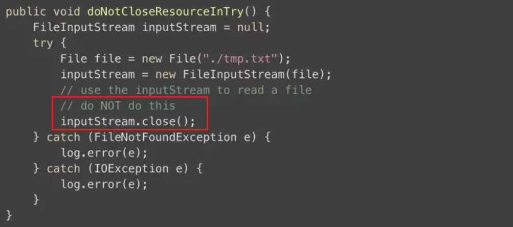
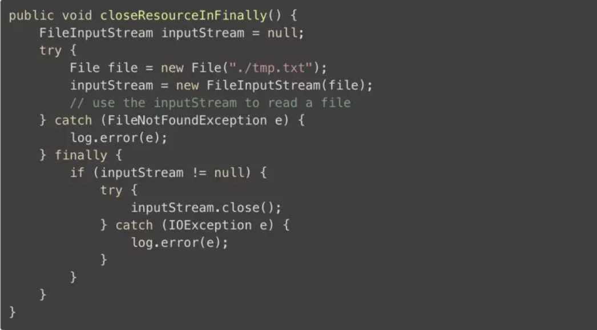
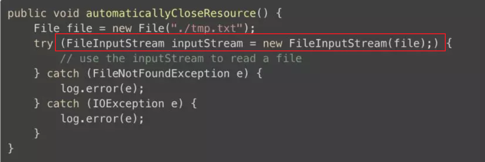
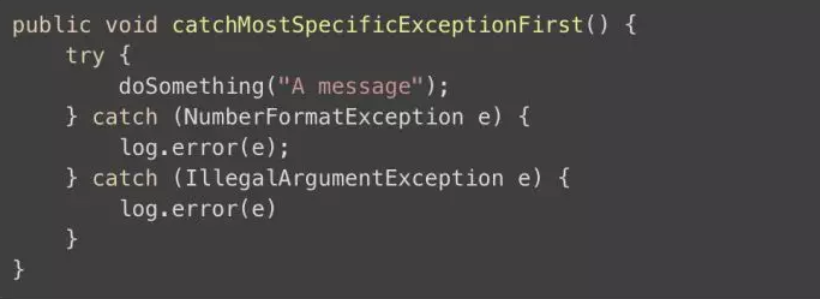
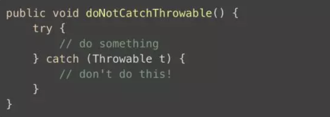
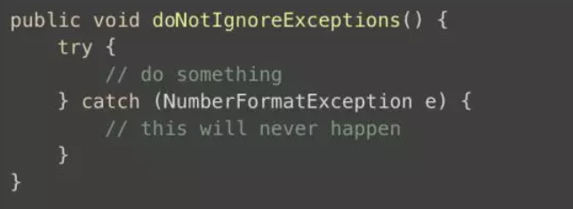

###Java 异常处理的 9 个最佳实践

这里有 9 大重要的约定被大部分团队接受，帮助你学习或者改进异常处理。

### <font color="#159957">1、在 Finally 清理资源或者使用 Try-With-Resource 特性</font>
我们在使用了类似于流资源之后要关闭资源，例如 <i>InputStream</i> 。在这些情况下，一种常见的失误就是在 try 代码块的最后关闭资源。



问题就是，<font color="#e50e0e">如果你关闭资源的操作在 try 代码块中的抛异常的下面，那么一旦出现异常，关闭资源的操作就不会被执行，那就永远无法关闭资源。</font>

所以，你应该把清理工作的代码放到 finally 里去，或者使用 try-with-resource 特性。

**1.1 使用 Finally 代码块**

与前面几行 try 代码块不同，**finally 代码块总是会被执行**。不管 try 代码块成功执行之后还是你在 catch 代码块中处理完异常后都会执行。因此，你可以确保你清理了所有打开的资源。



**1.2 Java 7 的 Try-With-Resource 语法**

另一个可选的方案是 try-with-resource 语法，我在介绍 Java 的异常处理里更详细的介绍了它。

如果你的资源实现了 AutoCloseable 接口，你可以使用这个语法。大多数的 Java 标准资源都继承了这个接口。当你在 try 子句中打开资源，资源会在 try 代码块执行后或异常处理后自动关闭。



### <font color="#159957">2、优先明确异常</font>
**你抛出的异常越明确越好**，永远记住，你的同事或者几个月之后的你，将会调用你的方法并且处理异常。

因此需要保证提供给他们尽可能多的信息。这样你的 API 更容易被理解。你的方法的调用者能够更好的处理异常并且避免额外的检查。

因此，总是尝试寻找最适合你的异常事件的类，例如，抛出一个 NumberFormatException 来替换一个 IllegalArgumentException 。避免抛出一个不明确的异常。


### <font color="#159957">3、记录指定的异常</font>
每当你在方法签名中指定异常，你也应该在 Javadoc 中记录它。 这与上一个最佳实践具有相同的目标：尽可能多地向调用者提供信息，以便避免或处理异常。

因此，请确保向 Javadoc 添加 @throws 声明并描述可能导致异常的情况。


### <font color="#159957">4、使用描述性消息抛出异常</font>
这个最佳实践背后的想法与前两个类似。但这一次，你不会将信息提供给方法的调用者。但你 **应该在1-2个短句中精确地解释异常的原因**。

如果抛出一个特定的异常，它的类名很可能已经描述了这种错误。所以，你不需要提供很多额外的信息。一个很好的例子是 NumberFormatException 。当你以错误的格式提供 String 时，它将被 java.lang.Long 类的构造函数抛出。


NumberFormatException 类的名称已经告诉你这种问题。它的消息表示只需要提供导致问题的输入字符串。**如果异常类的名称不具有表达性，则需要在消息中提供所需的信息**。
```Java
17:17:26,386 ERROR TestExceptionHandling:52 - java.lang.NumberFormatException: For input string: "xyz"
```

### <font color="#159957">5、优先捕获最具体的异常</font>

大多数 IDE 都可以帮助你实现这个最佳实践。当你尝试首先捕获较不具体的异常时，它们会报告无法访问的代码块。

但问题在于，只有匹配异常的第一个 catch 块会被执行。 因此，如果首先捕获 IllegalArgumentException ，则永远不会到达应该处理更具体的 NumberFormatException 的 catch 块，因为它是 IllegalArgumentException 的子类。

总是优先捕获最具体的异常类，并将不太具体的 catch 块添加到列表的末尾。

你可以在下面的代码片断中看到这样一个 try-catch 语句的例子。 第一个 catch 块处理所有 NumberFormatException 异常，第二个处理所有非 NumberFormatException 异常的  IllegalArgumentException 异常。



### <font color="#159957">6、不要捕获 Throwable 类</font>

Throwable 是所有异常和错误的超类。你可以在 catch 子句中使用它，但是你永远不应该这样做！

**如果在 catch 子句中使用 Throwable ，它不仅会捕获所有异常，也将捕获所有的错误。JVM 抛出错误，指出不应该由应用程序处理的严重问题**。 典型的例子是 OutOfMemoryError 或者 StackOverflowError 。 两者都是由应用程序控制之外的情况引起的，无法处理。

所以，最好不要捕获 Throwable ，除非你确定自己处于一种特殊的情况下能够处理错误。



### <font color="#159957">7、不要忽略异常</font>

你曾经有去分析过一个只执行了你用例的第一部分的 bug 报告吗？

这通常是由于一个被忽略的异常造成的。开发者可能会非常肯定，它永远不会被抛出，并添加一个 catch 块，不做处理或不记录它。而当你发现这个块时，你很可能甚至会发现其中有一个“这永远不会发生”的注释。



那么，你可能正在分析一个不可能发生的问题。

所以，请不要忽略任何一个异常。 你不知道代码将来如何改变。有人可能会在没有意识到会造成问题的情况下，删除阻止异常事件的验证。或者是抛出异常的代码被改变，现在抛出同一个类的多个异常，而调用的代码并不能阻止所有异常。

你至少应该写一条日志信息，告诉大家这个不可思议的事发生了，而且有人需要检查它。


### <font color="#159957">8、不要记录日志和抛出错误</font>

这可能是该文章中最常被忽略的最佳实践。 你可以找到很多的其中有一个异常被捕获的代码片段，甚至是一些代码库，被记录和重新抛出。


**<font color="#ed1c24">在发生异常时记录异常可能会感觉很直观，然后重新抛出异常，以便调用者可以适当地处理异常。但它会为同一个异常重复写入多个错误消息。</font>**

```Java
17:44:28,945 ERROR TestExceptionHandling:65 - java.lang.NumberFormatException: For input string: "xyz"
Exception in thread "main" java.lang.NumberFormatException: For input string: "xyz"
at java.lang.NumberFormatException.forInputString(NumberFormatException.java:65)
at java.lang.Long.parseLong(Long.java:589)
at java.lang.Long.(Long.java:965)
at com.stackify.example.TestExceptionHandling.logAndThrowException(TestExceptionHandling.java:63)
at com.stackify.example.TestExceptionHandling.main(TestExceptionHandling.java:58)
```

附加消息也不会添加任何信息。正如在最佳实践＃4中所解释的那样，**<font color="#ed1c24">异常消息应该描述异常事件。 堆栈跟踪告诉你在哪个类，方法和行中抛出异常。</font>**

如果你需要添加其他信息，则应该捕获异常并将其包装在自定义的信息中。 但请务必遵循最佳实践9。


所以，只捕获你想处理的异常。 否则，在方法签名中指定它，并让调用者处理它。

### <font color="#159957">9、封装好的异常类而不使用</font>

有时候，最好是捕获一个标准异常并将其封装成一定制的异常。**<font color="#ed1c24">一个典型的例子是应用程序或框架特定的业务异常。允许你添加些额外的信息（例如 8 的图片）</font>**，并且你也可以为你的异常类实现一个特殊的处理。

在你这样做时，请确保将原始异常设置为原因（注：参考下方代码 NumberFormatException e 中的原始异常 e ）。Exception 类提供了特殊的构造函数方法，它接受一个 Throwable 作为参数。另外，你将会丢失堆栈跟踪和原始异常的消息，这将会使分析导致异常的异常事件变得困难。


总结
如你所见，当你抛出或捕获异常的时候，有很多不同的事情需要考虑，而且大部分事情都是为了改善代码的可读性或者 API 的可用性。

异常通常都是一种异常处理技巧，同时也是一种通信媒介。因此，为了和同事更好的合作，一个团队必须要制定出一个最佳实践和规则，只有这样团队成员才能理解这些通用概念，同时在工作中使用它。
