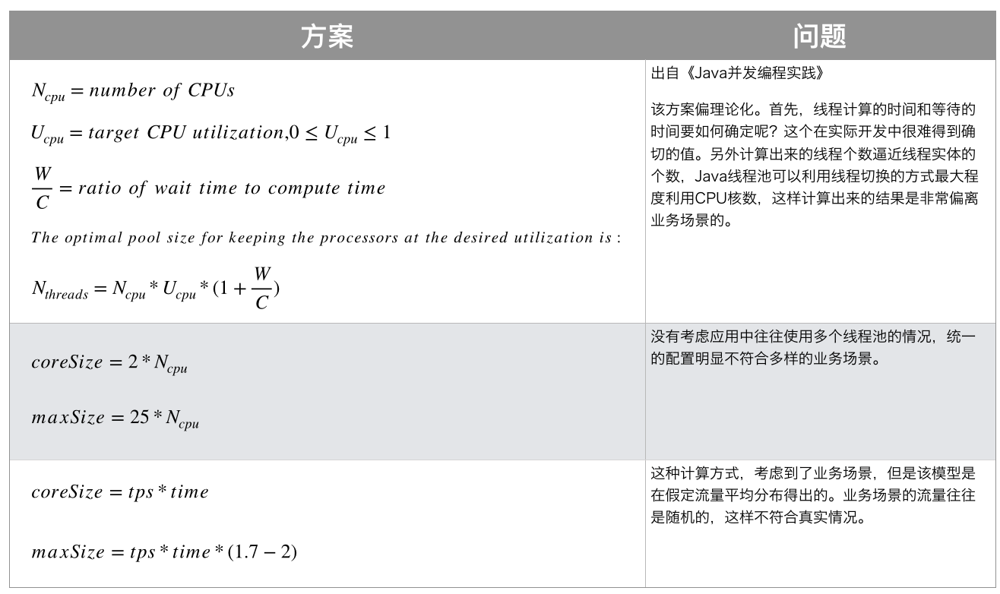

## 写在前面

本文对线程池基础知识就不做详细介绍了，主要对一些细节性问题做一个总结。

## 线程数量设置多少合适？

下面是业界的一些线程池线程数的配置方案：



理论方案和实际执行情况往往相差很大，因为影响因素有很多，比如，IO 密集型和 CPU 密集型任务实际执行情况可能和预估的大不相同，任务的高峰期和低峰期，机器的负载，CPU 上下文的切换等等，这些因素可能是随时变化的，无论你怎样去预估，都无法得出一个一劳永逸的值。

具体解决思路就落到了参数的动态化方向上了，具体可以参考美团的这篇文章 https://tech.meituan.com/2020/04/02/java-pooling-pratice-in-meituan.html。

**下面对上文几个概念做一下详细解释**

**<font color="#159957">CPU 核心数、线程数的概念:</font>**

CPU 从早期的单核，发展到现在的双核，多核。CPU 除了核心数之外，还有线程数之说(只针对 Intel)，下面解释一下 CPU 的核心数与线程数的关系和区别:

+ CPU 的核心数是指物理上，也就是硬件上存在着几个核心。比如，双核就是包括 2 个相对独立的 CPU 核心单元组，四核就包含 4 个相对独立的 CPU 核心单元组，等等，依次类推。

+ CPU 线程数是一种逻辑上的概念。简单地说，就是模拟出的 CPU 核心数。比如，可以通过 1 个 CPU 核心数模拟出 2 个线程的 CPU。

**<font color="#159957">为什么要有 CPU 线程数这个东西？</font>**

以前一直认为，单核心 CPU 通过时间分片，某一刻只能有一个线程在占用 CPU，然后由多个线程切换做到多线程执行任务，这种理解其实是错的。对于 Intel CPU 而言，如果单核 CPU 有两个 CPU 逻辑处理器（即上文说的两个线程），**那么就能够做到同一个时刻单核心两个线程同时占用 CPU，这就是 Intel 的超线程技术。** 超线程技术最早应用在 Intel 奔腾处理器 4 上，后来的逐步应用在 Intel 各个系列上，比如 Intel 赛扬 G460 是单核心双线程，Intel 酷睿 i3-3220 是双核四线程，Inte 酷睿 i7-3630QM 是四核心八线程等等。但是，并不是所有的 Intel 处理器都是具备超线程技术的，比如 Intel 酷睿 i5-6300 是四核心四线程等等。

CPU 之所以要增加线程数，是源于多任务处理的需要。线程数越多，越有利于同时运行多个程序，因为线程数等同于在某个瞬间 CPU 能同时并行处理的任务数。另外，CPU 的线程数概念仅仅只针对 Intel 的 CPU 才有用，因为它是通过 Intel 超线程技术来实现的。AMD 的 CPU 只有核心数的概念，没有线程数的概念，所以对于 AMD CPU 来说 一个 CPU 核心只对应一个线程。
>在 Windows 系统中，DOS 系统中输入"wmic"，然后在出现的新窗口中分别输入："cpu get Name"，"cpu get NumberOfCores"，"cpu get NumberOfLogicalProcessors" 即可查看 CPU 名称、CPU 核心数、线程数。

**<font color="#159957">线程池最大线程数应该如何设置？</font>**

在 Java 中通过 Runtime.getRuntime().availableProcessors();获得的是 CPU 线程数，而不是核心数。

比如：我的 CPU 是 Intel Core i7 3630 QM 四核八线程，通过上面获得的返回值是 8，等于同于核心数 * 2，所以直接写该代码即可；但是，如果你的核心数是 4，线程数也是 4，那就要乘以 2。

###阻塞队列的容量如何设置

阻塞队列的容量设置是一个牵扯面很广的问题，表面来看只是一个队列容量的设置，实际上是多方面权衡的一个产物。例如，FixedThreadPool 阻塞队列的容量是 Integer.MAX_VALUE，可能造成 OOM。如果设置的过小，比如我上面的 Demo，带来的问题是任务量过大的时候拒绝策略拒绝掉的任务就会很多，触发补偿策略太过频繁。所以，阻塞队列的容量设置不是简单的设置一下，下面给出的仅仅是理论考虑的角度，实际数值要根据具体的业务场景，经过一次次尝试和生产环境下不断地优化产生的。

阻塞队列的容量设置主要考虑到下面两个方面：

1. 单个任务占用内存量

   一般情况下，通过单个任务量占用内存量可计算出任务队列最大占用内存量从而确保是否超出服务能够承载的范围，确保服务可用。

2. 任务数量级

   如果该线程池处理的任务是服务比较繁忙且任务量一直维持在一个不小的数量级的的业务模块，可能每时每刻都有一定的任务量。那么其实这里要考虑整个服务的内存是否足够，然后才是适当的增加队列的容量。如果数量级一直不断攀升，那么在拒绝策略数量级能够接受的情况下也可以，但是如果拒绝策略数量级过大，那么就要考虑到线程数是否合理了，这里仅仅是一些考虑思路，实际情况取决于实际场景。

###线程池异常处理机制

####设置 Worker 线程的 UncaughtExceptionHandler
通过设置 Worker 线程的 UncaughtExceptionHandler，在 uncaughtException 方法中处理异常（注意：这种方式只针对 execute 方法有效，对 submit 方法无效）。

```Java
thread.setUncaughtExceptionHandler(new Thread.UncaughtExceptionHandler() {  
      @Override
      public void uncaughtException(Thread t, Throwable e) {
          System.err.println(t.getName() + ":" + e.getMessage());
      }
});

for (int i = 0; i < 5; i++) {
    threadPoolExecutor.execute(new Runnable() {
        public void run() {
            list.add(random.nextInt());
        }
    });
}
```

####捕获任务异常（submit、execute）
```Java
for (int i = 0; i < 5; i++) {
    threadPoolExecutor.execute(new Runnable() {
        public void run() {
            list.add(random.nextInt());
            try {
                Object object = null;
                object.hashCode();
            } catch (Exception e) {
                System.err.println("出异常啦");
            }
        }
    });
}

for (int i = 0; i < 5; i++) {
    threadPoolExecutor.submit(() -> {
        list.add(random.nextInt());
        try {
            Object object = null;
            object.hashCode();
        } catch (Exception e) {
            System.err.println("出异常啦！");
        }
    });
}
```

####捕获 future.get() 抛出的异常
通过 future.get() 方法接收抛出的异常并捕获处理
```Java
for (int i = 0; i < 5; i++) {
    Future future = threadPoolExecutor.submit(() -> {
        list.add(random.nextInt());
        Object object = null;
        object.hashCode();
    });

    try {
        future.get();
    } catch (Exception e) {
        System.err.println("出异常啦！");
    }
}
```

####重写 ThreadPoolExecutor.afterExecute 方法
通过重写 ThreadPoolExecutor 的 afterExecute 方法，处理传递的异常引用（JDK 官方给出的做法）
```Java
package com.tkz.threadPoolExecutor;

import java.util.concurrent.*;

/**
 * 该方式还存在问题，还是会抛出异常，暂未解决.
 */

public class AfterExecuteExceptionCaughtDemo{
     static class ExceptionCaughtThreadPoolExecutor extends ThreadPoolExecutor{
         public ExceptionCaughtThreadPoolExecutor(int corePoolSize, int maximumPoolSize, long keepAliveTime, TimeUnit unit, BlockingQueue<Runnable> workQueue) {
             super(corePoolSize, maximumPoolSize, keepAliveTime, unit, workQueue);
         }

         // jdk 文档里面给的例子
         @Override
         protected void afterExecute(Runnable r, Throwable t) {
             super.afterExecute(r, t);
             if (t == null && r instanceof Future<?>) {
                 try {
                     Object result = ((Future<?>) r).get();
                 } catch (CancellationException ce) {
                     t = ce;
                 } catch (ExecutionException ee) {
                     t = ee.getCause();
                 } catch (InterruptedException ie) {
                     Thread.currentThread().interrupt(); // ignore/reset
                 }
             }
             if (t != null) {
                 System.err.println("出异常啦！");
             }
         }
     }

    public static void main(String[] args){
        ExceptionCaughtThreadPoolExecutor threadPoolExecutor = new ExceptionCaughtThreadPoolExecutor(1,
                Runtime.getRuntime().availableProcessors(),
                60,
                TimeUnit.SECONDS,
                new LinkedBlockingQueue<>(200));

        for (int i = 0; i < 5; i++) {
            threadPoolExecutor.execute(new Runnable() {
                public void run() {
                    Object object = null;
                    object.hashCode();
                }
            });
        }

        threadPoolExecutor.shutdown();

        try {
            threadPoolExecutor.awaitTermination(1, TimeUnit.DAYS);
        } catch (InterruptedException e) {
            e.printStackTrace();
        }
    }
}
```

###线程池的关闭

从应用服务的角度出发，只要服务不关闭，一般线程池是不需要关闭的；但是实际生产过程中服务是有可能关闭的，当服务关闭的时候就要涉及到线程池的关闭问题了（服务要实现优雅关闭不仅仅只是线程池的关闭问题，还有很多组件的关闭问题，这里只说线程池的关闭）。

**<font color="#159957">线程池关闭的方式可以分为以下几种:</font>**

####通过 Spring 容器 detory-method 关闭

使用这种关闭方式通常将线程池交给 Spring 进行管理，当 Spring 容器关闭的时候会调用 destory-method，在 destory-method 里面要声明去调用 shutdown 方法进行关闭（或者是 @Predestory）。
**<font color="#e50e0e">注意：</font>**
1. 互联网公司一般都是使用 Spring 对线程池进行管理的，而不是直接创建线程池。
2. 假设线程池执行的任务有可能出现永久阻塞，那么 shutdown 方法可能无法关闭线程池；这时可以使用 shutdownnow 方法进行强行关闭，但是强行关闭可能会导致线程正在执行的任务失败从而导致数据出错，所以使用 shutdownnow 方法一定要有完善的补偿机制，比如：日志记录或入库等等。

**<font color="#e50e0e">最后要提醒各位小伙伴:</font>**

实际项目中使用线程池是非常严格的，因为一个项目中可能存在多个线程池部署在同一个机器上，所以，对于参数的设置是要做多个线程池的平衡的。一般由项目经理或者是技术经理做总体权衡后决定的。
<br />  
#####参考:

https://www.imooc.com/
http://www.blogjava.net/bolo/archive/2015/01/20/422296.html
https://www.cnblogs.com/syp172654682/p/9383335.html
https://juejin.im/post/5d1882b1f265da1ba84aa676
