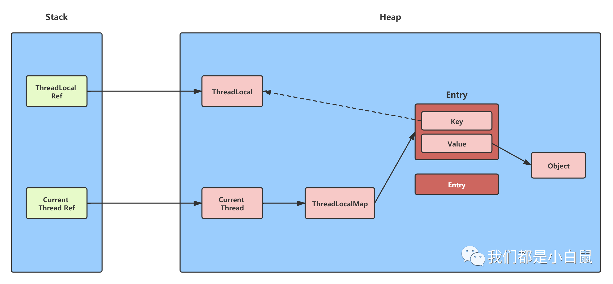

## 写在前面

ThreadLocal 是什么以及常见的使用场景本篇文章就不介绍了，如果有不知道的小伙伴可以先了解一下，本篇文章只研究 ThreadLocal 内存泄漏这一问题。

## ThreadLocal 会发生内存泄漏吗？

先给出结论：如果你使用不当是有可能发生内存泄露的。

具体原因，接下来对照下图给出详细分析：

每个 Thread 里面都有一个 ThreadLocalMap，ThreadLocalMap 中真正承载数据的是一个 Entry 数组，Entry 的 Key 是 threadlocal 对象的弱引用，当把栈中的 threadlocal 变量置为 null 以后，没有任何强引用指向堆中的 threadlocal 对象实例，因此，堆中的 threadlocal 实例将会被 GC 回收，但是，当前线程中的 ThreadLocalMap 里面的 Entry 的 Value 却无法回收，因为从 Current Thread 到 Value 存在强引用. 只有当前 Thread 运行结束被回收以后强引用才断开， 于是，Current Thread，ThreadLocalMap，Value 将全部被 GC 回收。

根据上面的描述，我们得出一个结论：只要线程执行结束后被 GC 回收，那么该线程内部的 ThreadLocalMap 也会被回收，其内部的 Entry 都会被回收，但是这里有一个时间差问题，当栈中的 threadlocal 变量置为 null 后，堆中的 threadlocal 实例会被 GC 回收，那么 Entry 中的 Key 自然也会变成 null，如果此时当前 thread 还未执行结束，而 Value 仍然会存在，此时就发生了内存泄漏，但是，当 thread 正常执行完后 Value 自然也就被回收了。相反，如果线程一直未回收，这就发生了真正意义上的内存泄露，比如使用线程池的时候，线程会被反复使用，就可能出现内存泄露。

Java 为了最小化减少内存泄露的可能性和影响，在 ThreadLocal 的 get，set 的时候都会清除线程 Map 里所有 key 为 null 的 value。所以最怕的情况就是，threadLocal 对象设 null 了，开始发生“内存泄露”，然后使用线程池，这个线程结束，线程放回线程池中不销毁，这个线程一直不被使用，或者分配使用了又不再调用 get，set 方法，那么这个期间就会发生真正的内存泄露。
