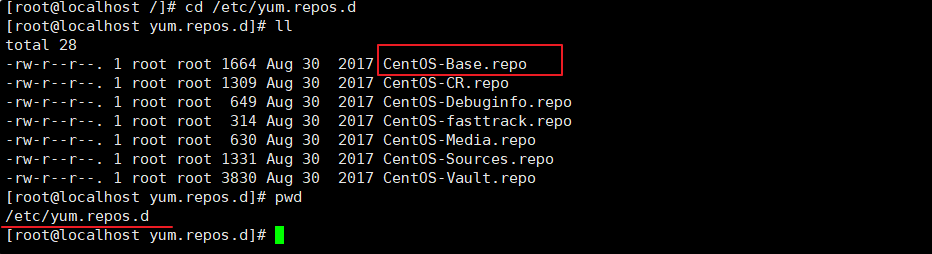
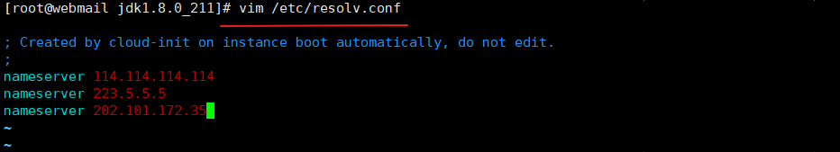
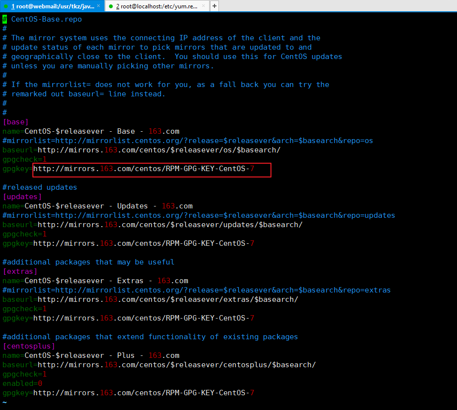

## 首先下载并安装 VMware

安装 VMware 较为简单，这里就贴出来了，小伙伴们可以自己去[官方网站](https://www.vmware.com)下载安装。

## 下载 CentOS7 镜像

小伙伴们可以去[官方网站](http://isoredirect.centos.org/centos/7/isos/x86_64/)下载，官网下载慢的小伙伴们可以去[华为云](http://mirrors.huaweicloud.com/centos/7.7.1908/isos/x86_64/)下载

>小贴士:
>
> CentOS-7-x86_64-DVD-1908                   标准安装版（推荐）
>
> CentOS-7-x86_64-Everything-1908            完整版，集成所有软件（以用来补充系统的软件或者填充本地镜像）
>
> CentOS-7-x86_64-LiveGNOME-1908             GNOME 桌面版  
>
> CentOS-7-x86_64-LiveKDE-1908               KDE 桌面版  
>
> CentOS-7-x86_64-Minimal-1908               精简版（自带的软件最少）
>
> CentOS-7-x86_64-NetInstall-1908            网络安装版（从网络安装或者救援系统）

一般推荐使用标准安装版

### 备份原配置文件，将下载的文件的名字改成 CenOS-Base.repo

### 配置 DNS 域名服务器

> 小贴士：配置 DNS 域名服务器的原因是在 yum 源文件（如下图）里面的镜像源地址都是 URL，所以需要配置 DNS 域名服务器对其进行解析

