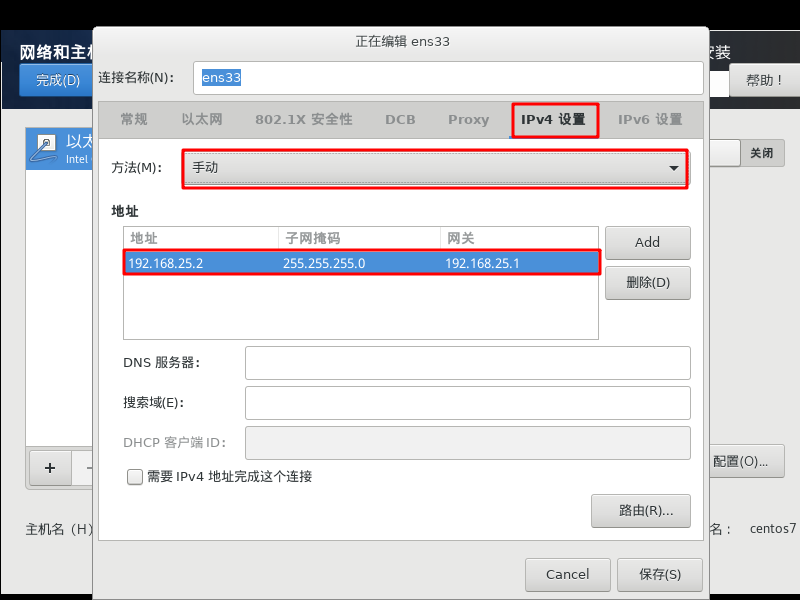
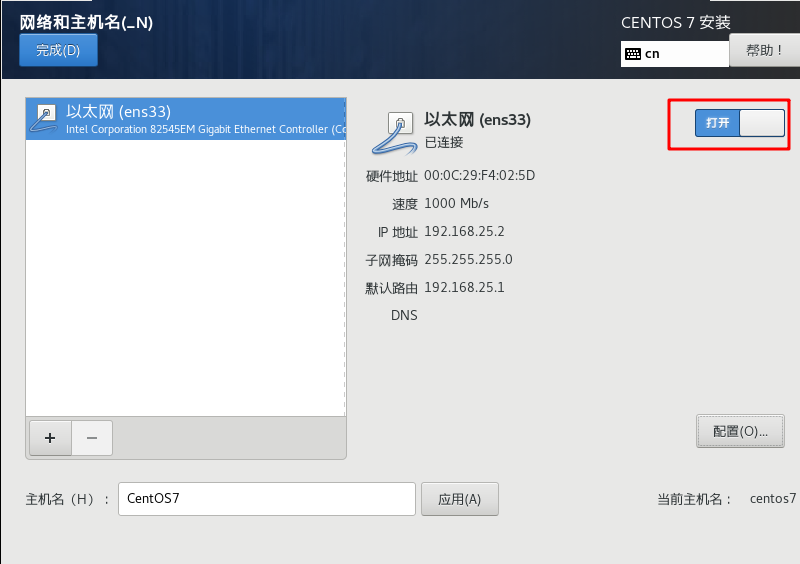

## 下载并安装 VMware

VMware 可以去[官方网站](https://www.vmware.com)下载。本人使用的是 **12.5.5** 版本，下载完之后双击安装包进行安装，然后点击“下一步”。

选择“我接受许可协议中的条款”，点击“下一步”。

选择安装位置和增强型键盘驱动程序。

> 小贴士:
>
> 增强型虚拟键盘功能可更好地处理国际键盘和带有额外按键的键盘，此功能只能在 Windows 主机系统中使用。详细介绍可以参考官方使用手册。

用户体验设置主要根据个人需求，这里我为了防止更新暂时未勾选这两项，然后点击“下一步”。

设置快捷方式，然后点击“下一步”。

点击“安装”

开始安装 VMware

点击“完成”

立即重启

重启之后查看 VMware 服务已经启动。

再看一下 VMware 虚拟出的两网卡。

修改 VMnet8 虚拟网卡配置（有关 IP 地址，子网掩码，网关等概念请看这篇文章）

我们看一下 VMnet8 的 IP 地址，子网掩码和默认网关（这里网关即本身）。

到这里 VMware 就安装完毕了。

## 下载 CentOS 7 镜像

CentOS 系统可以去[官方网站](http://isoredirect.centos.org/centos/7/isos/x86_64/)下载，官网下载慢的小伙伴可以去[华为云](http://mirrors.huaweicloud.com/centos/7.7.1908/isos/x86_64/)下载。以下是华为云的下载页面。

CentOS 一共分为 6 个版本，各版本介绍如下：

> CentOS-7-x86_64-DVD-1908 &emsp;&emsp;&emsp;&emsp;&emsp;&nbsp;&nbsp;&nbsp;标准安装版（推荐）
>
> CentOS-7-x86_64-Everything-1908 &emsp;&emsp;&emsp;完整版，集成所有软件（以用来补充系统的软件或者填充本地镜像）
>
> CentOS-7-x86_64-LiveGNOME-1908 &emsp;&emsp;&nbsp;GNOME 桌面版
>
> CentOS-7-x86_64-LiveKDE-1908&emsp;&emsp;&emsp;&emsp;&nbsp;&nbsp;KDE 桌面版  
>
> CentOS-7-x86_64-Minimal-1908 &emsp;&emsp;&emsp;&emsp;&nbsp;精简版（自带的软件最少）
>
> CentOS-7-x86_64-NetInstall-1908 &emsp;&emsp;&emsp;&nbsp;&nbsp;网络安装版（从网络安装或者救援系统）

一般无特殊需求推荐使用标准安装版。

## 安装 CentOS 7

### 创建虚拟机

#### 自定义安装

自定义安装可以针对性的把一些资源加强，把不需要的资源移除。避免资源的浪费。

#### 典型安装

VMwear 会将主流的配置应用在虚拟机的操作系统上，对于新手来很友好。

如果没有特殊需求建议选择典型安装，然后点击“下一步”。

选择稍后安装操作系统，然后点击“下一步”。

客户机操作系统这里选择 Linux 系统，版本选择 CentOS 64 位。

磁盘容量根据自身机器磁盘容量进行合理配置，这里暂时分配 40G 即可，后期根据自身需求可以合理增减。

勾选将虚拟磁盘拆分成多个文件，这样可以使虚拟机系统文件方便用储存设备拷贝复制。

自定义硬件可以根据自己的需要进行添加或移除，假设系统是作为服务器使用，那么声卡、打印机一般不太需要，可以将其移除。

选择下载好的 IOS 镜像文件。设置完毕之后点击“关闭”。

点击“开启此虚拟机”开启系统。

开始安装 CentOS 7

系统语言可以根据自己的需求，这里选择中文简体，然后点击“继续”。

时区选择亚洲上海并修改日期和时间，然后点击“完成”。

注意，目录分区是非常重要的一步，Linux 平台下的目录分区可以类比安装 Windows 系统时的磁盘分区。

分区方案要选择 LVM，然后点击加号进行磁盘分区。这里需要注意，安装 Linux 系统时的分区有三个是必须的：<code>/boot</code> 分区、<code>/swap</code> 分区和 <code>/</code> 分区，<code>/boot</code> 分区类似于 Windows 中的 C 盘，大小一般设置为 512M。

<code>/swap</code> 分区就是系统的内存分区，大小一般时新建虚拟机时内存的 2 倍。

<code>/</code> 分区是根目录分区，类似 Windows 系统中的文件除 C 盘之外的磁盘分区，大小最大；由于是最后新建的挂载点，那么期望容量可以不写，会默认把剩下的磁盘容量都分配给它。其他分区也可以根据自身需求进行创建，比如 <code>/home</code>，<code>/data</code> 分区，这些算是用户自定义分区，存放用户自己的数据或者程序，不是必须的。

按照上述步骤将 <code>/boot</code> 分区、<code>/swap</code> 分区和 <code>/</code> 分区 都分配好之后，点击左上角“完成”弹出更改摘要，继续点击“接受更改”。

接下来进行网络和主机名设置。

设置完主机名称，点击“应用”，再点击“配置”，进行网络配置。注意：这里的网络配置是现在正在安装的 CentOS 的 IP 配置，如果在这里不进行配置，也可以在安装完系统后，自己在系统中进行配置。

网卡名称是 <code>ens33</code>，这个不需要更改，点击 “IPv4 配置”，方法选择手动，点击 “Add” 添加 IP 地址，子网掩码和网关。

网关是之前虚拟机网络配置里面的网关，IP 地址自己设置，但是必须在 192.168.18.x 网段中，然后点击“保存”完成 IP 地址设置。

点击“打开以太网”，可以看到 IP 地址已经设置完成后的配置情况，继续点击左上角的“完成”。

软件选择根据个人需求，这里选择最小化安装。个人建议，如无特殊需求，可以先选择最小化安装以减少装系统的时间，后期使用的过程中发现有需要再安装即可。

开始安装，在安装的过程中可以自己设置 root 用户的密码，还可以自己添加用户，这些都可以自己设置，但是一定要记住 root 用户密码。

安装启动完毕，输入用户名和密码登录系统。

执行 <code>ifconfig</code> 命令查看系统 IP 地址，显示未找到改命令。原因是安装系统的时候选择的是最小化安装，所以系统未安装 net-tools 软件，这里我们自行安装，执行 <code>sudo yum install net-tools</code> 命令，紧接着又报错，出多的原因是 **安装系统时网卡没有打开，导致了无法连接网络**。

开始配置网卡

首先执行 <code>nmcli d</code> 查看自己本机的网卡

进入 <code>/etc/sysconfig/network-scripts/</code> 目录下，修改 <code>ifcfg-ens33</code> 网卡配置:

> <code>BOOTPROTO</code> 参数代表 IP 地址分配方式，<code>dhcp</code> 表示由 dhcp 服务器动态分配 IP 地址，<code>none</code> 是通过自己设置静态的 IP 地址。

> <code>ONBOOT</code> 参数，<code>yes</code> 表示系统启动时自动激活网卡，<code>no</code> 则相反。

执行 <code>systemctl restart network</code> 重启网络服务。然后重新执行 <code>sudo yum install net-tools</code> 命令发现可以联网了。

到这里使用 VMware 安装 CentOS 7 非 GONE 桌面版系统就全部结束了。
