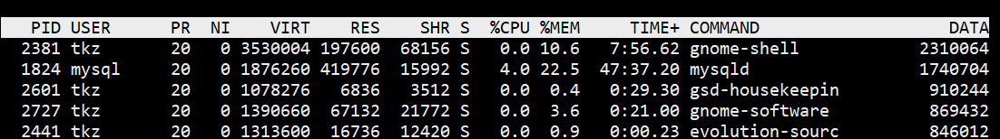

运行一下 top 命令

## 系统运行时间及负载

+ 17:48:19 ：当前时间
+ 18:08 ：系统已运行时间
+ 3 users ：当前登录用户数为 3
+ load average : 0.00，0.01，0.05 分别是 1 分钟、5 分钟、15 分钟的 CPU 平均负载情况。

对于单核 CPU 而言，如果 load average 低于 0.7 表明此时 CPU 处于不错的状态。load average 接近 1 说明 CPU 在全力运作。如果再有额外的计算请求，CPU 就会过载，系统运行效率就会减慢。当 load average 大于 5 时，系统已经有严重的问题了，进程的切换大大降低了 CPU 运行效率，需要干预解决。

通常我们先看 15 分钟 load，如果 load 很高，再看 1 分钟和 5 分钟 load，查看是否有下降趋势。
1 分钟负载值 > 1，那么我们不用担心，但是如果 15 分钟负载都超过 1，我们要赶紧看看发生了什么事情。所以我们要根据实际情况查看这三个值。

注意：如果是多核处理器，负载是单核的两倍。

## 任务进程

系统现在共有 210 个进程，其中处于运行中的有 1 个，209 个在休眠，stoped 状态的有 0 个，zombie 状态（僵尸）的有 0 个。

## CPU

us（user）：运行未调整优先级的用户进程的 CPU 时间
sy（system）: 运行内核进程的 CPU 时间
ni（niced）：运行已调整优先级的用户进程的 CPU 时间
id ：空闲 CPU 百分比
wa（IO wait）: 用于等待 IO 完成的 CPU 时间
hi（Hardware IRQ）：处理硬件中断的 CPU 时间
si（Software Interrupts）: 处理软件中断的 CPU 时间
st：这个虚拟机被 hypervisor 偷去的 CPU 时间（译注：如果当前处于一个 hypervisor 下的 vm，实际上 hypervisor 也是要消耗一部分 CPU 处理时间的）。

top 命令下按数字 1，可以监控每一个逻辑 CPU 使用情况。

## 内存

第一行代表物理内存：全部可用内存、空闲内存、已使用内存、缓冲内存。

第二行代表 SWAP 交换空间内存：全部可用内存、空闲内存、已使用内存、缓冲交换空间。

内存显示可以用 'm' 命令切换。

注意：Linux 内存和 Windows 不同。used 内存指的是系统内核控制的内存数，free 指的是还未纳入内核管理的内存。纳入内核管理的内存不见得都在使用中，有可能是之前有进程使用过，后来释放了，现在处于空闲的内存，内核并不把这部分可以被重新使用的内存交还到 free 中去，所以 free 会越来越少，但不用为此担心。

有关于可用内存数，有个近似的计算公式：free + buff/cache

如果 swap 交换分区的 used 在不断的变化，说明内核在不断进行内存和 swap 的数据交换，这是真正的内存不够用了。

## 进程状态

PID：进程 ID

USER：进程所有者的实际用户名。

PR：进程的调度优先级。这个字段的一些值是'rt'。这意味这这些进程运行在实时态。

NI：进程的 nice 值（优先级）。越小的值意味着越高的优先级。负值表示高优先级，正值表示低优先级。

VIRT（virtual memory usage）：进程需要的虚拟内存大小，包括进程使用的库、代码、数据等，假如进程申请 100m 的内存，但实际只使用了 10m，那么它会增长 100m，而不是实际的使用量。

RES（resident memory usage）：常驻内存。进程当前使用的内存大小，但不包括 SWAP 交换空间内存，包含其他进程的共享，如果申请 100m 的内存，实际使用 10m，它只增长 10m，与 VIRT 相反。关于库占用内存的情况，它只统计加载的库文件所占内存大小。

SHR（shared memory）：进程使用的共享内存。除了自身进程的共享内存，也包括其他进程的共享内存，虽然进程只使用了几个共享库的函数，但它包含了整个共享库的大小。计算某个进程所占的物理内存大小公式：RES – SHR。

DATA：进程运行过程中数据所占用的内存。top 命令获取视图后，按 f 键可以显示出来。

S：这个是进程的状态。它有以下不同的值:

+ D – 不可中断的睡眠态。
+ R – 运行态
+ S – 睡眠态
+ T – 被跟踪或已停止
+ Z – 僵尸态

%CPU：自从上一次更新时到现在任务所使用的 CPU 时间百分比。

%MEM：进程使用的可用物理内存百分比。20200527014543414

TIME+：任务启动后到现在所使用的全部 CPU 时间，精确到百分之一秒。

COMMAND：运行进程所使用的命令。进程名称（命令名/命令行）

还有许多在默认情况下不会显示的输出，它们可以显示进程的页错误、有效组和组ID和其他更多的信息。

top 运行中可以通过 top 的内部命令对进程的显示方式进行控制。内部命令如下：
s – 改变画面更新频率
l – 关闭或开启第一部分第一行 top 信息的表示
t – 关闭或开启第一部分第二行 Tasks 和第三行 Cpus 信息的表示
m – 关闭或开启第一部分第四行 Mem 和 第五行 Swap 信息的表示
N – 以 PID 的大小的顺序排列表示进程列表
P – 以 CPU 占用率大小的顺序排列进程列表
M – 以内存占用率大小的顺序排列进程列表
h – 显示帮助
n – 设置在进程列表所显示进程的数量
q – 退出 top
s – 改变画面更新周期

---
