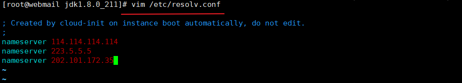

## CentOS 7 使用 163 的 yum 源，配置步骤如下:

### 下载镜像源文件

```java
http://mirrors.163.com/.help/centos.html
```


### 备份原配置文件，将下载的文件的名字改成 CenOS-Base.repo


### 配置 DNS 域名服务器



> 小贴士：配置 DNS 域名服务器的原因是在 yum 源文件（如下图）里面的镜像源地址都是 URL，所以需要配置 DNS 域名服务器对其进行解析


