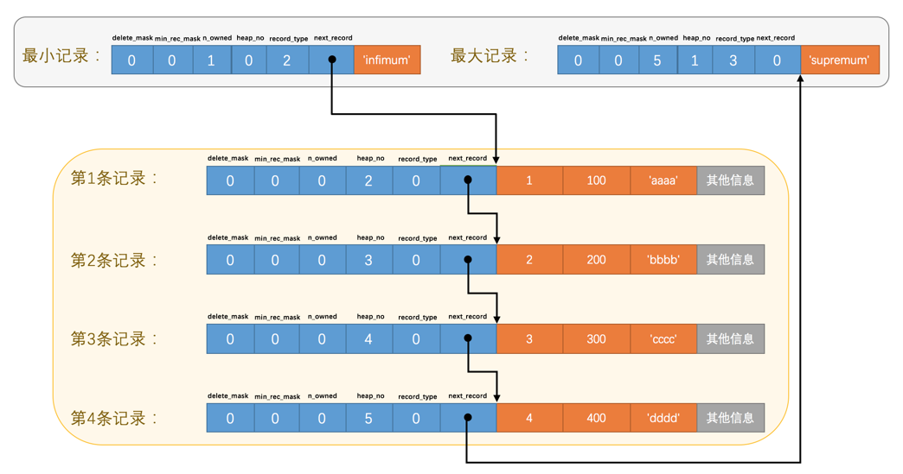
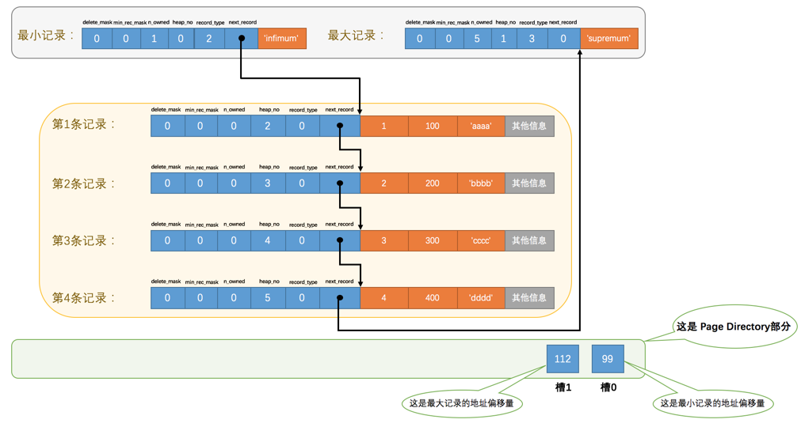

## 数据页

### 不同类型的页简介

**<font color="#e50e0e">页</font>** 是 InnoDB 管理存储空间的基本单位，一个页的大小一般是 **<font color="#e50e0e">16KB</font>** 。InnoDB 为了不同的目的而设计了许多种不同类型的页，比如存放表空间头部信息的页，存放Insert Buffer信息的页，存放INODE信息的页，存放undo日志信息的页等等等等。当然了，这些类型的页不是我们需要看的重点，我们聚焦的是那些 **<font color="#e50e0e">存放我们表中记录的那种类型的页</font>** ，官方称这种存放记录的页为索引（INDEX）页，鉴于我们还没有了解过索引是个什么东西，而这些表中的记录就是我们日常口中所称的数据，所以目前还是叫这种存放记录的页为 **<font color="#e50e0e">数据页</font>** 吧。

### 数据页结构

数据页代表的这块 16KB 大小的存储空间可以被划分为 7 个部分，各个部分如图所示：


不同部分有不同的功能，有的部分占用的字节数是确定的，有的部分占用的字节数是不确定的。下边我们用表格的方式来大致描述一下这 7 个部分都存储一些啥内容（快速的瞅一眼就行了，后边会详细唠叨的）：


>小贴士： 我们接下来并不打算按照页中各个部分的出现顺序来依次介绍它们，因为各个部分中会出现很多大家目前不理解的概念，这会打击各位读文章的信心与兴趣，希望各位能接受这种拍摄手法～

### 记录在页中的存储

我们先创建一个表：

```sql
mysql> CREATE TABLE page_demo(
    ->     c1 INT,
    ->     c2 INT,
    ->     c3 VARCHAR(10000),
    ->     PRIMARY KEY (c1)
    -> ) CHARSET=ascii ROW_FORMAT=Compact;
Query OK, 0 rows affected (0.03 sec)
```
这个新创建的 page_demo 表有 3 个列，其中 c1 和 c2 列是用来存储整数的，c3 列是用来存储字符串的。需要注意的是，我们把 c1 列指定为主键，所以在具体的行格式中 InnoDB 就没必要为我们去创建那个所谓的 row_id 隐藏列了。而且我们为这个表指定了 ascii 字符集以及 Compact 的行格式。所以这个表中记录的行格式示意图就是这样的：


从图中可以看到，我们特意把记录头信息的5个字节的数据给标出来了，说明它很重要，我们再次先把这些记录头信息中各个属性的大体意思浏览一下（我们目前使用Compact行格式进行演示）：


由于我们现在主要在研究记录头信息的作用，所以为了大家理解上的方便，我们只在 page_demo 表的行格式演示图中画出有关的头信息属性以及 c1、c2、c3 列的信息（其他信息没画不代表它们不存在啊，只不过不是现在的重点），简化后的行格式示意图就是这样：


下边我们试着向page_demo表中插入几条记录：

```sql
mysql> INSERT INTO page_demo VALUES(1, 100, 'aaaa'), (2, 200, 'bbbb'), (3, 300, 'cccc'), (4, 400, 'dddd');
Query OK, 4 rows affected (0.00 sec)
Records: 4  Duplicates: 0  Warnings: 0
```
为了方便大家分析这些记录在页的 User Records 部分中是怎么表示的，我把记录中头信息和实际的列数据都用十进制表示出来了（其实是一堆二进制位），所以这些记录的示意图就是：


我们对照着这个图来看看记录头信息中的各个属性是啥意思（这里只挑重点的出来）：

+ **<font color="#e50e0e">record_type</font>**
这个属性表示当前记录的类型，一共有 4 种类型的记录，0 表示普通记录，1 表示 B+ 树非叶节点记录，2 表示最小记录，3 表示最大记录。从图中我们也可以看出来，我们自己插入的记录就是普通记录，它们的 record_type 值都是 0，而最小记录和最大记录的 record_type 值分别为 2 和 3。
至于 record_type 为 1 的情况，我们之后在说索引的时候会重点强调的。
<br/>

+ **<font color="#e50e0e">next_record</font>**
这个非常重要，它表示从当前记录的真实数据到下一条记录的真实数据的地址偏移量。比方说第一条记录的 next_record 值为 32，意味着从第一条记录的真实数据的地址处向后找 32 个字节便是下一条记录的真实数据。如果你熟悉数据结构的话，就立即明白了，这其实是个链表，可以通过一条记录找到它的下一条记录。但是需要注意注意再注意的一点是，下一条记录指得并不是按照我们插入顺序的下一条记录，而是按照主键值由小到大的顺序的下一条记录。而且规定 Infimum 记录（也就是最小记录） 的下一条记录就是本页中主键值最小的用户记录，而本页中主键值最大的用户记录的下一条记录就是 Supremum 记录（也就是最大记录） ，为了更形象的表示一下这个 next_record 起到的作用，我们用箭头来替代一下 next_record 中的地址偏移量：



从图中可以看出来，**<font color="#e50e0e">我们的记录按照主键从小到大的顺序形成了一个单链表</font>**。最大记录的 next_record 的值为 0，这也就是说最大记录是没有下一条记录了，它是这个单链表中的最后一个节点。如果从中删除掉一条记录，这个链表也是会跟着变化的，比如我们把第 2 条记录删掉：

```sql
mysql> DELETE FROM page_demo WHERE c1 = 2;
Query OK, 1 row affected (0.02 sec)
```

删掉第 2 条记录后的示意图就是：


从图中可以看出来，删除第 2 条记录前后主要发生了这些变化：

+ 第 2 条记录并没有从存储空间中移除，而是把该条记录的 delete_mask 值设置为 1。

+ 第 2 条记录的 next_record 值变为了 0，意味着该记录没有下一条记录了。

+ 第 1 条记录的 next_record 指向了第 3 条记录。

+ 还有一点你可能忽略了，就是最大记录的 n_owned 值从 5 变成了 4，关于这一点的变化我们稍后会详细说明的。

所以，不论我们怎么对页中的记录做增删改操作，InnoDB 始终会维护一条记录的单链表，链表中的各个节点是按照主键值由小到大的顺序连接起来的。

>小贴士： 你会不会觉得 next_record 这个指针有点儿怪，为啥要指向记录头信息和真实数据之间的位置呢？为啥不干脆指向整条记录的开头位置，也就是记录的额外信息开头的位置呢？ 因为这个位置刚刚好，向左读取就是记录头信息，向右读取就是真实数据。我们前边还说过变长字段长度列表、NULL值列表中的信息都是逆序存放，这样可以使记录中位置靠前的字段和它们对应的字段长度信息在内存中的距离更近，可能会提高高速缓存的命中率。当然如果你看不懂这句话的话就不要勉强了，果断跳过～

## Page Directory（页目录）

**<font color="#e50e0e">现在我们了解了记录在页中按照主键值由小到大顺序串联成一个单链表</font>** ，那如果我们想根据主键值查找页中的某条记录该咋办呢？比如说这样的查询语句：

```sql
SELECT * FROM page_demo WHERE c1 = 3;
```

最笨的办法：从 Infimum 记录（最小记录）开始，沿着链表一直往后找，总有一天会找到（或者找不到）。

这个方法在页中存储的记录数量比较少的情况用起来也没啥问题，比方说现在我们的表里只有 4 条自己插入的记录，所以最多找 4 次就可以把所有记录都遍历一遍，但是如果一个页中存储了非常多的记录，这么查找对性能来说还是有损耗的，所以我们说这种遍历查找这是一个笨办法。但是设计 InnoDB 的大叔们是什么人，他们能用这么笨的办法么，当然是要设计一种更 6 的查找方式喽，他们从书的目录中找到了灵感。

我们平常想从一本书中查找某个内容的时候，一般会先看目录，找到需要查找的内容对应的书的页码，然后到对应的页码查看内容。设计InnoDB 的大叔们为我们的记录也制作了一个类似的目录，他们的制作过程是这样的：

1. 将所有正常的记录（包括最大和最小记录，不包括标记为已删除的记录）划分为几个组。

2. 每个组的最后一条记录（也就是组内最大的那条记录）的头信息中的 n_owned 属性表示该记录拥有多少条记录，也就是该组内共有几条记录。

3. 将每个组的最后一条记录的地址偏移量单独提取出来按顺序存储到靠近页的尾部的地方，这个地方就是所谓的 Page Directory，也就是页目录（此时应该返回头看看页面各个部分的图）。页面目录中的这些地址偏移量被称为槽（英文名：Slot），所以这个页面目录就是由槽组成的。

比方说现在的 page_demo 表中正常的记录共有 6 条，InnoDB 会把它们分成两组，第一组中只有一个最小记录，第二组中是剩余的 5 条记录，看下边的示意图：



从这个图中我们需要注意这么几点：

1. 现在页目录部分中有两个槽，也就意味着我们的记录被分成了两个组，槽 1 中的值是 112，代表最大记录的地址偏移量（就是从页面的0字节开始数，数 112 个字节）；槽 0 中的值是 99，代表最小记录的地址偏移量。

2. 注意最小和最大记录的头信息中的 n_owned 属性
   + 最小记录的 n_owned 值为 1，这就代表着以最小记录结尾的这个分组中只有 1 条记录，也就是最小记录本身。
   + 最大记录的 n_owned 值为 5，这就代表着以最大记录结尾的这个分组中只有 5 条记录，包括最大记录本身还有我们自己插入的4条记录。

99 和 112 这样的地址偏移量很不直观，我们用箭头指向的方式替代数字，这样更易于我们理解，所以修改后的示意图就是这样：


哎呀，咋看上去怪怪的，这么乱的图对于我这个强迫症真是不能忍，那我们就暂时不管各条记录在存储设备上的排列方式了，单纯从逻辑上看一下这些记录和页目录的关系：


这样看就顺眼多了嘛！为什么最小记录的n_owned值为1，而最大记录的n_owned值为5呢，这里头有什么猫腻么？

是的，设计InnoDB的大叔们对每个分组中的记录条数是有规定的：对于最小记录所在的分组只能有 1 条记录，最大记录所在的分组拥有的记录条数只能在 1~8 条之间，剩下的分组中记录的条数范围只能在是 4~8 条之间。所以分组是按照下边的步骤进行的：

初始情况下一个数据页里只有最小记录和最大记录两条记录，它们分属于两个分组。

之后每插入一条记录，都会从页目录中找到主键值比本记录的主键值大并且差值最小的槽，然后把该槽对应的记录的n_owned值加1，表示本组内又添加了一条记录，直到该组中的记录数等于8个。

在一个组中的记录数等于8个后再插入一条记录时，会将组中的记录拆分成两个组，一个组中4条记录，另一个5条记录。这个过程会在页目录中新增一个槽来记录这个新增分组中最大的那条记录的偏移量。


由于现在page_demo表中的记录太少，无法演示添加了页目录之后加快查找速度的过程，所以再往page_demo表中添加一些记录：
