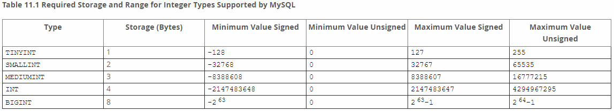
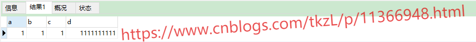
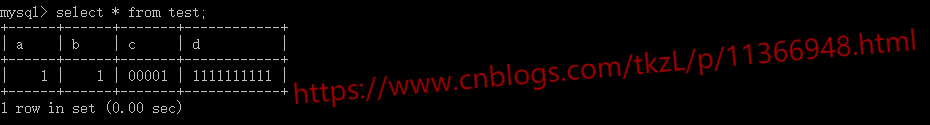
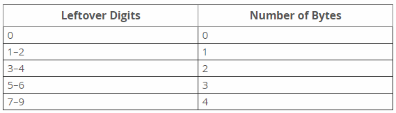
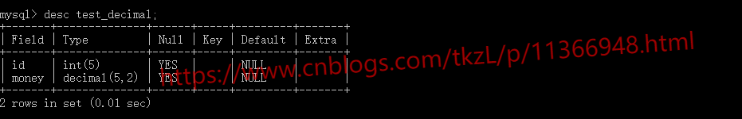
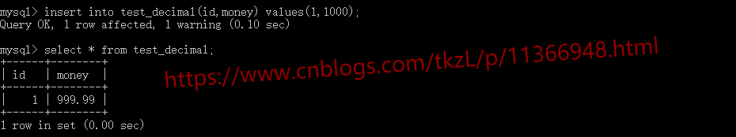
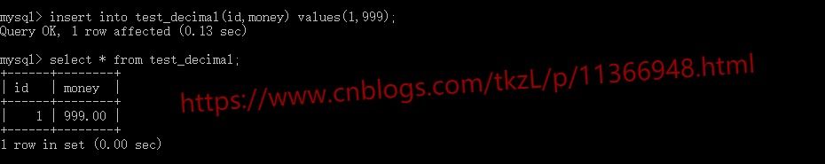
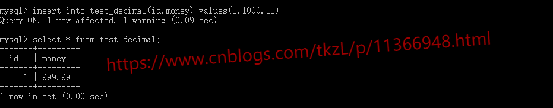
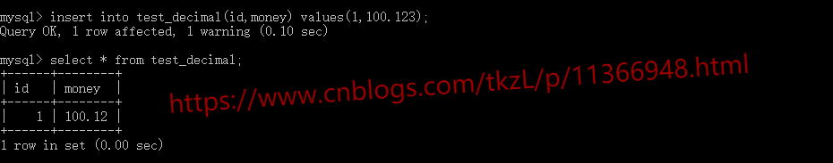
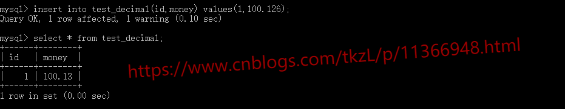

## 前言

本来觉得这篇博客没必要写的，因为 MySQL 官方介绍的很详细。但是最近在设计表的时候遇到一些问题并不是简单的看官方介绍就能够解决的，所以，在这里想给大家看一下。

数据类型大致分为以下几种：数字类型、日期和时间类型、字符串类型。

## 数字类型

### 整数类型（精确值）

整数类型主要有这几种：**INTEGER（INT）、SMALLINT、TINYINT、MEDIUMINT、BIGINT**。我们看一下 MySQL 5.7 官方给出的这几种整数类型所需要的存储空间和数值范围：



实际应用中，**<font color="#e50e0e">我们一定要根据实际情况选择最合适的数据类型。</font>** 例如：

+ 一个表示布尔类型的 0 和 1 的列，选择 TINYINT(1) 就足够了，但是如果你使用了存储字节数大于 TINYINT 的数据类型就是设计不合理。

数据库和内存不同，以 Java 为例，可以使用 byte 类型的地方使用了 long 类型问题不大，因为绝大多数的对象在程序中都是短命对象，方法执行完毕这块内存区域就被释放了，7 个字节实际上不存在浪不浪费一说。但是数据库作为一个存储系统，8 字节的 BIGINT 据的空间是实实在在的。

#### 整型（N）形式

先看一下 MySQL 5.7 官方介绍

> 对于整数类型，M 表示最大显示宽度。最大显示宽度为 255. 显示宽度与类型可包含的值范围无关

所以对于整型（N）这种形式，我们只要明白两点：

+ 无论 N 是多少和该类型所占字节数无关

+ N 表示的是显示宽度，不足的用 0 补足，超过的无视长度而直接显示整个数字，但这要整型设置了 unsigned zerofill 才有效

下面举个例子：

```sql
DROP TABLE IF EXISTS test;
CREATE TABLE test (
   a INT(5),
   b INT(5) UNSIGNED,
   c INT(5) UNSIGNED ZEROFILL,
   d INT(8) UNSIGNED ZEROFILL
) ENGINE=InnoDB DEFAULT CHARSET=utf8;

INSERT INTO test VALUES(1,1,1,1111111111);

SELECT * FROM test;
```

从上面的两点，我们应该预期结果应该是 1,1,00001,1111111111

我们看一下结果：




不符合预期是吧，因为这个问题我也有过困扰，后来查了一下貌似是 Navicat 工具本身的问题，我们使用控制台就不会有这个问题了；



不过实际工作场景中反正我是没有碰到过指定 zerofill 的，也不知道具体应用场景，如果有使用这种写法的朋友可以留言告知具体在哪种场景下用到了这种写法。

### 定点类型（精确值）

定点类型主要有两种：**DECIMAL、NUMERIC**。我们看一下 MySQL 5.7 官方介绍：

> The DECIMAL and NUMERIC types store exact numeric data values. These types are used when it is important to preserve exact precision, for example with monetary data. In MySQL, NUMERIC is implemented as DECIMAL, so the following remarks about DECIMAL apply equally to NUMERIC.

从官方介绍中我们知道：DECIMAL 和 NUMERIC 都是用来存储精确的数值数据的。NUMERIC 是 DECIMAL 的一个具体实现。

#### DECIMAL 数据类型的特征

DECIMAL 数据类型的特征主要分三个方面：

+ 最大位数

+ 存储格式

+ 存储要求

DECIMAL 列声明的语法是：DECIMAL(M,D)。M 是最大位数。它的范围是 1 到 65。D 是小数点后面的位数。它的范围是 0 到 30，并且不得大于 M。如果 D 省略，则默认值为 0，如果 M 省略，则默认值是 10。最大值 M 为 65 表示 DECIMAL 类型能够描述的数据精确到 65 位。这个 65 位精度的限制已经足够描述非常精确的数字了。

DECIMAL 列的值使用二进制格式存储，该格式将 9 个十进制数字打包为 4 个字节。每个值的整数和小数部分的存储分开确定。9 个数字的每个倍数都需要 4 个字节，剩下的任何剩余数字需要 4 个字节的一部分。剩余数字所需的存储量由下表给出。



例如，一个 DECIMAL(18，9) 列在小数点两边各有 9 位，因此整数部分和小数部分各需要 4 个字节。一个 DECIMAL(20,6) 列有 14 个整数位和 6 个小数位。对于 9 个数字，整数位需要 4 个字节，对于剩余的 5 个数字，整数位需要 3 个字节。6 个小数位需要 3 个字节。

DECIMAL 列不存储前导 + 符号或 - 符号或前导为 0 的数字。如果插入 +0003.1 到一个 DECIMAL(5,1) 列，它被存储为 3.1。对于负数，不存储 - 符号。

**<font color="#159957">下面通过一些实际操作案例加深对 DECIMAL 的理解</font>**

```sql
DROP TABLE IF EXISTS test_decimal;
CREATE TABLE test_decimal (
  id INT(5),
  money DECIMAL(5,2)
) ENGINE=InnoDB DEFAULT CHARSET=utf8;
```

操作之前先看一下表描述：



1、插入整数部分为 1000 的数，会报一个警告。



2、插入的 999 的小数部分面自动补齐。



3、插入整数部分为 1000，小数部分为 11 的数，会报一个警告。



4、插入整数部分 100，小数部分 123 的数字，可以成功插入，但有警告，警告表明小数部分发生了截断，被截取成了两位小数。



5、插入整数部分 100，小数部分 126 的数字，可以成功插入，但有警告，警告表明小数部分发生了截断，被截取成了两位小数，但是这里不同于第 4 个案例，虽然 3 位小数被截成了 2 位，但是第 2 位变成了 3（根据第三位进行了四舍五入）。



### 浮点类型（近似值）

浮点类型主要有两种：**FLOAT、DOUBLE**。我们看一下 MySQL 5.7 官方介绍：

> The FLOAT and DOUBLE types represent approximate numeric data values. MySQL uses four bytes for single-precision values and eight bytes for double-precision values.

FLOAT 单精度浮点型占 4 个字节，DOUBLE 双精度浮点型占用 8 个字节。
