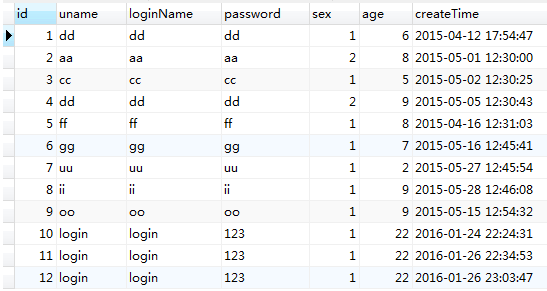
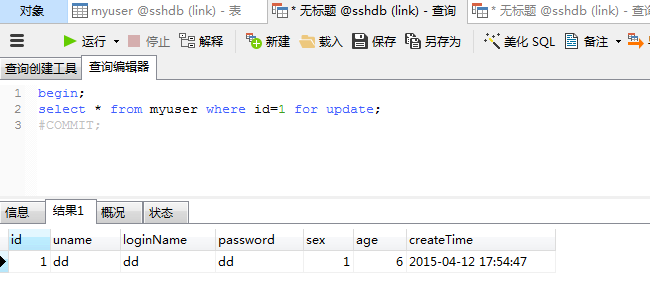

https://www.cnblogs.com/boblogsbo/p/5602122.html（自己补充了一部分）

#### MySQL 针对 InnoDB 引擎锁的种类：行锁（共享锁和排他锁）和表锁（意向共享锁和意向排他锁）

>InnoDB锁
>>行锁：共享锁（S）、排他锁（X）
>>表锁：意向共享锁（IS）、意向排他锁（IX）

下面主要针对 MySQL 中行级锁中的共享锁（S）与排他锁（X）进行分析

**共享锁又称为读锁，简称 S 锁，顾名思义，共享锁就是多个事务对于同一数据可以共享一把锁，都能访问到数据，但是只能读不能修改。**

**排他锁又称为写锁，简称X锁，顾名思义，排他锁就是不能与其他所并存，如一个事务获取了一个数据行的排他锁，其他事务就不能再获取该行的其他锁，包括共享锁和排他锁，但是获取排他锁的事务是可以对数据就行读取和修改。**

对于共享锁大家可能很好理解，就是多个事务只能读数据不能写数据，对于排他锁大家的理解可能就有些差别，**我当初就犯了一个错误，以为排他锁锁住一行数据后，其他事务就不能读和写该行数据**，其实不是这样的。**排他锁指的是一个事务在一行数据加上排他锁后，其他事务不能再在其上加其他的锁**。MySQL InnoDB 引擎默认的修改数据语句，update,delete,insert都会自动给涉及到的数据加上排他锁，select 语句默认不会加任何锁类型，如果加排他锁可以使用 select ...for update 语句，加共享锁可以使用 select ... lock in share mode 语句。**所以加过排他锁的数据行在其他事务种是不能写数据（因为写数据是需要加排他锁的，同一数据是不能够在加排他锁之后还进行加锁的,哪怕是共享锁也不行）的，也不能通过 for update 和 lock in share mode 锁的方式读数据**，但可以直接通过 select ...from... 查询数据，因为普通查询不会加任何锁。

说了这么多，咱们来看下以下简单的例子：
测试数据

> 1. 现在我们对 id=1 的数据行 **排他查询**，这里会使用 begin（或 start transaction）开启事务，而不会看见我关闭事务，这样做是用来测试，因为 **提交事务或回滚事务就会释放锁**。
>> （1） 打开一个查询窗口

