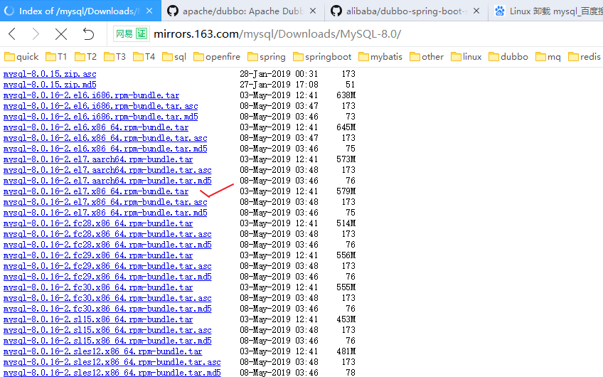

## MySQL 8.0.16 安装

参考：https://www.cnblogs.com/zyongzhi/p/10063149.html

### 目录

&emsp;**一、下载地址**

&emsp;**二、下载目录**

&emsp;**三、将安装包放入待解压文件夹**

&emsp;**四、解压**

&emsp;**五、安装 Common**

&emsp;**六、安装 libs**

&emsp;**七、安装 client**

&emsp;**八、额外需要注意的点**

---
**一、下载地址**

官网

网易开源镜像站

**二、下载目录**

**三、创建一个文件夹将此安装包放入其中，准备解压**

**四、解压**

**五、安装 Common（必须按照下面的顺序）**

**六、安装 libs**

**七、安装 client**

**七、安装 server**

**八、初始化数据库**

**九、目录授权，否则启动失败**

**十、启动服务**

**十一、停止服务**

**十二、找到初始密码，使用客户端登陆**

**十三、set global validate_password_policy=0; 设置密码规则遇到错误**

https://blog.csdn.net/zd147896325/article/details/82427107

设置完密码之后，使用 Navicat 进行连接报错：

解决方法:

