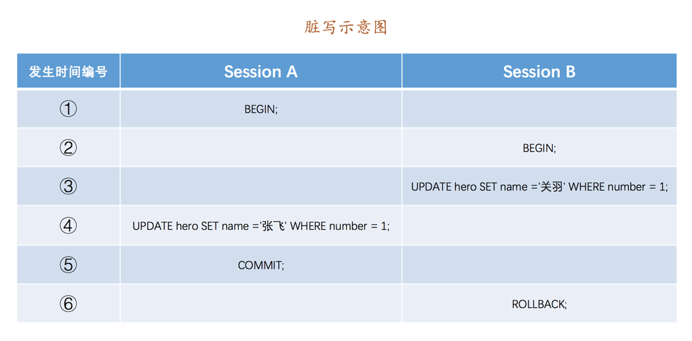
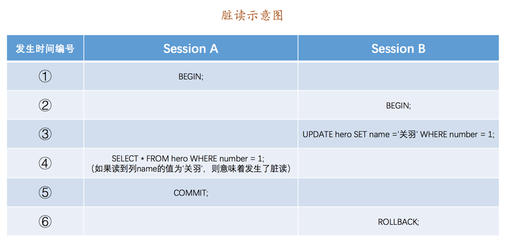
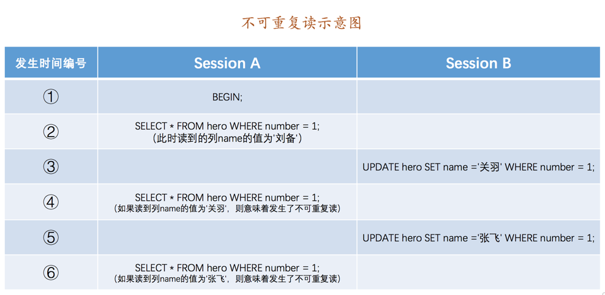
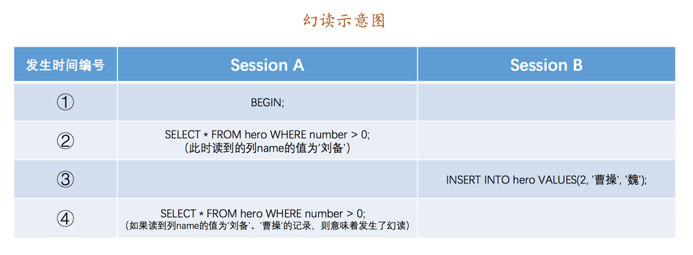
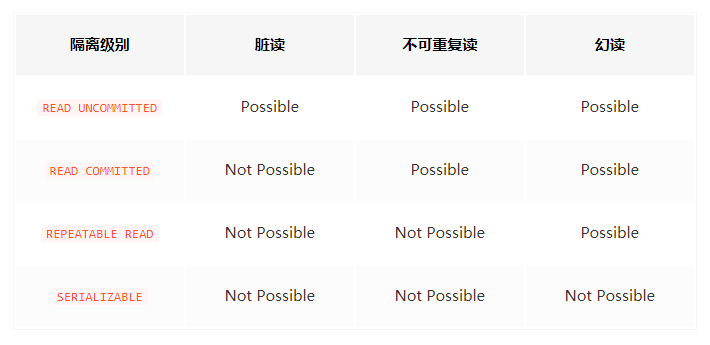

**引言：**

在写 “事务” 之前有一点要说明一下，对于 MySQL 而言并不是所有的引擎都支持事务的，目前只有 InnoDB 和 NDB 存储引擎支持（NDB 存储引擎不是我们的重点）。

## 事务的概念

事务是指逻辑上的一组操作

## 事务的特性

### 原子性（Atomicity）

事务是一个不可分割的工作单位，事务中的操作要么都成功，要么都失败。

### 一致性(Consistency)

事务发生前后数据的完整性必须保持一致。例：A：200,B:200，A、B之间无论怎么交换，最终都要保证和是 400。

### 隔离性(Isolation)

多事务并发访问数据库时，一个事务不能被其他事务所干扰，多个并发事务之间数据要相互隔离。如果不考虑隔离性，会引发诸多安全问题，比如下：脏读、不可重复读、幻读（虚读），下面会对其展开介绍。

### 持久性（Durability）

一个事务一旦被提交，它对数据库中数据的改变就是永久性的，接下来即使数据库发生故障也不应该对其有任何影响

## 事务并发执行遇到的问题

讲这一块内容的时候为了更好的理解，我们要结合一些实际操作来讲解。下面先做一些基础数据的准备：

首先先创建一张表：

```sql
CREATE TABLE hero (
    number INT,
    name VARCHAR(100),
    country varchar(100),
    PRIMARY KEY (number)
) Engine=InnoDB CHARSET=utf8;
```

> 小贴士： 注意我们把这个 hero 表的主键命名为 number，而不是 id，主要是想和后边要用到的事务 id 做区别，大家不用大惊小怪哈～

然后向这个表里插入一条数据：

```sql
INSERT INTO hero VALUES(1, '刘备', '蜀');
```

现在表里的数据就是这样的：

```sql
mysql> SELECT * FROM hero;
+--------+--------+---------+
| number | name   | country |
+--------+--------+---------+
|      1 | 刘备   | 蜀      |
+--------+--------+---------+
1 row in set (0.00 sec)
```

我们知道 MySQL 是一个客户端／服务器架构的软件，对于同一个服务器来说，可以有若干个客户端与之连接，每个客户端与服务器连接上之后，就可以称之为一个会话（Session）。每个客户端都可以在自己的会话中向服务器发出请求语句，一个请求语句可能是某个事务的一部分，也就是对于服务器来说可能同时处理多个事务。事务有一个称之为隔离性的特性，理论上在某个事务对某个数据进行访问时，其他事务应该进行排队，当该事务提交之后，其他事务才可以继续访问这个数据。但是这样子的话对性能影响太大，我们既想保持事务的隔离性，又想让服务器在处理访问同一数据的多个事务时性能尽量高些，鱼和熊掌不可得兼，那么就要舍弃一部分隔离性来获取性能的提升。怎么个舍弃法呢？我们先得看一下访问相同数据的事务在不保证串行执行（也就是执行完一个再执行另一个）的情况下可能会出现哪些问题：

### 脏写

A 事务修改了 B 事务修改的但未提交的数据。示意图如下：



### 脏读

A 事务读取了 B 事务 **update 但还未 commit** 的数据，如果 B 事务回滚，那么 A 事务刚才读到的数据就会消失。示意图如下：



### 不可重复读

A 事务第一次查询到一条记录后，此时 B 事务更新了该条记录后进行 commit，A 事务接着进行第二次查询发现该记录数据变了，不可重复读就发生了。（<u>**强调的是读到了其他事务的已经提交的 update 的数据**</u>）



如上图，在 Session B 中提交了几个隐式事务（注意是隐式事务，意味着语句结束事务就提交了），这些事务都修改了 number 列为 1的记录的列 name 的值，每次事务提交之后，如果 Session A 中的事务都可以读到最新的值，这种现象也被称之为不可重复读。

### 幻读（虚读）

A 事务第一次查询到了两行记录，此时 B 事务插入（insert）一条记录后进行 commit， A 事务接着进行查询发现有三行记录，幻读就发生了。（<u>**强调的是读到了其他事务已经提交的 insert 的数据**</u>）



**<font color="#cf271d">注意:</font>**

在这里可能有人会有一个疑问：如果 Session B 中是删除了一些符合 number > 0 的记录而不是插入新记录，那 Session A 中之后再根据 number > 0 的条件读取的记录变少了，这种现象算不算幻读呢？明确说一下，这种现象不属于幻读，幻读强调的是一个事务按照某个相同条件多次读取记录时，后读取时 **读到了之前没有读到的记录。**

> 小贴士： 那对于先前已经读到的记录，之后又读取不到这种情况，算啥呢？其实这相当于对每一条记录都发生了不可重复读的现象。幻读只是重点强调了读取到了之前读取没有获取到的记录。

## SQL标准中的四种隔离级别

我们上边介绍了几种并发事务执行过程中可能遇到的一些问题，我们给这些问题按照严重性来排一下序：

```
脏写 > 脏读 > 不可重复读 > 幻读
```

我们上边所说的舍弃一部分隔离性来换取一部分性能在这里就体现在：设立一些隔离级别，隔离级别越低，越严重的问题就越可能发生，隔离级别越高，发生的概率越低，但是性能也越低。为了解决上面的事务间的隔离性的问题有人制定了 SQL 标准，设立了 4 个隔离级别：READ UNCOMMITTED、READ COMMITTED、REPEATABLE READ、SERIALIZABLE。

SQL 标准中规定，针对不同的隔离级别，并发事务可以发生不同严重程度的问题，具体情况如下：



> 脏写是怎么回事儿？怎么里边都没写呢？这是因为脏写这个问题太严重了，不论是哪种隔离级别，都不允许脏写的情况发生。

## MySQL支持的四种隔离级别
不同的数据库厂商对 SQL 标准中规定的四种隔离级别支持不一样，比方说 Oracle 就只支持 READ COMMITTED 和 SERIALIZABLE 隔离级别。本书中所讨论的 MySQL 虽然支持 4 种隔离级别，但与 SQL 标准中所规定的各级隔离级别允许发生的问题却有些出入，**<font color="##ff0000">MySQL在 REPEATABLE READ 隔离级别下，是可以禁止幻读问题的发生的</font>**（InnoDB 和 Falcon 存储引擎通过多版本并发控制 MVCC（Multiversion Concurrency Control）机制解决了该问题，后面会有详细解释，这里不展开介绍）。
