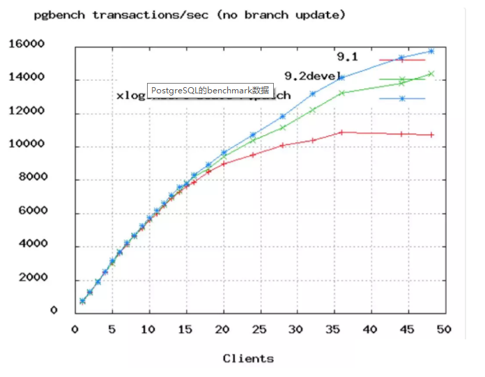

文章翻译整理自: https://github.com/brettwooldridge/HikariCP/wiki/About-Pool-Sizing
作者：犬小哈
来源：小哈学java
## 如何正确设置数据库连接池大小

### <font color="#159957">目录</font>

&emsp;**一、笔者前言**

&emsp;**二、正文开始**

&emsp;**三、假设你的服务有1万并发的访问**

&emsp;**四、为啥有这种效果?**

&emsp;**五、其他应该考虑到的因素**

&emsp;**六、连接数计算公式**

&emsp;**七、结论：你需要的是一个小连接池，和一个等待连接的线程队列**

&emsp;**八、额外需要注意的点**

---
**<font color="#159957">一、前言</font>**

&emsp;&emsp;基本上来说，大部分项目都需要跟数据库做交互，那么，数据库连接池的大小设置成多大合适呢？

&emsp;&emsp;一些开发老鸟可能还会告诉你：没关系，尽量设置的大些，比如设置成 200，这样数据库性能会高些，吞吐量也会大些！

&emsp;&emsp;你也许会点头称是，真的是这样吗？看完这篇文章，也许会颠覆你的认知哦！

**<font color="#159957">二、正文开始</font>**

&emsp;&emsp;可以很直接的说，关于数据库连接池大小的设置，每个开发者都可能在一环节掉进坑里，事实上呢，大部分程序员可能都会依靠自己的直觉去设置它的大小，设置成 100 ？思量许久后，自顾自想，应该差不多吧？

**<font color="#159957">三、假设你的服务有 1 万并发的访问</font>**

&emsp;&emsp;不妨意淫一下，你手里有个网站，并发压力虽然还没到 Facebook 那个级别，但是呢？也有个 1 万上下的并发量！也就是说差不多 2 万左右的 TPS。

&emsp;&emsp;那么问题来了！这个网站的数据库连接池应该设置成多大合适呢？

&emsp;&emsp;其实这个问法本身就是有问题的，我们需要反过来问，正确问法应该是：

&emsp;&emsp;**<font color="#cc0001">“这个网站的数据库连接池应该设置成多小合适呢？”</font>**

>&emsp;PS: 这里有一个 Oracle 性能小组发布的简短视频，链接地址为
>&emsp;```https://video.tudou.com/v/XMjE0MDU2MjAxMg==.html?spm=a2h28.8313475.play-container.5!2~5~5!3~5~5!2~5~5~A&f=50513641```


&emsp;&emsp;&emsp;&emsp;

&emsp;&emsp;口述一下，视频中对 Oracle 数据库进行了压力测试，模拟 9600 个并发线程来操作数据库，每两次数据库操作之间 sleep 550ms，注意，视频中刚开始设置的线程池大小为 2048。

&emsp;&emsp;让我们来看看数据库连接池的大小为 2048 性能测试结果的鬼样子：

&emsp;&emsp;**<font color="#cc0001">每个请求要在连接池队列里等待 33ms，获得连接之后，执行SQL需要耗时77ms, CPU 消耗维持在 95% 左右；</font>**

&emsp;&emsp;接下来，我们将连接池的大小改小点，设置成 1024，其他测试参数不变，结果咋样？

&emsp;&emsp;**<font color="#cc0001">"这里，获取连接等待时长基本不变，但是 SQL 的执行耗时降低了！"</font>**

&emsp;&emsp;哎呦，有长进哦！

&emsp;&emsp;接下来，我们再设置小些，连接池的大小降低到 96，并发数等其他参数不变，看看结果如何：

&emsp;&emsp;**<font color="#cc0001">每个请求在连接池队列中的平均等待时间为 1ms, SQL 执行耗时为 2ms.</font>**

&emsp;&emsp;我去！什么鬼？

&emsp;&emsp;**<font color="#cc0001">我们没调整任何东西，仅仅只是将数据库连接池的大小降低了，这样，就能把之前平均 100ms 响应时间缩短到了 3ms。吞吐量指数级上升啊！</font>**

&emsp;&emsp;你这也太溜了！

**<font color="#159957">四、为啥有这种效果?</font>**

&emsp;&emsp;我们不妨想一下，为啥 Nginx 内部仅仅使用了 4 个线程，其性能就大大超越了 100 个进程的 Apache HTTPD 呢？追究其原因的话，回想一下计算机科学的基础知识，答案其实非常明显。

&emsp;&emsp;要知道，即使是单核 CPU 的计算机也能“同时”运行着数百个线程。但我们其实都知道，这只不过是操作系统快速切换时间片，跟我们玩的一个小把戏罢了。

&emsp;&emsp;一核 CPU同一时刻只能执行一个线程，然后操作系统切换上下文，CPU 核心快速调度，执行另一个线程的代码，不停反复，给我们造成了所有进程同时运行假象。

&emsp;&emsp;其实，在一核 CPU 的机器上，顺序执行A和B永远比通过时间分片切换“同时”执行A和B要快，其中原因，学过操作系统这门课程的童鞋应该很清楚。一旦线程的数量超过了 CPU 核心的数量，再增加线程数系统就只会更慢，而不是更快，因为这里涉及到上下文切换耗费的额外的性能。

&emsp;&emsp;说到这里，应该恍然大悟了 ……

**<font color="#159957">五、其他应该考虑到的因素</font>**

&emsp;&emsp;上小节中说到了主要原因，但其实没有这么简单，我们还需要考虑到一些其他的因素。

&emsp;&emsp;当我们在寻找数据库的性能瓶颈时，大致可归为三类：

>+ **CPU**
>+ **盘 IO**
>+ **网络 IO**

&emsp;&emsp;也许你会说，还有内存这一因素？内存的确是需要考虑的，但是比起**磁盘 IO** 和**网络 IO**，稍显微不足道，这里就不加了。

&emsp;&emsp;假设我们不考虑磁盘 IO 和网络 IO，就很好定论了，在一个 8 核的服务器上，数据库连接数/线程数设置为 8 能够提供最优的性能，如果再增加连接数，反而会因为上下文切换导致性能下降。

&emsp;&emsp;大家都知道，数据库通常把数据存储在磁盘上，而磁盘呢，通常是由一些旋转着的金属碟片和一个装在步进马达上的读写头组成的。读/写头同一时刻只能出现在一个位置，当它需要再次执行读写操作时，它必须“寻址”到另外一个位置才能完成任务。所以呢？这里就有了 **寻址的耗时**，此外还有 **旋转耗时**，读写头需要等待磁盘碟片上的目标数据“旋转到位”才能进行读写操作。使用缓存当然是能够提升性能的，但上述原理仍然适用。

&emsp;&emsp;在这段（"I/O等待"）时间内，线程是处于“阻塞”等待状态，也就是说没干啥正事！此时操作系统可以将这个空闲的CPU 核心用于服务其他线程。

&emsp;&emsp;这里我们可以总结一下，当你的线程处理的是 I/O 密集型业务时，便可以让线程/连接数设置的比 CPU核心大一些，这样就能够在同样的时间内，完成更多的工作，提升吞吐量。

&emsp;&emsp;那么问题又来了？

&emsp;&emsp;大小设置成多少合适呢？

&emsp;&emsp;这要取决于 **磁盘**，如果你使用的是 SSD 固态硬盘，它不需要寻址，也不需要旋转碟片。打住打住！！！你千万可别理所当然的认为：**“既然SSD速度更快，我们把线程数的大小设置的大些吧！！”**

&emsp;&emsp;结论正好相反！**无需寻址和没有旋回耗时的确意味着更少的阻塞**，所以更少的线程（更接近于CPU核心数）会发挥出更高的性能。**<font color="#cc0001">只有当阻塞密集时，更多的线程数才能发挥出更好的性能"。</font>**

&emsp;&emsp;上面我们已经说过了磁盘 IO, 接下来我们谈谈网络 IO！

&emsp;&emsp;网络 IO 其实也是非常相似的。通过以太网接口读写数据时也会造成阻塞，10G带宽会比1G带宽的阻塞耗时少一些，而 1G 带宽又会比 100M 带宽的阻塞少一些。通常情况下，我们把网络 IO 放在第三顺位来考虑，然而有些人会在性能计算中忽略网络 IO 带来的影响。



&emsp;&emsp;PostgreSQL 的 benchmark 数据

&emsp;&emsp;上图是 PostgreSQL 的基准性能测试数据，从图中我们可以看到，TPS 在连接数达到 50 时开始变缓。回过头来想下，在上面 Oracle 的性能测试视频中，测试人员们将连接数从 2048 降到了 96，实际上 96 还是太高了，除非你的服务器 CPU 核心数有 16 或 32。

**<font color="#159957">六、连接数计算公式</font>**

&emsp;&emsp;下面公式由 PostgreSQL 提供，不过底层原理是不变的，它适用于市面上绝大部分数据库产品。还有，你应该模拟预期的访问量，并通过下面的公式先设置一个偏合理的值，然后在实际的测试中，通过微调，来寻找最合适的连接数大小。

&emsp;&emsp;**<font color="#cc0001">连接数 = ((核心数 * 2) + 有效磁盘数)</font>**


&emsp;&emsp;核心数不应包含超线程(hyper thread)，即使打开了超线程也是如此，如果热点数据全被缓存了，那么有效磁盘数实际是0，随着缓存命中率的下降，有效磁盘数也逐渐趋近于实际的磁盘数。另外需要注意，这一公式作用于SSD 的效果如何，尚未明了。
好了，按照这个公式，如果说你的服务器 CPU 是 4核 i7 的，连接池大小应该为 ((4*2)+1)=9。

&emsp;&emsp;取个整, 我们就设置为 10 吧。你这个行不行啊？10 也太小了吧！

&emsp;&emsp;你要是觉得不太行的话，可以跑个性能测试看看，我们可以保证，它能轻松支撑 3000 用户以 6000 TPS 的速率并发执行简单查询的场景。你还可以将连接池大小超过 10，那时，你会看到响应时长开始增加，TPS 开始下降。

**<font color="#159957">七、结论：你需要的是一个小连接池，和一个等待连接的线程队列</font>**

&emsp;&emsp;假设说你有 10000 个并发访问，而你设置了连接池大小为 10000，你怕是石乐志哦。

&emsp;&emsp;改成 1000，太高？改成 100？还是太多了。

&emsp;&emsp;你仅仅需要一个大小为 10 数据库连接池，然后让剩下的业务线程都在队列里等待就可以了。

> 连接池中的连接数量大小应该设置成：数据库能够有效同时进行的查询任务数（通常情况下来说不会高于 2*CPU核心数）。
你应该经常会看到一些用户量不是很大的 web 应用中，为应付大约十来个的并发，却将数据库连接池设置成 100， 200 的情况。请不要过度配置您的数据库连接池的大小。

**<font color="#159957">八、额外需要注意的点</font>**

&emsp;&emsp;实际上，连接池的大小的设置还是要结合实际的业务场景来说事。

&emsp;&emsp;比如说，你的系统同时混合了长事务和短事务，这时，根据上面的公式来计算就很难办了。正确的做法应该是创建两个连接池，一个服务于长事务，一个服务于"实时"查询，也就是短事务。

&emsp;&emsp;还有一种情况，比方说一个系统执行一个任务队列，业务上要求同一时间内只允许执行一定数量的任务，这时，我们就应该让并发任务数去适配连接池连接数，而不是连接数大小去适配并发任务数。

Ref

>https://github.com/brettwooldridge/HikariCP/wiki/About-Pool-Sizing

Question：

&emsp;&emsp;1、我遇到过 20 的连接池，但长链接没有释放，后面所以的业务连接都卡死了，这样的情况如何处理？

&emsp;&emsp;2、是以应用服务区还是以数据库服务器为准？多数据源的情况又是什么样的呢？

&emsp;&emsp;3、数据库连接池的数量应该是以文中提到的几个点为基础，考虑实际业务去作调整。看评论里有人说 20 个连接的池子碰到了长连接出问题了。这是应该在设置参数考虑的问题，也就是末尾文中提到针对长短事务的部分。但如果是网络突发问题导致的长链接，设再大的连接数也不好使。

&emsp;&emsp;4、这是因为数据库端是 bio 模型。连接数和线程数一一对应了？

&emsp;&emsp;5、我也觉得是分应用。像大家做的业务系统大多数都是 IO 密集型，用 10 的连接数岂不是很多时间还是卡在了访问数据库上面？

&emsp;&emsp;6、大佬，平时开发中，十多个开发同时连接同一个数据库进行开发，经常会遇到连接数不够，导致项目启动不了呀!
