## InnoDB 行格式
MySQL 表中的数据记录在磁盘上的存放方式被称为行格式或者记录格式。InnoDB 存储引擎目前有 4 种不同类型的行格式，分别是 Compact、Redundant、Dynamic 和 Compressed，四种类型对于数据记录的存放在磁盘上的方式虽然不同，但是在原理上大体都是相同的。

## InnoDB 页

MySQL InnoDB 引擎以页作为磁盘和内存之间交互的基本单位，将数据记录划分为若干个页，InnoDB 中页的大小一般为 16 KB。也就是在一般情况下，一次最少从磁盘中读取 16KB 的内容到内存中，一次最少把内存中的 16KB 内容刷新到磁盘中。InnoDB 为了不同的目的而设计了许多种不同类型的页，比如存放表空间头部信息的页，存放 Insert Buffer 信息的页，存放 INODE 信息的页，存放 undo 日志信息的页等等。当然了，我们也不准备说这些类型的页，我们聚焦的是那些存放我们表中记录的那种类型的页，官方称这种存放记录的页为索引（INDEX）页，鉴于我们还没有了解过索引是个什么东西，而这些表中的记录就是我们日常口中所称的数据，所以目前还是叫这种存放记录的页为数据页吧。

## 数据页结构的快速浏览

一个数据页包含多个部分，不同部分有不同的功能，如图所示：


从上图可知，一个 InnoDB 数据页的存储空间大致被划分成了 7 个部分，有的部分占用的字节数是确定的，有的部分占用的字节数是不确定的。


## 记录在页中的存储

在页的 7 个组成部分中，我们自己存储的记录会按照我们指定的行格式存储到 User Records 部分。但是在一开始还没有数据记录的时候，其实并没有 User Records 这个部分，每当我们插入一条记录，都会从 Free Space 存储空间中申请一个记录大小的空间划分到 User Records 中去，当 Free Space 空间全部被 User Records 瓜分完之后，也就意味着这个页使用完了，如果还有新的记录插入的话，就需要去申请新的页了，这个过程的图示如下：


为了更好的管理在 User Records 中的这些记录，InnoDB 可费了一番力气呢，在哪费力气了呢？不就是把记录按照指定的行格式一条一条摆在 User Records 部分么？其实这话还得从记录行格式的记录头信息中说起。

## 记录头信息的秘密

为了故事的顺利发展，我们先创建一个表：

```sql
mysql> CREATE TABLE page_demo(
    ->     c1 INT,
    ->     c2 INT,
    ->     c3 VARCHAR(10000),
    ->     PRIMARY KEY (c1)
    -> ) CHARSET=ascii ROW_FORMAT=Compact;
Query OK, 0 rows affected (0.03 sec)
```

这个新创建的 page_demo 表有 3 个列，其中c1和c2列是用来存储整数的，c3列是用来存储字符串的。需要注意的是，我们把 c1 列指定为主键，所以在具体的行格式中InnoDB就没必要为我们去创建那个所谓的 row_id 隐藏列了。而且我们为这个表指定了ascii字符集以及Compact的行格式。所以这个表中记录的行格式示意图就是这样的：

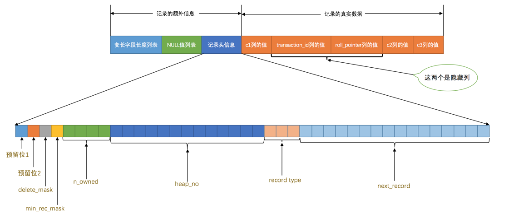

从图中可以看到，我们特意把记录头信息的5个字节的数据给标出来了，说明它很重要，我们再次先把这些记录头信息中各个属性的大体意思浏览一下（我们目前使用Compact行格式进行演示）：

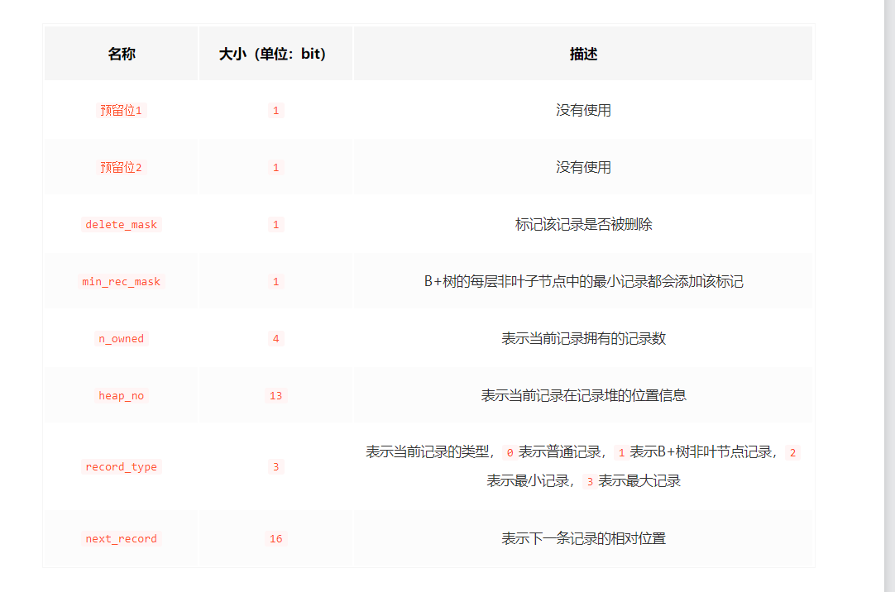

由于我们现在主要在唠叨记录头信息的作用，所以为了大家理解上的方便，我们只在page_demo表的行格式演示图中画出有关的头信息属性以及c1、c2、c3列的信息（其他信息没画不代表它们不存在啊，只是为了理解上的方便在图中省略了～），简化后的行格式示意图就是这样：


为了方便大家分析这些记录在页的User Records部分中是怎么表示的，我把记录中头信息和实际的列数据都用十进制表示出来了（其实是一堆二进制位），所以这些记录的示意图就是：

+ delete_mask

这个属性标记着当前记录是否被删除，占用1个二进制位，值为0的时候代表记录并没有被删除，为1的时候代表记录被删除掉了。

啥？被删除的记录还在页中么？是的，摆在台面上的和背地里做的可能大相径庭，你以为它删除了，可它还在真实的磁盘上[摊手]（忽然想起冠希～）。这些被删除的记录之所以不立即从磁盘上移除，是因为移除它们之后把其他的记录在磁盘上重新排列需要性能消耗，所以只是打一个删除标记而已，所有被删除掉的记录都会组成一个所谓的垃圾链表，在这个链表中的记录占用的空间称之为所谓的可重用空间，之后如果有新记录插入到表中的话，可能把这些被删除的记录占用的存储空间覆盖掉。

小贴士： 将这个delete_mask位设置为1和将被删除的记录加入到垃圾链表中其实是两个阶段，我们后边在介绍事务的时候会详细唠叨删除操作的详细过程，稍安勿躁。

+ min_rec_mask

B+树的每层非叶子节点中的最小记录都会添加该标记，什么是个B+树？什么是个非叶子节点？好吧，等会再聊这个问题。反正我们自己插入的四条记录的min_rec_mask值都是0，意味着它们都不是B+树的非叶子节点中的最小记录。

+ n_owned

这个暂时保密，稍后它是主角～

+ record_type

这个属性表示当前记录的类型，一共有4种类型的记录，0表示普通记录，1表示B+树非叶节点记录，2表示最小记录，3表示最大记录。从图中我们也可以看出来，我们自己插入的记录就是普通记录，它们的record_type值都是0，而最小记录和最大记录的record_type值分别为2和3。

至于record_type为1的情况，我们之后在说索引的时候会重点强调的。

这玩意儿非常重要，它表示从当前记录的真实数据到下一条记录的真实数据的地址偏移量。比方说第一条记录的next_record值为32，意味着从第一条记录的真实数据的地址处向后找32个字节便是下一条记录的真实数据。如果你熟悉数据结构的话，就立即明白了，这其实是个链表，可以通过一条记录找到它的下一条记录。但是需要注意注意再注意的一点是，下一条记录指得并不是按照我们插入顺序的下一条记录，而是按照主键值由小到大的顺序的下一条记录。而且规定 Infimum记录（也就是最小记录） 的下一条记录就是本页中主键值最小的用户记录，而本页中主键值最大的用户记录的下一条记录就是 Supremum记录（也就是最大记录） ，为了更形象的表示一下这个next_record起到的作用，我们用箭头来替代一下next_record中的地址偏移量：

## File Header（文件头部）

上边唠叨的Page Header是专门针对数据页记录的各种状态信息，比方说页里头有多少个记录了呀，有多少个槽了呀。我们现在描述的File Header针对各种类型的页都通用，也就是说不同类型的页都会以File Header作为第一个组成部分，它描述了一些针对各种页都通用的一些信息，比方说这个页的编号是多少，它的上一个页、下一个页是谁啦吧啦吧啦～ 这个部分占用固定的38个字节，是由下边这些内容组成的：


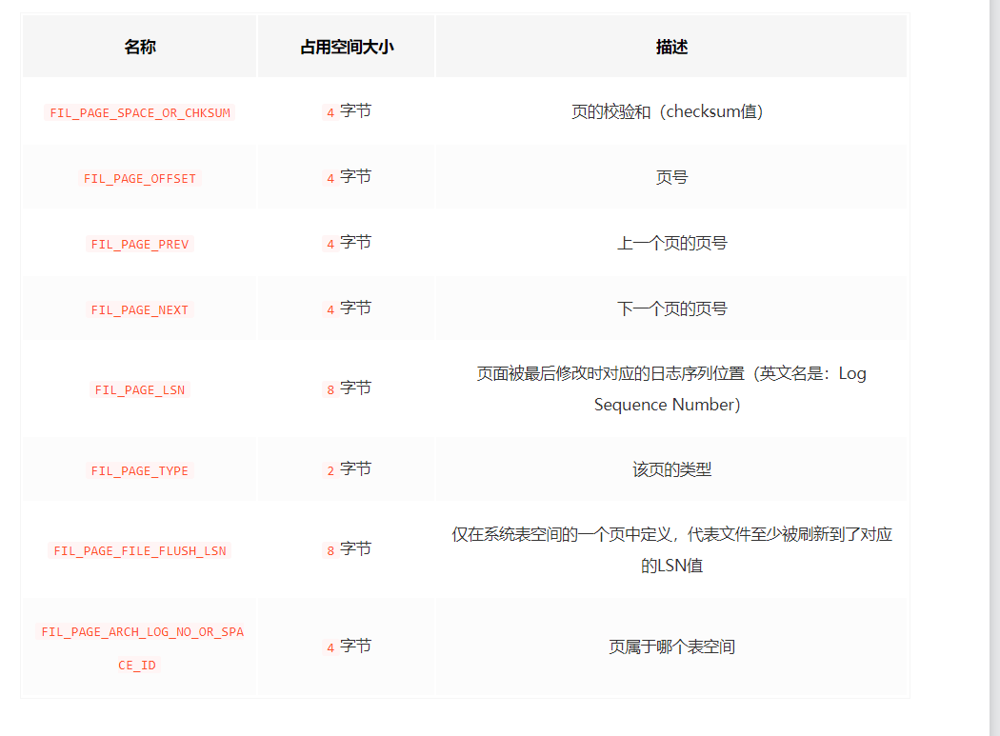


对照着这个表格，我们看几个目前比较重要的部分：

FIL_PAGE_SPACE_OR_CHKSUM

这个代表当前页面的校验和（checksum）。啥是个校验和？就是对于一个很长很长的字节串来说，我们会通过某种算法来计算一个比较短的值来代表这个很长的字节串，这个比较短的值就称为校验和。这样在比较两个很长的字节串之前先比较这两个长字节串的校验和，如果校验和都不一样两个长字节串肯定是不同的，所以省去了直接比较两个比较长的字节串的时间损耗。

FIL_PAGE_OFFSET

每一个页都有一个单独的页号，就跟你的身份证号码一样，InnoDB通过页号来可以唯一定位一个页。

FIL_PAGE_TYPE

这个代表当前页的类型，我们前边说过，InnoDB为了不同的目的而把页分为不同的类型，我们上边介绍的其实都是存储记录的数据页，其实还有很多别的类型的页，具体如下表：

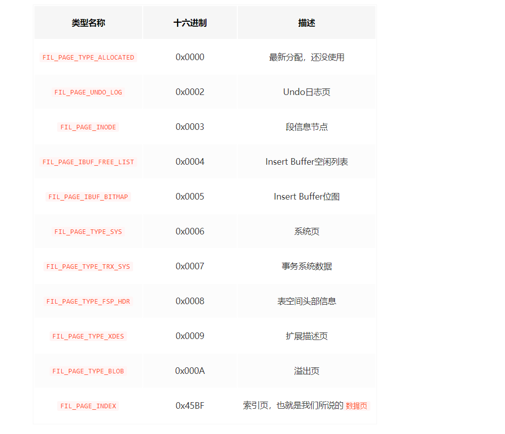

我们存放记录的数据页的类型其实是FIL_PAGE_INDEX，也就是所谓的索引页。至于啥是个索引，且听下回分解～


FIL_PAGE_PREV和FIL_PAGE_NEXT

我们前边强调过，InnoDB都是以页为单位存放数据的，有时候我们存放某种类型的数据占用的空间非常大（比方说一张表中可以有成千上万条记录），InnoDB可能不可以一次性为这么多数据分配一个非常大的存储空间，如果分散到多个不连续的页中存储的话需要把这些页关联起来，FIL_PAGE_PREV和FIL_PAGE_NEXT就分别代表本页的上一个和下一个页的页号。这样通过建立一个双向链表把许许多多的页就都串联起来了，而无需这些页在物理上真正连着。需要注意的是，并不是所有类型的页都有上一个和下一个页的属性，不过我们本集中唠叨的数据页（也就是类型为FIL_PAGE_INDEX的页）是有这两个属性的，所以所有的数据页其实是一个双链表，就像这样：


关于File Header的其他属性我们暂时用不到，等用到的时候再提哈～

## 索引

为了故事的顺利发展，我们先建一个表：

```bash
mysql> CREATE TABLE index_demo(
    ->     c1 INT,
    ->     c2 INT,
    ->     c3 CHAR(1),
    ->     PRIMARY KEY(c1)
    -> ) ROW_FORMAT = Compact;
Query OK, 0 rows affected (0.03 sec)
```

这个新建的index_demo表中有2个INT类型的列，1个CHAR(1)类型的列，而且我们规定了c1列为主键，这个表使用Compact行格式来实际存储记录的。为了我们理解上的方便，我们简化了一下index_demo表的行格式示意图：

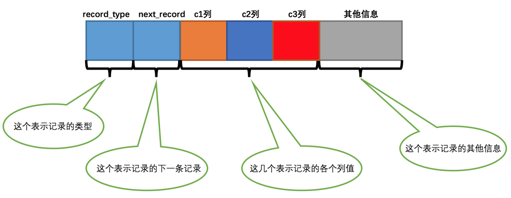


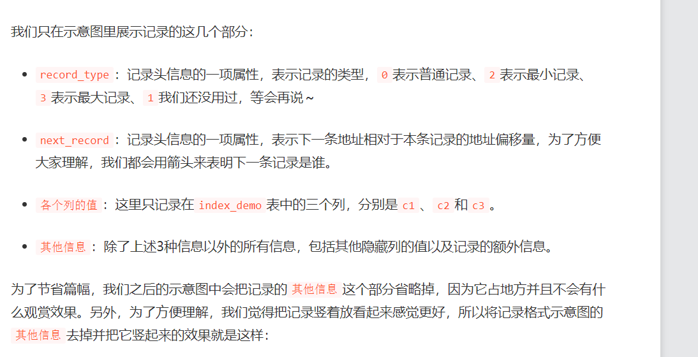


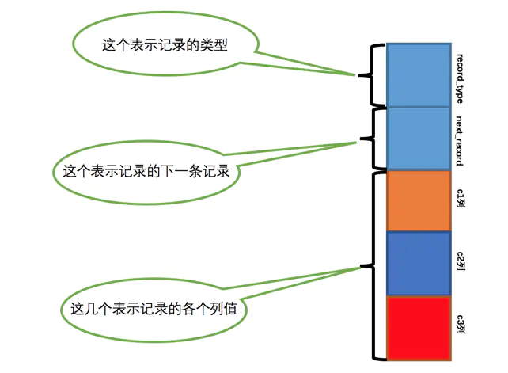


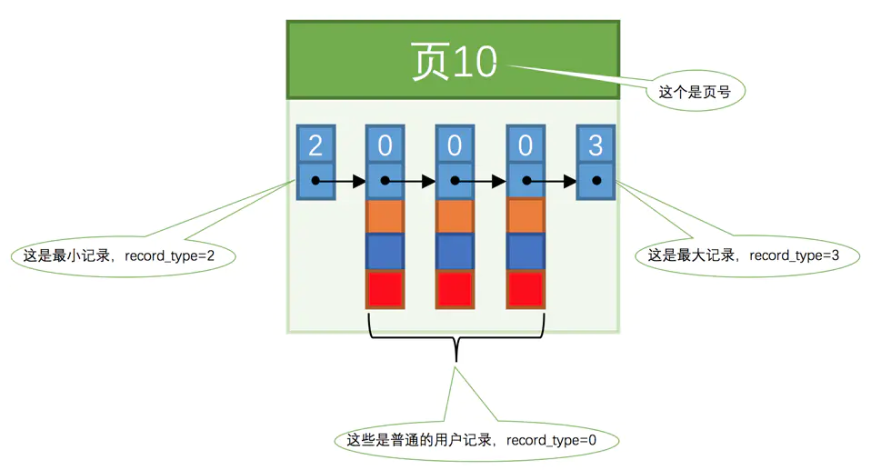

一个简单的索引方案
回到正题，我们在根据某个搜索条件查找一些记录时为什么要遍历所有的数据页呢？因为各个页中的记录并没有规律，我们并不知道我们的搜索条件匹配哪些页中的记录，所以 不得不 依次遍历所有的数据页。所以如果我们想快速的定位到需要查找的记录在哪些数据页中该咋办？还记得我们为根据主键值快速定位一条记录在页中的位置而设立的页目录么？我们也可以想办法为快速定位记录所在的数据页而建立一个别的目录，建这个目录必须完成下边这些事儿：

下一个数据页中用户记录的主键值必须大于上一个页中用户记录的主键值。

为了故事的顺利发展，我们这里需要做一个假设：假设我们的每个数据页最多能存放3条记录（实际上一个数据页非常大，可以存放下好多记录）。有了这个假设之后我们向index_demo表插入3条记录：

mysql> INSERT INTO index_demo VALUES(1, 4, 'u'), (3, 9, 'd'), (5, 3, 'y');
Query OK, 3 rows affected (0.01 sec)
Records: 3  Duplicates: 0  Warnings: 0
那么这些记录已经按照主键值的大小串联成一个单向链表了，如图所示：


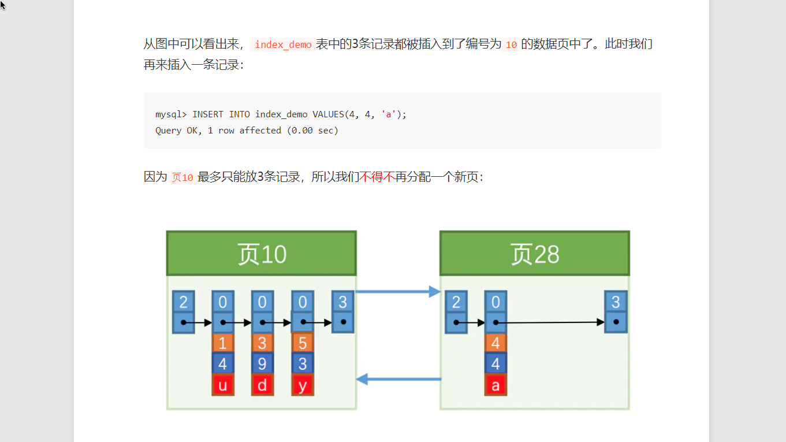

咦？怎么分配的页号是28呀，不应该是11么？再次强调一遍，新分配的数据页编号可能并不是连续的，也就是说我们使用的这些页在存储空间里可能并不挨着。它们只是通过维护着上一个页和下一个页的编号而建立了链表关系。另外，页10中用户记录最大的主键值是5，而页28中有一条记录的主键值是4，因为5 > 4，所以这就不符合下一个数据页中用户记录的主键值必须大于上一个页中用户记录的主键值的要求，所以在插入主键值为4的记录的时候需要伴随着一次记录移动，也就是把主键值为5的记录移动到页28中，然后再把主键值为4的记录插入到页10中，这个过程的示意图如下：


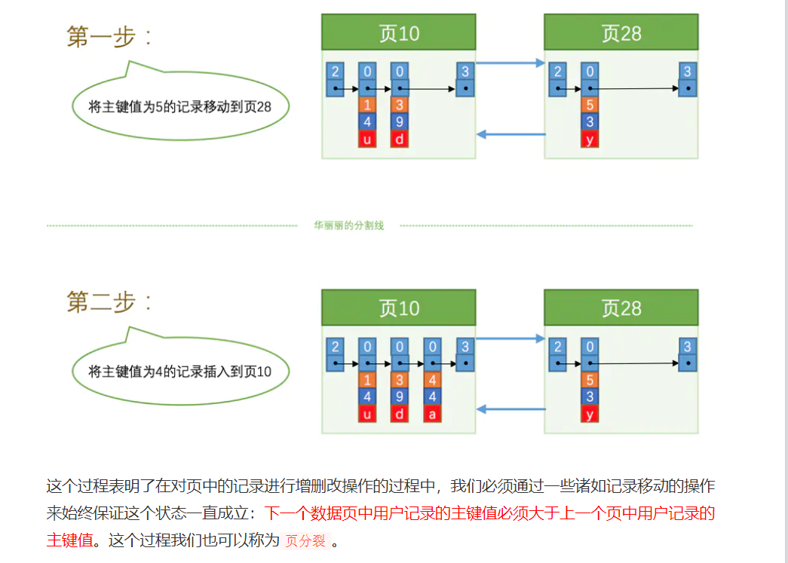


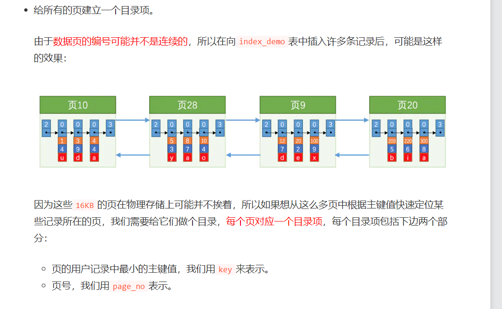


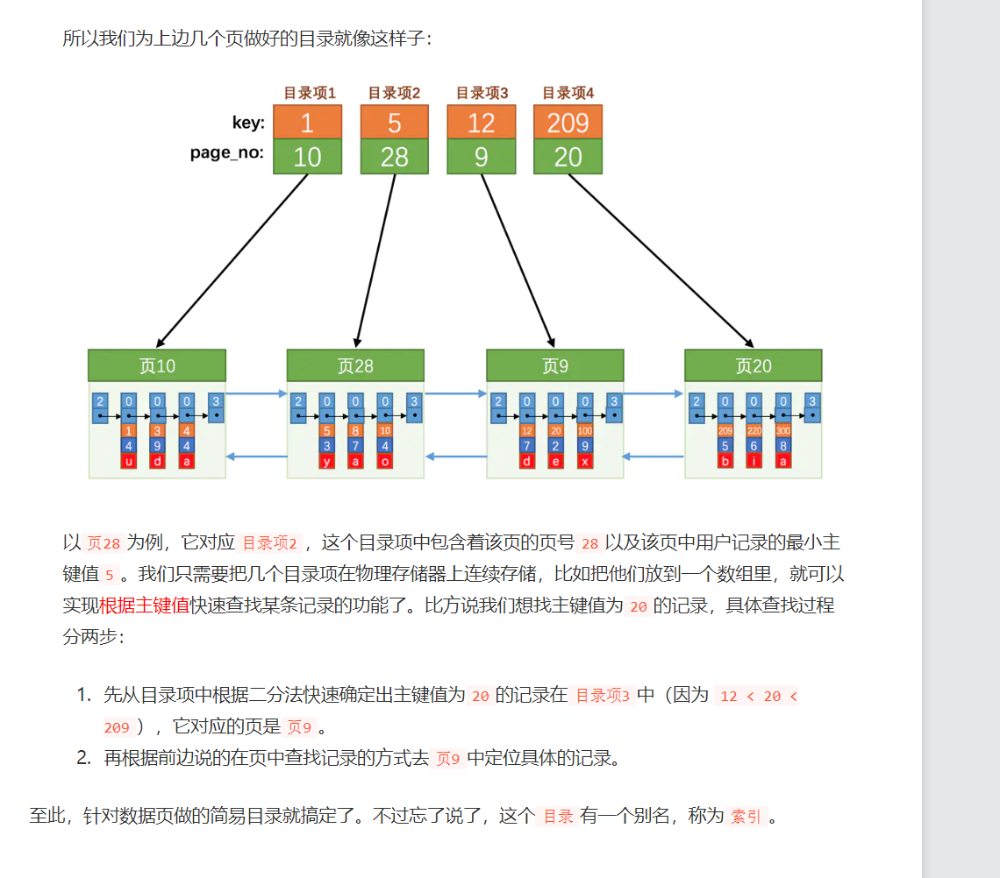


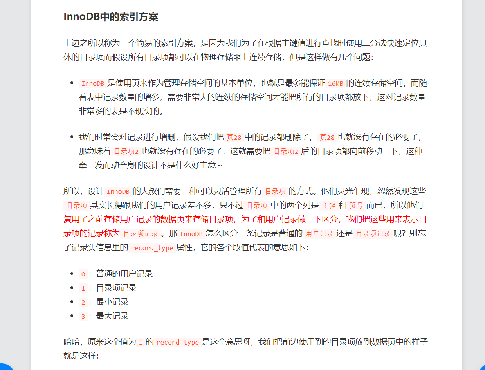


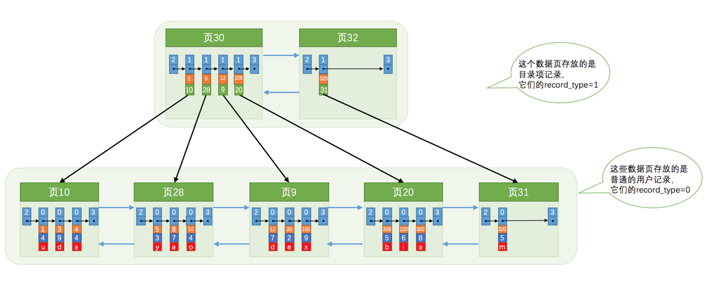


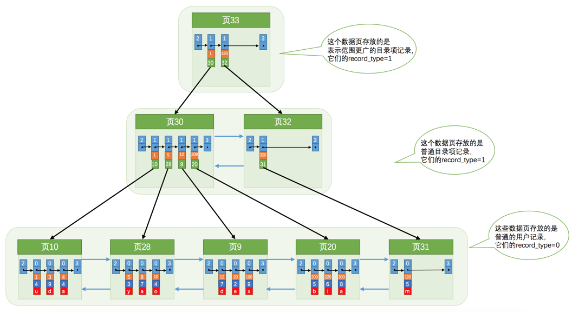
