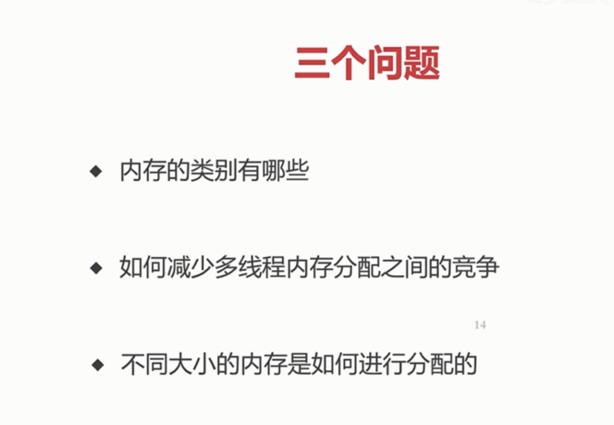

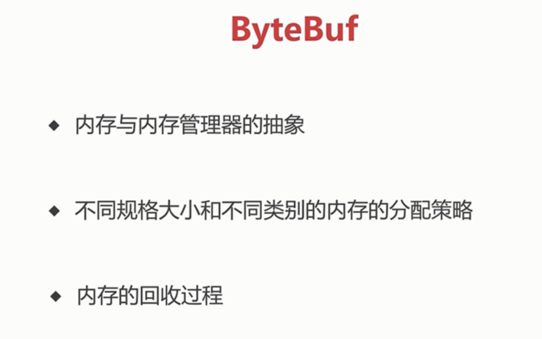

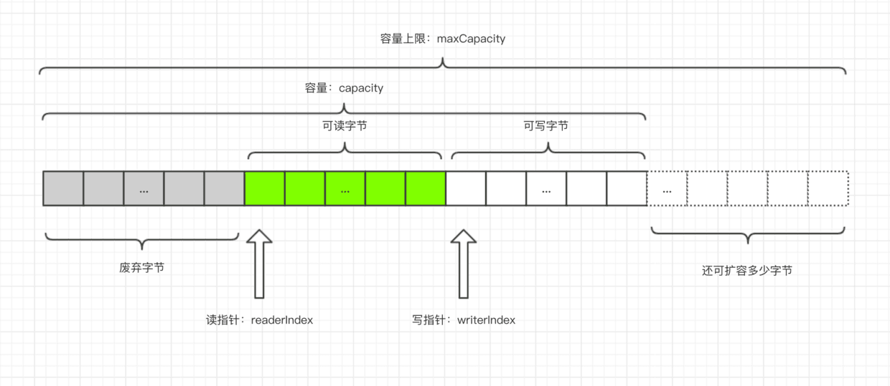

### AbstractByteBuf 是 ByteBuf 的子类

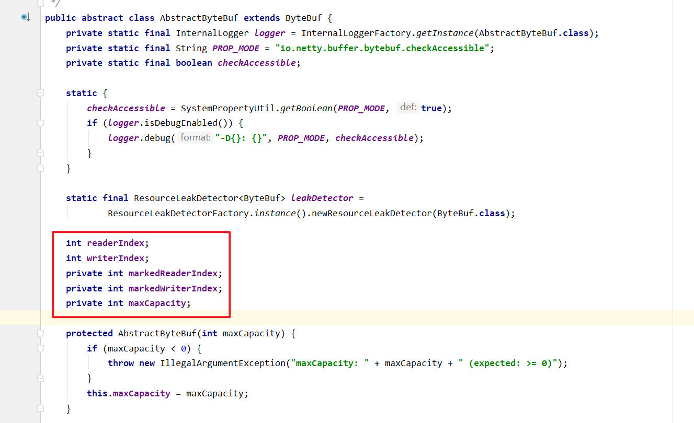

readableBytes()

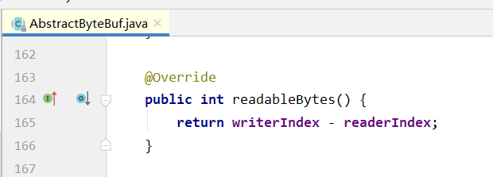

writeableBytes()

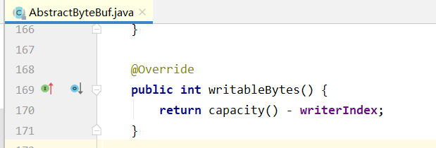

maxWritableBytes()
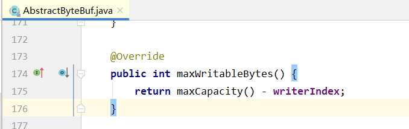

markReaderIndex()
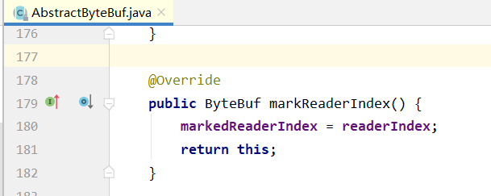

markWriterIndex()

resetWriterIndex()
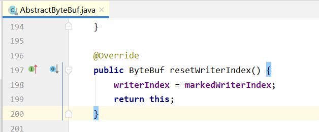

resetReaderIndex()
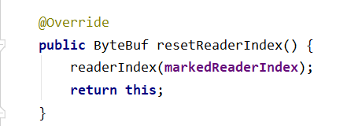

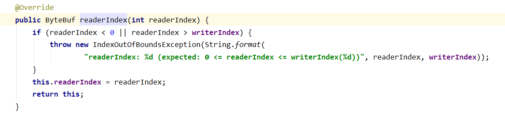

### ByteBuf 分类

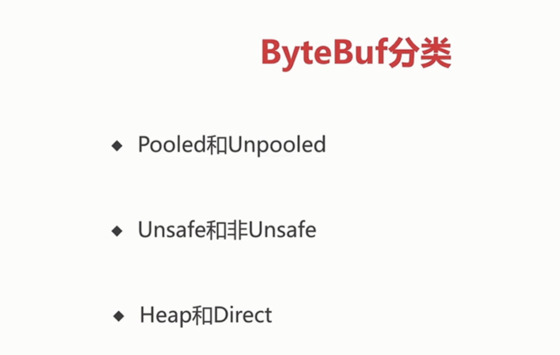
