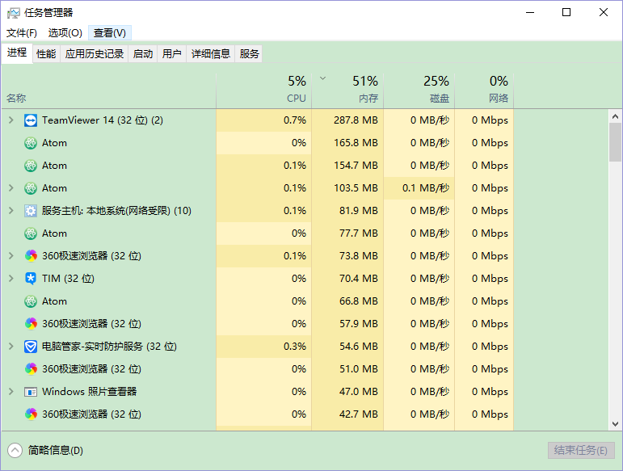
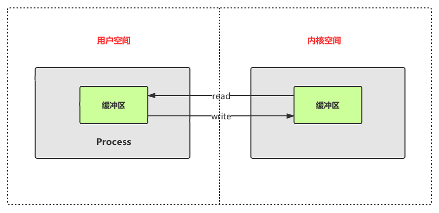
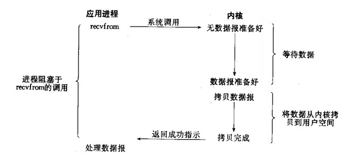
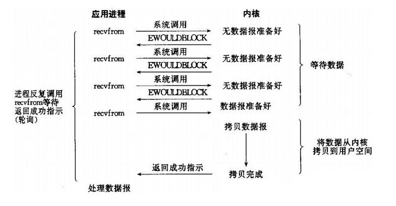
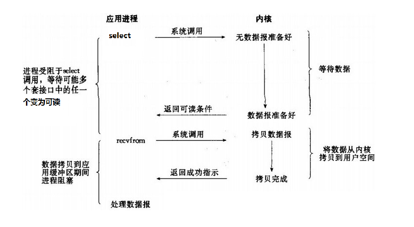

## 写在前面

本文主要介绍 Unix/Linux 下五种网络 IO 模型，但是。为了更好的理解下面提到的五种网络 IO 的概念，我们有必要先理清下面这几个概念。

### 用户空间与内核空间

一个计算机通常有一定大小的内存空间，如一台计算机有 4GB 的地址空间，但是程序并不能完全使用这些地址空间，因为这些地址空间是被划分为 **用户空间和内核空间** 的。用户应用程序只能使用用户空间的内存，这里所说的使用是指应用程序能够申请的内存空间，并不是真正访问的地址空间。下面看下什么是用户空间和内核空间：

### 用户空间

用户空间是常规进程所在的区域，什么是常规进程，打开任务管理器看到的就是常规进程：

JVM 就是常规进程，驻守于用户空间，用户空间是非特权区域，比如在该区域执行的代码不能直接访问硬件设备。

### 内核空间

内核空间主要是指操作系统运行时所使用的用于程序调度、虚拟内存的使用或者连接硬件资源等的程序逻辑。内核代码有特别的权利，比如它能与设备控制器通讯，控制着整个用于区域进程的运行状态。和 I/O 相关的一点是：所有 I/O 都直接或间接通过内核空间。

那么，为什么要划分用户空间和内核空间呢？这也是为了保证操作系统的稳定性和安全性。用户程序不可以直接访问硬件资源，如果用户程序需要访问硬件资源，必须调用操作系统提供的接口，这个调用接口的过程也就是系统调用。**每一次系统调用都会存在两个内存空间之间的数据交互，通常的网络传输也是一次系统调用，通过网络传输的数据先是从内核空间接收到远程机器的数据，然后再从内核空间复制到用户空间，供用户程序使用。**

下面通过一张图更形象的描述这一过程：

> 小贴士：这种内核空间与用户空间的数据的复制很费时，虽然保住了程序运行的安全性和稳定性，但是牺牲了一部分的效率。但是，目前的操作系统已经针对这一块进行了不错的优化，这里不是我们讨论的重点。

> 小贴士：如何分配用户空间和内核空间的比例也是一个问题，是更多地分配给用户空间供用户程序使用，还是首先保住内核有足够的空间来运行，还是要平衡一下。在当前的 Windows 32 位操作系统中，默认用户空间：内核空间的比例是 1:1，而在 32 位 Linux 系统中的默认比例是 3:1（3GB 用户空间、1GB 内核空间）。

### 同步和异步

同步和异步是一种思想，涉猎到的领域也比较多，在 I/O 领域（同步 IO，异步 IO），请求调用领域（同步请求，异步请求，同步调用，异步调用）。虽然，涉及多种领域，但是思想是一样的。同步和异步，真正的关注点是 **消息通信机制** 。

#### 同步

以 “调用” 为例，所谓同步，就是 **在发出一个 “调用请求” 时，在没有得到结果之前，该 “调用请求” 就不返回，但是一旦调用返回就得到返回值了**。换句话说，就是由 **"调用者" 主动等待 “被调用者” 的结果**。像我们平时写的，方法 A 调用 Math.random() 方法、方法 B 调用 String.substring() 方法都是同步调用，因为调用者主动在等待这些方法的返回。

#### 异步

所谓异步，则正好相反，**当一个异步调用请求发出之后，调用者不会立刻得到这个请求真正的执行完后得出的结果，立即返回的可能只是一个伪结果** 。因此异步调用适用于那些对数据一致性要求不是很高的场景，或者是执行过程很耗时的场景。如果这种场景下，我们希望获取异步调用的结果，"被调用者"可以通过状态、通知来通知调用者，或通过回调函数处理这个调用，对应 Java 中的有 Future/FutureTask、wait/notify 体现了这一思想。

### 阻塞和非阻塞

阻塞和非阻塞其实是针对进程或者是线程的状态来判定的。比如下面的，用户进程从操作系统的内核缓冲区读取数据的时候，如果此时内核缓冲区中的数据还没准备好的话，操作系统可采用的一种方式就是将用户进程阻塞在那儿，那么此时该用户进程的状态就会从运行状态变为阻塞状态，也就是阻塞了。

了解了上面的基础知识之后，接下来我们就正式进入 Linux 的网络 IO 模型。

## Linux 网络 IO 模型

**理解这五种网络 I/O 模型之前，我们还得得先清楚一个网络 IO 事件发生，会涉及到哪些对象，会经历哪些步骤：**

**网络 IO 涉及到的对象**

对于一个网络 IO （这里我们 以 read 举例），它会涉及到两个系统对象，一个是调用这个 IO 的进程或者是线程，另一个就是 Linux 系统内核空间和用户空间。

**进程执行 I/O 操作的步骤**

进程执行 I/O 操作，归结起来，就是向操作系统发出请求，让它要么把缓冲区里的数据排干净（写），要么用数据把缓冲区填满（读）。进程利用这一机制处理所有数据进出操作，操作系统内部处理这一任务的机制，其复杂程度可能超乎想像，但就概念而言，却非常直白易懂，对于一个网络 IO，这里我们以 read 为例，当一个 read 操作发生时，会经历两个阶段：

1. **内核缓冲区准备数据**

2. **内核缓冲区数据拷贝到用户缓冲区**

几种 IO 模型的区别就体现在这两阶段，下面对这几种 IO 模型进行详细介绍。

### 阻塞 IO

当用户进程开始调用了 recvfrom 这个函数后，就开始了 IO 的 **第一阶段：内核缓冲区准备数据**。对于网络 IO 来说，数据只有在积累到一定的量的时候才会发送，这个时候内核缓冲区就要等待足够的数据到来。而在用户缓冲区这边，**用户进程会一直被操作系统阻塞**，当内核缓冲区数据准备好了，此时就会将内核缓冲区中的数据拷贝到用户缓冲区，然后 **由操作系统唤醒被阻塞的用户进程** 并将结果返回给用户进程，此时用户进程才重新运行起来。所以，**阻塞 IO 的特点就是在 IO 执行的两个阶段都被阻塞了**。

### 非阻塞 IO

从图中可以看出，当用户进程发出 read 操作时，如果内核缓冲区中的数据还没有准备好，**那么它并不会阻塞用户进程，而是立刻返回一个 error**。从用户进程角度讲 ，它发起一个 read 操作后，并没有被阻塞，而是马上就得到了一个结果。用户进程判断结果是一个 error 时，它就知道数据还没有准备好，于是它可以再次发送 read 操作，就这样一直进行下去，到这里第一阶段都是一直在轮训。一旦内核缓冲区中的数据准备好了，并且又再次收到了用户进程的 read 请求，那么它马上就将数据从内核缓冲区拷贝到用户缓冲区，然后返回给用户线程，这是第二阶段。**所以，用户进程在第一阶段其实并没有被操作系统一直阻塞，而是需要不断的主动询问内核缓冲区数据好了没有。只有在第二阶段数据拷贝到时候会被阻塞** 。

### IO 多路复用

IO 多路复用机制

IO 多路复用机制（也称作事件驱动方式（Event Driven IO））具体实现主要分为三种，分别为 select，poll，和 epoll 。下面分别介绍 select，epoll 模型。

#### select 模型或 epoll 模型

注意，上面的阻塞 IO 和非阻塞 IO 用户进程都是只是调用 recvfrom 一个函数，而这里用户进程还会再调用一个 select 函数，当用户进程调用了 select，那么整个进程会被阻塞，而同时，操作系统会 “监视” 所有 select 负责的 socket 所对应的的内核缓冲区的数据，当任何一个 socket 所对应的内核缓冲区中的数据准备好了，就会返回可读条件的通知。此时用户进程再调用 read 操作，将数据从内核缓冲区拷贝到用户缓冲区。

这个图和阻塞 IO 的图其实并没有太大的区别，事实上，还更差一些。因为这里需要使用两个 system call (select 和 recvfrom)，而阻塞 IO 只调用了一个system call (recvfrom)。但是，调用 select 的优势在于它可以同时处理多个 socket。（所以，如果处理的连接数不是很高的话，使用 select 的 web server 不一定比使用 多线程 + 阻塞 IO 的 web server 性能更好，可能延迟还更大。

>小贴士：select 的优势并不是对于单个连接能处理得更快，而是在于能处理更多的连接。

在 IO 多路复用模型中，实际上，对于每一个 socket，一般都设置成为非阻塞的，但是，如上图所示，整个用户进程实际上是一直被阻塞的。只不过用户进程是被 select 这个函数阻塞的 ，而不是被 socket IO 给阻塞的（或者也可以理解为是操作系统阻塞的）。

这里肯定有人要问那 select 的作用不就是阻塞多个用户进程，然后将这些用户进程与服务器建立的 socket 监视起来，看看哪个 socket 对应的内核缓冲区中的数据准备好了，然后再通知用户进程，让用户进程再发一次 recvfrom 请求来进行数据拷贝。那 epoll 的作用也是这个呀，为啥人家就说 epoll 的效率更高呢？下面，我就来详细的介绍为啥 epoll 效率更高。

从上面我们已经知道了，select 和 epoll 的作用都是监控多个 socket ，但是不一样的是在于他们俩监控方式和通知用户进程的方式不同。举个例子：这里有 100 个 socket 连接被 select 管理着，select 会保存这 100 个连接的 fd_set 数据结构，假如只有 5 个 socket 的内核缓冲区的数据准备好了，此时 select 的方式是将这 5 个 内核缓冲区数据准备好的 socket 连接打上标记，然后将这 100 个连接 fd_set 数据结构全部返回给用户进程，用户进程拿到整个 fd_set 之后，需要遍历整个 fd_set 挑选出那些被标记数据准备好了的连接，然后再去发送 recvfrom 请求。

>小贴士：select 返回给用户进程所有的 fd_set 数据结构，不仅仅浪费网络带宽，而且用户进程拿到之后还要遍历挑选，也浪费性能。另外，一个进程对应的 select 最多只能监控 1024 个 socket。如果想监控更多的 socket 要多个进程，这也是 select 的一个不够优秀的地方。

那么 epoll 和 select 比较有哪些不同的地方呢？

首先，epoll 模型只会将那些内核缓冲区准备好了的数据的连接所对应的的标识告诉给用户进程，不会返回所有的标识。

### 同步 IO

同步，可以理解为在执行完一个函数或调用后，一直等待系统的返回值或消息，这时进程是处于阻塞的，只有接收到返回的值或消息进程才往下执行。说白了，就是如果进程没有完成功能，进程就会一直阻塞，直到完成这个功能。 对于上面select来说，用户进程调用select这个系统调用后，如果当前没有准备好的数据报（不具备条件完成功能）则一直阻塞等待，直到有准备好的数据报，这时内核将成功信息返回给select后才返回（完成功能后返回），进程这时才会解除阻塞。

### 异步 IO

发出异步IO后，IO操作立即返回，用户进程这时就可以去做别的事情了，之后的一切工作都又内核来完成。当kernel有数据可读时，内核自动将数据拷贝到用户空间 (不阻塞用户进程)，拷贝完成后向用户进程发送信号。
linux下的asynchronous IO其实用得很少。先看一下它的流程：

   
#####参考:
https://juejin.im/entry/585ba7038d6d810065d3d54a
https://www.cnblogs.com/xrq730/p/5074199.html
https://blog.51cto.com/xingej/1971598
https://www.cnblogs.com/javalyy/p/8882066.html
https://www.jianshu.com/p/6f132d27aeaf?utm_campaign
https://blog.csdn.net/u013374645/article/details/82808301
http://baijiahao.baidu.com/s?id=1604983471279587214&wfr=spider&for=pc
