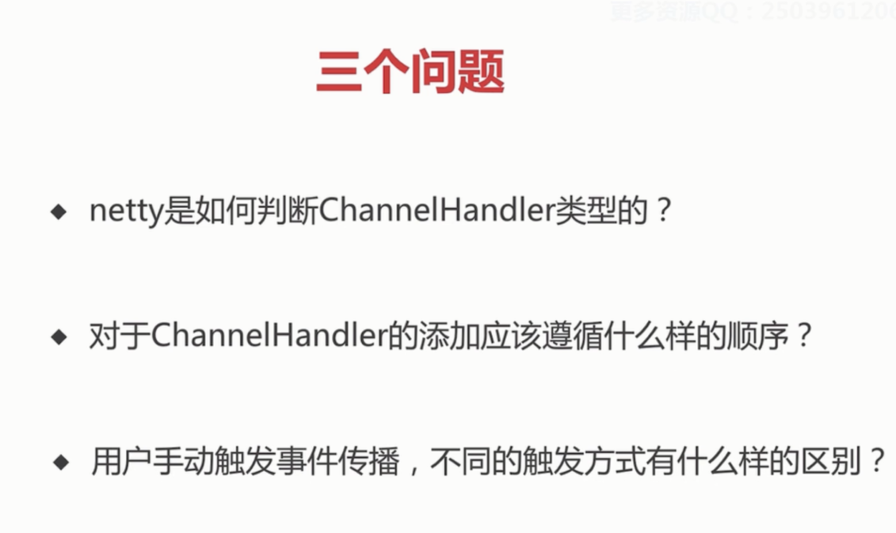
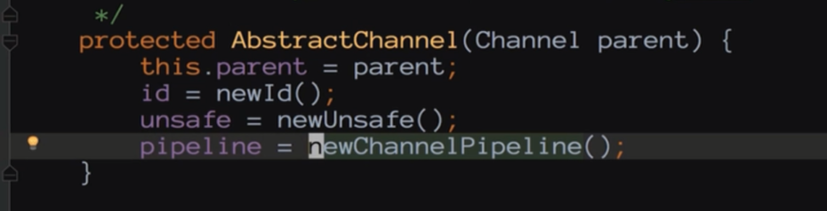
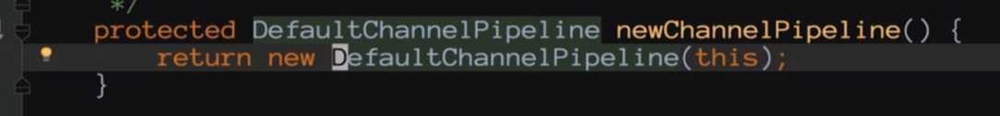
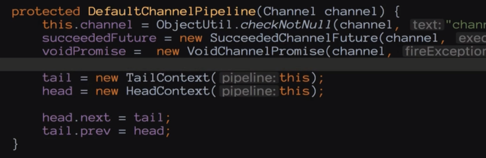
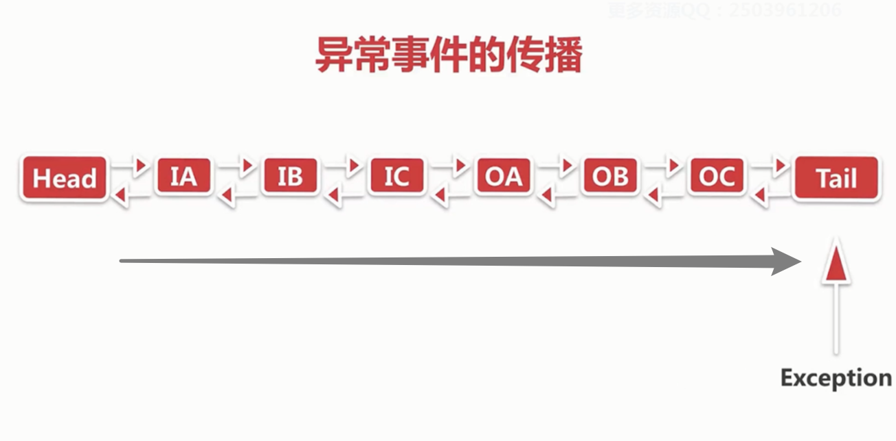
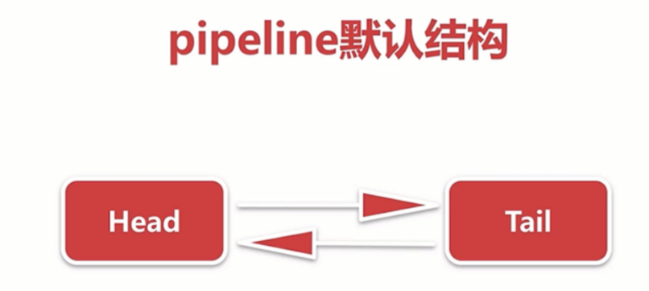
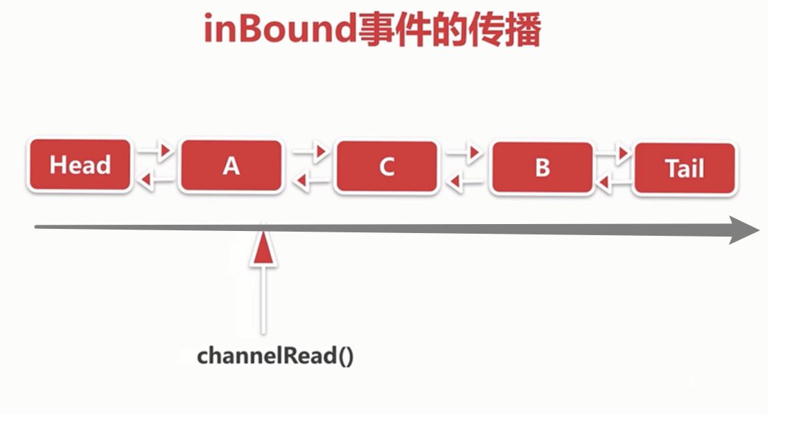
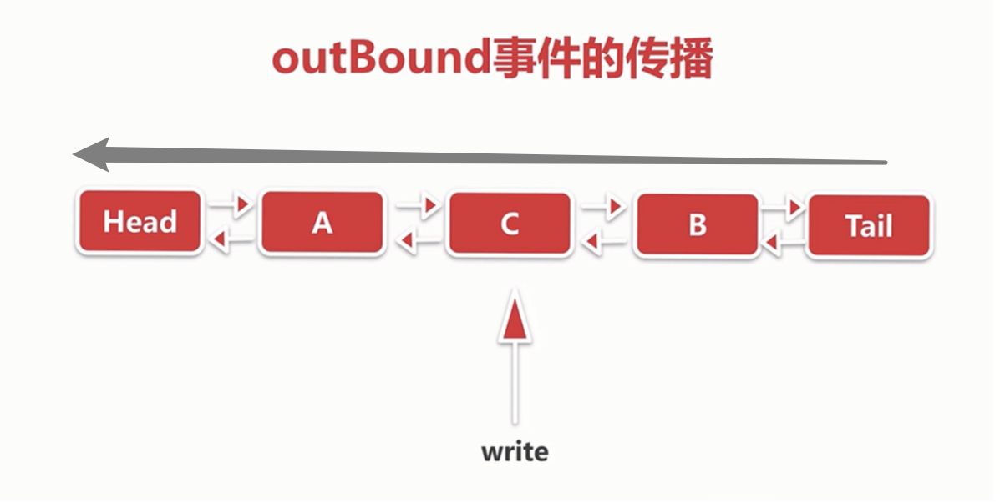
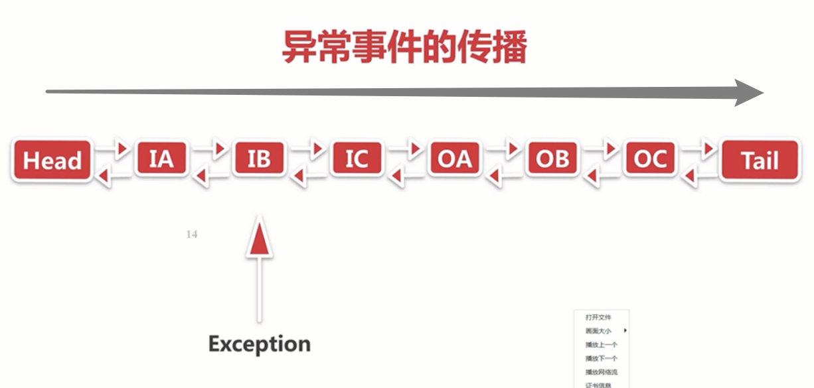

1. netty 是如何判断 ChannelHandler 类型的，比如一个 ChannelHandler 是 Inbound 类型还是 Outbound 类型

    当你去调用 pipeline 去添加一个节点的时候，netty 会使用 instanceof 关键字来判断当前节点是属于 inbound 类型还是 outbound 类型，分别会用一个布尔类型的变量来标识。

---
2. 对于 ChannelHandler 的添加应该遵循什么样的顺序？

    inbound 事件类型的传播跟你添加 ChannelHandler 的顺序正相关，outbound 事件类型的传播跟你添加 ChannelHandler 的顺序逆相关。
---
3. 用户手动触发事件传播，不同的触发方式有什么样的区别？

    调用 channel 去触发事件，只有两种情况，要么从 tail 节点触发传播，要么从 tail 节点触发传播。
    用户手动触发事件传播是可以实现从当前节点开始触发的，比如如果是 inbound 事件，那么可以从当前节点触发沿着从 head 到 tail 的方向的最后一个 inbound 节点；outbound 则相反。

---
4. netty 的 pipeline 什么时候被创建？

   

   

   netty 的 pipeline 在创建 Channel 的时候被创建
---
5. pipeline 节点的数据结构是什么？

  

  在创建 pipeline 的时候会默认创建两个 ChannelHandlerContext，也即是 head 和 tail，他们的作用是什么？

   pipeline 节点的数据结构是 ChannelHandlerContext

---

6. netty 异常事件传播顺序

1. 首先异常传播链的顺序和 Inbound 和 Outbound 事件没关系，只和 pipeline 添加的 ChannelHandler 的顺序有关系

2. 如上图 pipeline 链结构，如果在 B 节点发生异常，那么只会从 B 节点往后传播，传播方向是从 head 节点到 tail 节点

3. 如果中途想中断传播，也可以，不继续往下调用就行了。

异常最佳处理机制

我们通常在业务代码中，会加入一个异常处理器，统一处理 pipeline 过程中的所有的异常，并且，一般该异常处理器需要加在自定义节点的最末尾，即 tail 节点之前，这个自定义异常处理器会针对不同类型的异常分别处理。

注意，如果整个 pipeline 链一直将异常往 tail 节点方向传播的话，默认 tail 节点会抛出一个警告信息。

https://www.jianshu.com/p/087b7e9a27a2

pipeline 结构是一个双向链表结构，每一个节点都是一个 ChannelHandlerContext，ChannelHandlerContext 里面包装了用户自定义的 ChannelHandler，添加和删除 ChannelHandler 最终都是在 pipeline 链表结构中添加和删除对应的 ChannelHandlerContext 节点，而在添加 ChannelHandler 的过程中，netty 使用 instanceof 关键字来判断 ChannelHandler 类型，如果该 ChannelHandler 实现了 InboundHandler，那通过设计一个布尔类型的字段 inbound 来标识该 ChannelHandler 是 InboundHandler，outboundHandler 类似。

默认 pipeline 中存在两种类型的节点，一种是 head，一种是 tail，

head 节点里面的 unsafe 负责实现 channel 具体协议，而 tail 节点起到了终止事件和异常传播的作用。

pipeline 里面的事件分为三种，inbound 事件，Outbound 事件和异常事件

比如从 B 节点触发，那么 A 节点就不会涉及到，是从 B 节点开始按照从 head 到 tail 的传播方向，最终会传播给 tail。

Outbound 触发是从当前节点触发，然后沿着 tail 到 head 的方向进行传播。

1
