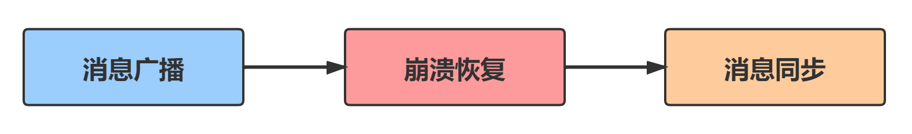
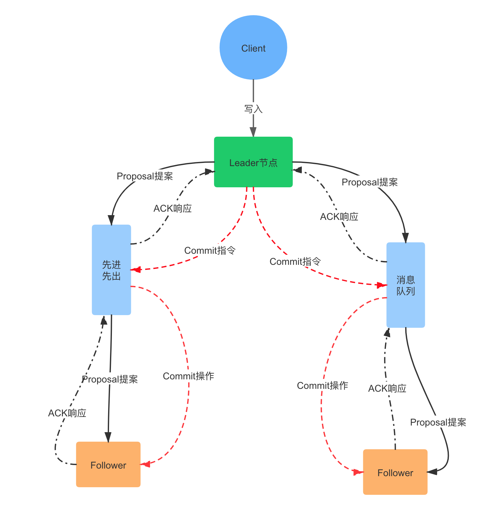

## 写在前面

分布式架构出现后，越来越多的分布式系统会面临数据一致性的问题。目前，ZooKeeper 是在解决分布式数据一致性上最成熟稳定且被大规模应用的工业级解决方案。

ZooKeeper 保证 **分布式系统数据一致性的核心算法就是 ZAB 协议**（ZooKeeper Atomic Broadcast，原子消息广播协议）。

## ZAB 协议

ZooKeeper 能够保证数据一致性主要依赖于 ZAB 协议的 **消息广播，崩溃恢复和数据同步** 三个过程。

### 消息广播

1. 一个事务请求（Write）进来之后，Leader 节点会将写请求包装成 Proposal 事务，并添加一个全局唯一的 64 位递增事务 ID，也就是 Zxid（消息的先后顺序就是通过比较 Zxid）；

2. Leader 节点向集群中其他节点广播 Proposal 事务，Leader 节点和 Follower 节点是解耦的，通信都会经过一个 FIFO 的消息队列，Leader 会为每一个 Follower 节点分配一个单独的 FIFO 队列，然后把 Proposal 发送到队列中；

3. Follower 节点收到对应的 Proposal 之后会把它持久到磁盘上，当完全写入之后，发一个 ACK 给 Leader；

4. 当 Leader 节点收到超过半数 Follower 节点的 ACK 之后（Quorum 机制），会提交本地机器上的事务，同时开始广播 commit， Follower 节点收到 commit 之后，完成各自的事务提交。

ZAB 协议针对事务请求的处理过程类似于一个两阶段提交过程，第一阶段是广播事务操作，第二阶段是广播提交操作，而在这种两阶段提交模型下，是无法处理因 Leader 节点宕机带来的数据不一致问题的，比如下面两种情况：

1. 当 Leader（Server1） 发起一个事务 Proposal1 后就宕机了，导致 Follower 都没有 Proposal1。

2. 当 Leader 发起 Proposal2 后收到了半数以上的 Follower 的 ACK，但是还没来得及向 Follower 节点发送 Commit 消息就宕机了。

**为了解决 Leader 宕机以及宕机后导致的数据不一致问题，ZAB 协议引入了崩溃恢复模式**。

崩溃恢复模式必须解决以下问题：

1. Server1 恢复过来再次加入到集群中的时候，必须确保丢弃 Proposal1，即保证被丢弃的消息不能再次出现。

2. 选举出的新 Leader 必须拥有集群中所有机器 Zxid 最大的 Proposal，即保证已经被处理的消息不能丢。

### 崩溃恢复

> Zookeeper 集群进入崩溃恢复阶段的时机：
>
> + 集群服务刚启动时进入崩溃恢复阶段选取 Leader 节点。
>
> + Leader 节点突然宕机或者由于网络原因导致 Leader 节点与过半的 Follower 失去了联系，集群也会进入崩溃恢复模式。

#### 选举 Leader 节点

首先使用 Leader 选举算法选出一个新的 Leader 节点。选举过程如下：

1. **各个节点变为 Looking 状态**

    Leader 宕机后，余下的 Follower 节点都会将自己的状态变更为 Looking（注意 Observer 不参与选举），然后开始进入 Leader 选举过程。

2. **各个 Server 节点都会发出一个投票，参与选举**

    在第一次投票中，所有的 Server 都会投自己，然后各自将投票发送给集群中所有机器。

3. **集群接收来自各个服务器的投票，开始处理投票和选举**

    处理投票的过程就是对比 Zxid 的过程，假定 Server3 的 Zxid 最大，Server1 判断 Server3 可以成为 Leader，那么 Server1 就投票给 Server3，判断的依据如下：首先选举 epoch 最大的，如果 epoch 相等，则选 zxid 最大的，若 epoch 和 zxid 都相等，则选择 server id 最大的。
    在选举过程中，如果有节点获得超过半数的投票数，则会成为 Leader 节点，反之则重新投票选举。

4. **选举成功，各节点的状态为 Leading 和 Following**。

> Zab 中的节点有三种状态，folloing（当前节点是 Follower 节点），leading（当前节点是 Leader 节点），looking/election（当前节点处于选举状态）；伴随着的 Zab 协议消息广播和崩溃恢复两阶段之间的转换，节点状态也随之转换。

### 数据同步

崩溃恢复完成选举以后，接下来的工作就是数据同步，在选举过程中，通过投票已经确认 Leader 节点是最大 Zxid 的节点，同步阶段就是利用 Leader 前一阶段获得的最新 Proposal 历史同步集群中所有的副本。

## 总结

ZAB 协议是 CAP 理论中 CP 的典型实现，其崩溃恢复阶段涉及到的 Leader 节点选举过程和数据同步选举完成后的数据同步过程都是对外不提供服务的，就是为了保证数据的强一致性牺牲了可用性。到这里，关于 ZooKeeper 使用 ZAB 协议保证分布式系统下数据一致性已经分析完了，有关于 Paxos 算法以及 ZAB 协议与 Paxos 算法之间的联系这里不做详细分析，有兴趣的小伙伴可以查阅《从 Paxos 到 ZooKeeper 分布式一致性原理与实战》这本书，里面有详细的介绍。

#### 参考

《从 Paxos 到 ZooKeeper 分布式一致性原理与实战》

《分布式技术原理与实战 45 讲》

---

如果大家想要实时关注我更新的文章以及我分享的干货的话，可以关注我的公众号 **我们都是小白鼠**。公众号内有一些整理过的原创精品脑图，不仅包含技术点的知识脉络，更多的底层原理的梳理，在公众号内分别回复【技术脑图】、【面试题】、【开发工具】即可获取。

感谢您的关注，如果您喜欢的话，可以点击右下方的 在看，也欢迎您把这篇文章分享给更多的朋友，谢谢！

---

每天进步一点点！！！

于 2020.05.18 晚

##最后

如果大家想要实时关注我更新的文章以及我分享的干货的话，可以关注我的公众号 **我们都是小白鼠**。

1
