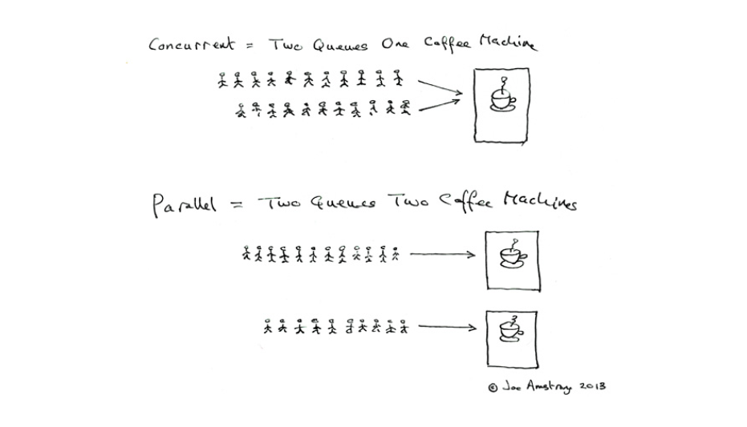

### 并发和并行

以下是 Go 语言之父 Rob Pike 对于 并发（Concurrency）和并行（Parallelism）的定义：

>Concurrency is about **dealing with** lots of things at once. Parallelism is about **doing** lots of things at once. Not the same, but related. One is about structure, one is about execution. Concurrency provides a way to structure a solution to solve a problem that may(but not necessarily) be parallelizable.

简单翻译：并发指的是同时 **处理** 很多事情，并行指的是同时 **执行** 很多事情；两者并不相同，但具有相关性。

Erlang 之父 Joe Armstrong 用一张5岁小孩都能看懂的图解释了并发与并行的区别

Explain it to a five year old.

