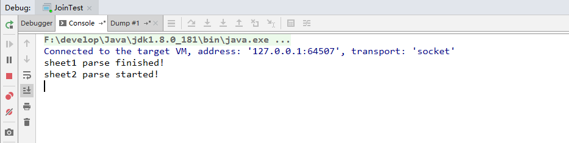
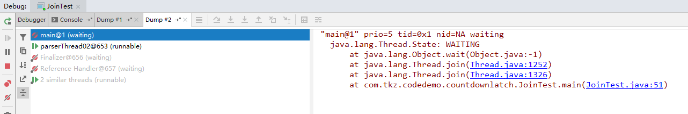
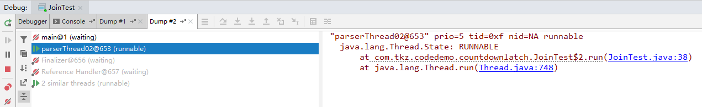

## 前言

在 JDK 并发包提供了几个非常有用的并发工具类。CountDownLatch，CyclicBarrier 和 Semaphore 工具类提供了一种并发流程控制手段，Exchanger 工具类则提供了在线程间交换数据的一种手段。这篇文章主要了解 CountDownLatch 和 CyclicBarrier。

## CountDownLatch

假如有这样一个需求：我们需要解析一个 Excel 里面的多个 sheet 页的数据，此时可以考虑使用多线程，每个线程解析一个 sheet 页，等到所有的的 sheet 页都解析完之后，程序需要提示解析完成。在这个需求中，要实现主线程等待所有解析线程完成 sheet 的解析操作有两种方式，第一种是 join，第二种就是我们今天要说的是 CountDownLatch。

### join

```java
public class JoinTest {

    public static void main(String[] args) throws InterruptedException {

        Thread parserThread01 = new Thread(new Runnable() {
            @Override
            public void run() {
                System.out.println("sheet1 parse finished!");
            }
        });

        Thread parserThread02 = new Thread(new Runnable() {
            @Override
            public void run() {
                System.out.println("sheet2 parse finished!");
            }
        });

        parserThread01.start();
        parserThread02.start();

        parserThread01.join();
        parserThread02.join();

        System.out.println("all sheet parse finished!");
    }
}
```
运行结果：

```xml
sheet2 parse finished!
sheet1 parse finished!
all sheet parse finished!
```

main 线程执行了 ```parserThread01.start();``` 和 ```parserThread02.start();``` 效果就是 main 线程会一直等待 ```parserThread01``` 和 ```parserThread02``` **<font color="#e50e0e">执行完</font>** 才会继续执行。

如果我需要 sheet2 的解析在 sheet1 之后进行，可以这样修改。

```java
public class JoinTest2 {

    public static void main(String[] args) throws InterruptedException {

        Thread parserThread01 = new Thread(new Runnable() {
            @Override
            public void run() {
                System.out.println("sheet1 parse finished!");
            }
        });

        Thread parserThread02 = new Thread(new Runnable() {
            @Override
            public void run() {
                try {
                    parserThread01.join(); // *
                    System.out.println("sheet2 parse finished!");
                } catch (InterruptedException e) {
                    e.printStackTrace();
                }
            }
        });

        parserThread01.start();
        parserThread02.start();

        parserThread01.join();
        parserThread02.join();

        System.out.println("all sheet parse finished!");
    }
}
```
运行结果：
```xml
sheet1 parse finished!
sheet2 parse finished!
all sheet parse finished!
```

解析顺序是这样的：main 线程要等待 ```parserThread01``` 和 ```parserThread02``` 解析完之后才开始执行 ```System.out.println("all sheet parse finished!");```，而 ```parserThread02``` 要等待 ```parserThread01``` 解析完之后才开始解析。

join 的原理是不停的检查 join 线程是否存活，如果 join 线程存活则让当前线程永远等待。其中，wait(0) 表示永远等待下去。源码片段如下：

```java
while (isAlive()) {
   wait(0);
}
```

所以，接下来我们看一下，如果 ```parserThread02``` 线程一直在执行，main 线程会一直等待吗？

```java
public class JoinTest3 {

    public static void main(String[] args) throws InterruptedException {

        Thread parserThread01 = new Thread(new Runnable() {
            @Override
            public void run() {
                System.out.println("sheet1 parse finished!");
            }
        });

        Thread parserThread02 = new Thread(new Runnable() {
            @Override
            public void run() {
                try {
                    parserThread01.join();
                    System.out.println("sheet2 parse started!");
                    for(;;);  // *
                } catch (InterruptedException e) {
                    e.printStackTrace();
                }
            }
        });

        parserThread01.setName("parserThread01");
        parserThread02.setName("parserThread02");

        parserThread01.start();
        parserThread02.start();

        parserThread01.join();
        parserThread02.join();

        System.out.println("all sheet parse finished!");
    }
}
```
运行结果：



从编辑器的左边的红点可以看出来程序一直没结束，我们再来看一下线程的堆栈信息：

Main 线程



ParserThread02 线程



可以看到 ```parserThread02``` 线程一直处于 ```RUNNABLE``` 状态，说明一直在运行中，而 Main 线程一直处于 ```WAITING``` 状态，说明 Main 线程的确是一直等待 ```parserThread02``` 线程的。不过 JDK 提供了一个 ```join(long millis)``` 方法，拿这个案例来说，如果 Main 线程等待时间超过了 millis，Main 线程就会被唤醒，从```WAITING``` 状态变为```RUNNABLE```状态，从而继续执行。

> **<font color="#e50e0e">小贴士：</font>**
这里可能有一个点大家比较困惑：Main 线程执行了 ```parserThread02.join()``` 方法之后从 ```RUNNABLE``` 状态变为 ```WAITING``` 状态，我们知道 ```join()``` 方法其实 ```join()``` 方法也是通过 ```wait()``` 方法来实现的，那么就有一个问题了：当 ```parserThread02``` 线程执行完毕之后，Main 线程从 ```WAITING``` 状态变为 ```RUNNABLE``` 状态，说白了也就是 Main 线程被唤醒，这个操作应该是要调用 ```notify()``` 方法的，那么这个 ```notify()``` 方法是在哪里被调用的？
**<font color="#e50e0e">解答：</font>** ```notify()``` 方法的调用实在 JVM 里面实现的，在 JDK 里面看不到，如果大家想详细了解，可以看 JVM 源码实现。

到这里为了解决这个需求，我们采取的都是 ```join()``` 的方式，那么有没有别的方式呢？下面就给大家介绍另一种方式，也是我们本篇文章的重点：CountDownLatch。

### CountDownLatch

代码示例：

```java

public class CountDownLatchTest {
    public static void main(String[] args) throws InterruptedException {

        CountDownLatch countDownLatch = new CountDownLatch(2);

        Thread parserThread01 = new Thread(new Runnable() {
            @Override
            public void run() {
                try {
                    System.out.println("sheet1 parse started，the time is: " + new SimpleDateFormat("yyyy-MM-dd HH:mm:ss").format(new Date()));
                    Thread.sleep(1000);
                    countDownLatch.countDown();
                    System.out.println("sheet1 parse finished，the countDownLatch count is: " + countDownLatch.getCount() +
                            "，the time is: " + new SimpleDateFormat("yyyy-MM-dd HH:mm:ss").format(new Date()));
                } catch (InterruptedException e) {
                    e.printStackTrace();
                }
            }
        });

        Thread parserThread02 = new Thread(new Runnable() {
            @Override
            public void run() {
                try {
                    System.out.println("sheet2 parse started，the time is: " + new SimpleDateFormat("yyyy-MM-dd HH:mm:ss").format(new Date()));
                    Thread.sleep(2000);
                    countDownLatch.countDown();
                    System.out.println("sheet2 parse finished，the countDownLatch count is: " + countDownLatch.getCount() +
                            "，the time is: " + new SimpleDateFormat("yyyy-MM-dd HH:mm:ss").format(new Date()));
                } catch (InterruptedException e) {
                    e.printStackTrace();
                }
            }
        });

        parserThread01.setName("parserThread01");
        parserThread02.setName("parserThread02");
        parserThread01.start();
        parserThread02.start();

        countDownLatch.await();

        System.out.println("all sheets parse finished，the countDownLatch count is: " + countDownLatch.getCount()
                + " ，the time is: " + new SimpleDateFormat("yyyy-MM-dd HH:mm:ss").format(new Date()));
    }
}
```
运行结果：

```xml
sheet1 parse started，the time is: 2019-09-28 20:20:59
sheet2 parse started，the time is: 2019-09-28 20:20:59
sheet1 parse finished，the countDownLatch count is: 1，the time is: 2019-09-28 20:21:00
sheet2 parse finished，the countDownLatch count is: 0，the time is: 2019-09-28 20:21:01
all sheet parse finished，the countDownLatch count is: 0 ，the time is: 2019-09-28 20:21:01
```

从运行结果可以看到：```Main``` 线程执行了 ```countDownLatch.await()``` 方法之后一直处于阻塞状态，直到 ```parserThread02``` 线程执行完 ```countDownLatch.countDown();``` 之后 ```Main``` 线程被唤醒。

每调用一次 ```countDown()``` 方法计数器都会减 1，直到计数器的值减为 0 时就代表条件已成熟，所有因调用 ```await()``` 方法而阻塞的线程都会被唤醒（前面说了唤醒操作是 JVM 调用的 ```notifyAll()``` 方法）。这就是 CountDownLatch 的内部机制，看起来很简单，无非就是阻塞一部分线程让其在达到某个条件之后再唤醒被阻塞的线程。但是 CountDownLatch 的应用场景却比较广泛。最常见的一个应用场景是开启多个线程同时执行某个任务，等到所有任务都执行完再统计汇总结果。
